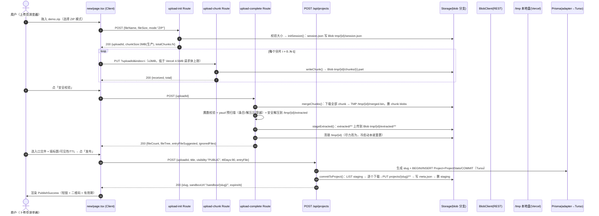
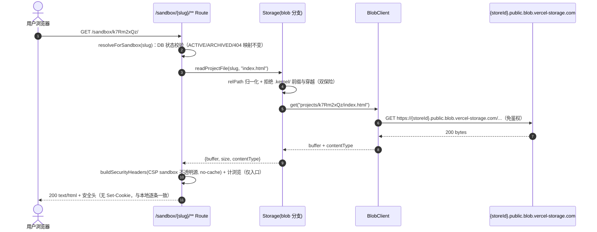
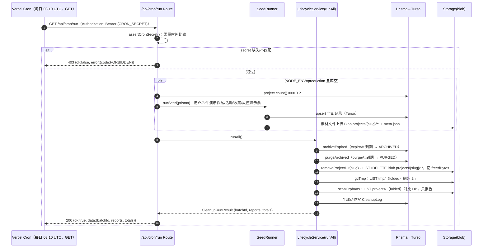
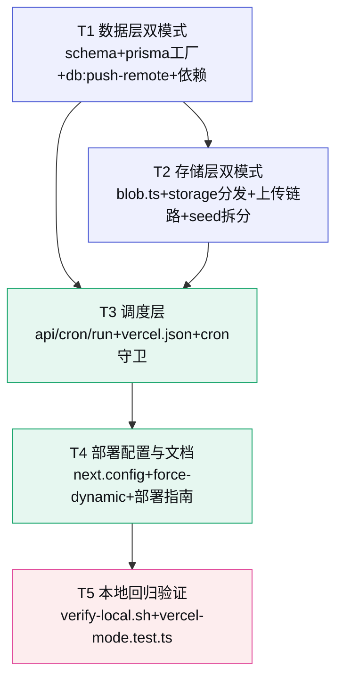

# Kernel · 创意种子 — P0 → Vercel 试验部署改造 · 增量设计与任务分解

> 架构师：高见远　|　阶段：**P0 本地轻量桩 → Vercel 试验寄放（增量改造，先改造验证无误再提交）**
>
> 真源：`docs/P0-架构与任务分解.md`（本地桩形态 + ⬆️生产化替换点）· `docs/02-技术架构.md`（正式部署方案，本次是试验版轻量替代）
>
> 原则：**双模式兼容 —— 本地桩零破坏（dev / build / 单测 / QA 照常），生产模式（NODE_ENV=production + 云环境变量存在时）走云服务。改造可逆、低绑定。**
>
> 本文档只做**设计与分解**，不含实现代码。

---

## 〇、改造目标与总体形态

| 层 | 本地桩（现状，不动） | Vercel 试验版（新增分支） | 判定开关 |
|----|--------------------|--------------------------|---------|
| 数据 | SQLite `prisma/dev.db`（Prisma 原生引擎） | **Turso（libsql，HTTP）**，schema 保持 SQLite 兼容，表结构零改动 | `DATABASE_URL` 以 `libsql:` 开头 |
| 存储 | 本地磁盘 `.kernel-data/`（node:fs 仅 storage.ts） | **Vercel Blob**（REST 直调，零依赖） | `NODE_ENV=production` 且 `BLOB_TOKEN`/`BLOB_READ_WRITE_TOKEN` 存在 |
| 调度 | `node-cron` 常驻进程 `npm run cleanup:cron` | **`vercel.json` + `/api/cron/run` HTTP 端点**（每日一次，见 §0.1 调研修正） | `NODE_ENV=production` 时进程内 cron 直接退出 |
| 上传中转 | `.kernel-data/tmp/{uploadId}/`（跨请求持久） | 分片写 **Blob**（跨实例持久）+ 单请求内 `/tmp` 解压（冷启动重置无影响） | 存储后端分发 |
| 部署 | `npm run dev / build && start` | Vercel（GitHub 仓库 ghostyee2023/kernel） | — |

### 0.1 三个关键调研结论（先修正任务书假设）

| # | 任务书假设 | 调研事实（已核实） | 设计结论 |
|---|-----------|-------------------|---------|
| R1 | Prisma 6.5 支持 `provider="libsql"`，可零依赖 | **Prisma 6.5 官方对 Turso 的支持路径是 driver adapter**：`provider = "sqlite"` + `previewFeatures = ["driverAdapters"]` + `@prisma/adapter-libsql` + `@libsql/client`。不存在独立 `provider="libsql"` datasource（官方 SQLite/Turso 文档、@prisma/adapter-libsql 包说明均为此形态） | **确需 2 个新依赖**（`@prisma/adapter-libsql` + `@libsql/client`），其余全部零依赖。schema 的 `provider` 保持 `sqlite`，**表结构零改动** |
| R2 | Vercel Blob 可 REST 直调零依赖 | **成立**。Blob Store REST API：`PUT/DELETE/LIST` 走 `api.vercel.com/v1/blob` + Bearer token；公共读走 `https://{storeId}.public.blob.vercel-storage.com/{path}` 免鉴权（详见 §3.2 / §8） | **采用 REST 直调，不装 `@vercel/blob` SDK** |
| R3 | Vercel Cron 免费层可用，默认每小时 | **Hobby 免费层 cron 每天最多 1 次**：`0 * * * *`（每小时）等子日表达式会在部署时报错「Hobby accounts are limited to daily cron jobs」；精度 ±59 分钟 | **默认 `10 3 * * *`（每日 03:10 UTC）**；若要每小时需 Pro 或外部触发（GitHub Actions）——见待拍板 Q1 |

### 0.2 上传链路在 Serverless 下的关键约束

- **Vercel Function 请求体上限 4.5MB** → 生产模式 `chunkSize` 由 5MB 降为 **3MB**（init 响应下发，客户端契约不变）。
- **无跨请求持久盘** → 分片与解压产物必须落 Blob（`tmp/{uploadId}/chunks|extracted/**`）；`/tmp` 仅用于**单请求内**合并/解压，请求结束即清。
- **构建期不能连 Turso 预渲染** → 直读 DB 的页面补 `export const dynamic = 'force-dynamic'`（见 T4）。
- **fixtures 必须进函数包** → `next.config.ts` 加 `outputFileTracingIncludes` 包含 `prisma/fixtures/**`，否则生产自动 seed 拿不到素材（见 T4）。

---

## 一、增量设计要点

### 1.1 数据层双模式（Prisma + Turso）

**schema（`prisma/schema.prisma`）—— 最小改动：**

```prisma
generator client {
  provider        = "prisma-client-js"
  previewFeatures = ["driverAdapters"]   // 新增：允许 driver adapter 接入
}

datasource db {
  provider = "sqlite"                    // 保持 sqlite（Turso 即 SQLite，表结构零改动）
  url      = env("DATABASE_URL")
}
```

- `provider` 保持 `"sqlite"`，模型/索引/类型**一行不改**。
- 本地模式（`DATABASE_URL="file:./dev.db"`）：不传 adapter，Prisma 原生引擎照旧，行为与现在完全一致。
- 云模式（`DATABASE_URL="libsql://{db}-{org}.turso.io"` + `TURSO_AUTH_TOKEN`）：传 `PrismaLibSQL` adapter，经 HTTP 连 Turso。

**客户端工厂（`src/lib/prisma.ts` 重构）：**

```
createPrismaClient():
  url = process.env.DATABASE_URL ?? "file:./dev.db"
  if url.startsWith("libsql:"):
      authToken = process.env.TURSO_AUTH_TOKEN（缺失 → 抛错）
      adapter = new PrismaLibSQL({ url, authToken })
      return new PrismaClient({ adapter, log })
  else:
      return new PrismaClient({ log })        // 本地：与现状逐字一致
```

- 保留 `globalThis` 单例挂载模式（`prisma` 导出不变，全站 import 零改动）。
- **schema 变更如何应用到 Turso**（Prisma Migrate / `db push` 需要本地 SQLite，无法直接打远端）：
  1. 本地 `prisma migrate diff --from-empty --to-schema-datamodel prisma/schema.prisma --script` 产出 DDL；
  2. `turso db shell {db-name} < migration.sql` 应用（或 Turso Dashboard SQL 面板粘贴执行）；
  3. 新增脚本 `npm run db:push-remote` 自动完成 1 并输出 2 的指引。
- `scripts/db-init.ts` 加守卫：`DATABASE_URL` 以 `libsql:` 开头时直接提示「本地专用脚本，远端请用 db:push-remote」并退出。

### 1.2 存储层双模式（storage.ts 抽象 + blob.ts REST 封装）

**分层约束（保持）：** `node:fs` 仍仅 `src/lib/storage.ts` 一个文件出现；`src/lib/blob.ts` 是纯 REST（不 import 任何 fs），只被 `storage.ts` 消费。调用方永远通过 storage 的公开函数，不感知后端。

**后端判定：**

```
isBlobBackend() = NODE_ENV === "production" && (BLOB_READ_WRITE_TOKEN || BLOB_TOKEN) 存在
```

- 生产但未配 Blob token → 仍走本地 fs（打 warn），保证部署不崩；试验版文档明确必须配 Blob。
- **Vercel 上 `KERNEL_DATA_DIR=/tmp/kernel-data`**：所有现有 fs 临时逻辑（chunks/merged/extracted/session）在单请求内继续工作，冷启动重置不影响（云分支从不跨请求依赖 /tmp）。

**Blob pathname 约定（与本地目录 1:1）：**

```
projects/{slug}/{relPath}            # 作品文件；relPath 为 POSIX（如 index.html、assets/app.js）
projects/{slug}/.kernel/meta.json    # 磁盘侧元数据（沙箱路由对 .kernel/ 前缀硬拒，双模式一致）
tmp/{uploadId}/session.json          # 上传会话元数据
tmp/{uploadId}/chunks/{index}.part   # 分片（跨实例持久）
tmp/{uploadId}/extracted/{relPath}   # 解压产物 staging（跨请求持久，供 publish）
covers/{slug}.svg                    # ❌ 不落 Blob：covers 路由已有「磁盘缺失 → 即时生成」fallback，云模式直接走生成
```

**storage.ts 公开面变化（对外签名不变的尽量不变）：**

| 函数 | 行为 | 说明 |
|------|------|------|
| `isBlobBackend()` | 新增 | 判定开关 |
| `readProjectFile(slug, relPath)` | 新增 | 沙箱读取：local=读文件；blob=GET 公共 URL。内部做 relPath 归一化 + 拒绝 `.kernel/` 与穿越（双保险） |
| `statProjectFile(slug, relPath)` | 新增 | 沙箱 HEAD：blob=HEAD 公共 URL |
| `writeProjectFile(slug, relPath, data, contentType?)` | 新增 | seed / publish 落盘：local=写文件；blob=PUT |
| `listProjectFiles(slug)` / `projectDirSize(slug)` | 新增 | 项目文件清单/体积（purge freedBytes、meta fileCount）：blob=LIST prefix |
| `writeMeta` / `readMeta` | 后端感知 | 内部改走 writeProjectFile/readProjectFile（`.kernel/meta.json`） |
| `removeProjectDir(slug)` | 后端感知 | blob=LIST + 逐个 DELETE，返回 freedBytes |
| `listProjectSlugs()` | 后端感知 | blob=LIST `projects/`（folded） |
| `listTmpDirs()` | 后端感知 | blob=LIST `tmp/`（folded），用 `uploadedAt` 判 2h 过期 |
| `writeChunk` / `mergeChunks` | 后端感知 | blob：chunk 写/读 Blob；merge 时下载到 `/tmp/{id}/merged.bin` 后删除 chunk blobs |
| `stageExtracted(uploadId)` | 新增 | 仅 blob：把 `/tmp/{id}/extracted/**` 上传到 Blob staging；local=no-op（本地 extracted 已在磁盘） |
| `commitToProject(uploadId, slug)` | 后端感知 | blob=LIST staging → 逐个下载→PUT 到 `projects/{slug}/**` → 删 staging；local=原 `fs.rename` 原子搬移 |
| `seedProjectFromDir(dir, slug)` | 后端感知 | blob=遍历 fixture 目录逐个 writeProjectFile；local=原 `fs.cp` |
| `ensureDataSkeleton` / 路径解析 / 基础 fs 函数 | 保持本地 | 云模式同样可用（/tmp 下建目录） |

**sandbox 路由**改为调用 `readProjectFile` / `statProjectFile`（不再直接 `resolveSafePath` + `readFileBuffer`），安全头 / 状态映射 / 计浏览逻辑不变；blob 模式先缓冲再下发（试验规模足够；流式回传列为优化项）。

### 1.3 生产上传流程（临时文件策略）

> 目标：**客户端契约零改动**（init / chunk / complete / publish 四段式 API 形状不变），仅服务器后端与 chunkSize 变化。

```
① upload-init    校验大小 → 生成 uploadId → session.json 写 Blob(tmp/{id}/session.json)
                 → 返回 {uploadId, chunkSize: 本地5MB / 生产3MB, totalChunks, expiresAt}
② upload-chunk ×N 客户端分片 PUT（≤3MB < Vercel 4.5MB 请求体上限）
                 → storage.writeChunk()：生产写 Blob tmp/{id}/chunks/{i}.part
③ upload-complete 单请求内：LIST+下载全部 chunk → /tmp/{id}/merged.bin
                 → 魔数校验 + yauzl 预扫描 + 安全解压到 /tmp/{id}/extracted
                 → storage.stageExtracted()：上传 extracted/** 到 Blob staging
                 → 删除 chunk blobs + 清理 /tmp/{id}（尽力而为）
                 → 返回 {fileCount, fileTree, entryFileSuggested, ignoredFiles}
④ POST /api/projects（发布） 生成 slug + 事务写库（Turso）
                 → storage.commitToProject()：Blob staging → projects/{slug}/** + meta.json → 删 staging
                 → 返回 {slug, sandboxUrl, expireAt}
```

- 每步都是**单请求完成 + 持久化在 Blob**，不依赖 /tmp 跨请求。
- 已知代价：staging → 最终路径是「下载再上传」而非复制（Blob 无 rename/copy），试验规模（≤20MB）可接受；P1 若做正式化可改为「complete 时预生成 slug 直落最终路径」或客户端直传（presign）。
- 生产建议 `MAX_UPLOAD_MB=20`（100MB 在 300s 超时窗口内下载+解压+重传风险高）——见待拍板 Q5。

### 1.4 调度层：HTTP cron 端点 + vercel.json

**`POST|GET /api/cron/run`（新增 `src/app/api/cron/run/route.ts`）：**

| 项 | 设计 |
|----|------|
| 方法 | `GET`（Vercel Cron 以 GET 调用）+ `POST`（本地/手动 curl，与 admin/cleanup 对齐） |
| 鉴权 | `Authorization: Bearer {CRON_SECRET}` 或 `X-Cron-Secret` 头；**常量时间比较**（复用 admin/cleanup 的 `safeEqual` 模式）；secret 缺失或不匹配 → `403 FORBIDDEN`。`x-vercel-cron-schedule` 头仅作日志标记，**不作文鉴权**（可伪造） |
| 空库自动 seed（拍板项） | `NODE_ENV=production` 且 `prisma.project.count() === 0` → 调 `runSeed(prisma)`（与 `db:seed` 同逻辑，从 `prisma/seed.ts` 抽出复用）；**本地 dev 不自动 seed**（保持现状手动 `npm run db:seed`）。seed 全部 upsert，幂等 |
| 执行 | `runAll()` = archiveExpired → purgeArchived → gcTmp → scanOrphans（顺序不可调换，逻辑零改动） |
| 幂等/并发 | 模块级 in-flight 布尔守卫（尽力而为）；真正的幂等靠**状态机转移**（ACTIVE→ARCHIVED→PURGED，天然不重复消费）；Hobby 精度 ±59min 不产生重复触发 |
| 审计 | 不写 AuditLog（actorId 是 User 外键，无会话主体）；留痕靠 Lifecycle 已有的 CleanupLog |
| 运行时 | `export const runtime = 'nodejs'; export const dynamic = 'force-dynamic'` |
| 响应 | 统一响应体 `ok(result)`（batchId / reports / totals） |

**`vercel.json`（新增）：**

```json
{
  "crons": [
    { "path": "/api/cron/run", "schedule": "10 3 * * *" }
  ],
  "functions": {
    "app/api/cron/run/route.ts": { "maxDuration": 120 }
  }
}
```

- schedule 用**每日一次**（Hobby 限制，见 R3）；Pro 可改 `0 * * * *`。crons 仅对 production 部署生效。
- `functions.maxDuration=120` 预留自动 seed + runAll 耗时（Hobby 上限 300s）。

**进程内 cron 禁用**：`scripts/cron.ts` 开头加守卫 `NODE_ENV === 'production' → 提示并 exit(0)`（Vercel 本无常驻进程，此为双保险）。

### 1.5 next.config.ts 确认与微调

- 确认无 `distDir` 等与 Vercel 冲突配置（现状无）✓
- 新增 `outputFileTracingIncludes: { '/*': ['./prisma/fixtures/**'] }`——保证生产自动 seed 的素材进入函数包（**关键**，否则 Vercel 上 fixtures 缺失、seed 失败）。
- `serverExternalPackages: ['yauzl']` 保留（Node runtime 下正常）。

### 1.6 环境变量清单（`.env.example` 增量）

| 变量 | 本地默认 | Vercel 生产 | 说明 |
|------|---------|------------|------|
| `DATABASE_URL` | `file:./dev.db` | `libsql://{db}-{org}.turso.io` | `libsql:` 前缀 = Turso 分支 |
| `TURSO_AUTH_TOKEN` | （空） | `eyJ...` | Turso 认证 token（`turso db tokens create`） |
| `BLOB_READ_WRITE_TOKEN` / `BLOB_TOKEN` | （空） | `vercel_blob_rw_...` | Vercel Blob store 自动注入前者；代码二者兼容读取。**存储云模式开关** |
| `BLOB_STORE_ID` | （空） | 自动注入 | 拼公共读 URL `https://{storeId}.public.blob.vercel-storage.com/...`；缺失时从 token 解析 |
| `CRON_SECRET` | `dev-cron-secret` | 随机强值 | `/api/cron/run` 鉴权 |
| `KERNEL_DATA_DIR` | `./.kernel-data` | `/tmp/kernel-data` | 生产为单请求临时盘 |
| `SITE_URL` | `http://localhost:3000` | `https://{project}.vercel.app` | 拼接 detailUrl / sandboxUrl |
| `SANDBOX_MODE` | `subpath` | `subpath`（试验版保持） | 同源 + CSP opaque origin，与本地一致；正式上线换独立域（docs/02 契约不变） |
| `SANDBOX_CSP_STRICT` | `true` | `true` | 保持 |
| `AUTH_SECRET` | dev fallback | 随机强值 | 登录 cookie 签名（已有占位，生产必须显式设置） |
| `MAX_UPLOAD_MB` | `100` | `20`（建议） | 见 Q5 |
| `ADMIN_CLEANUP_TOKEN` | `dev-only-token` | 不配 | admin/cleanup 生产恒 403（现状不变） |

---

## 二、文件列表（新增 / 修改，标注职责）

```
kernel/
├── package.json                         [改] 新增 @prisma/adapter-libsql、@libsql/client；scripts 增 db:push-remote
├── prisma/
│   ├── schema.prisma                    [改] generator 加 previewFeatures=["driverAdapters"]；注释更新（provider 保持 sqlite）
│   ├── seed-data.ts                     [新] seed 逻辑抽出：export runSeed(prisma)，供 CLI 与 cron 自动 seed 复用
│   ├── seed.ts                          [改] 变薄壳：createPrismaClient() → runSeed() → disconnect（双模式可跑）
│   └── fixtures/**                      [不] 素材原样（新增 outputFileTracingIncludes 保证进函数包）
├── scripts/
│   ├── db-init.ts                       [改] libsql: URL 守卫（本地专用，远端走 db:push-remote）
│   ├── db-push-remote.ts                [新] migrate diff 产出 DDL + turso db shell 应用指引
│   ├── cron.ts                          [改] NODE_ENV=production 守卫（进程内 cron 生产禁用）
│   └── verify-local.sh                  [新] 本地回归一键串行（typecheck+build+db:reset+单测+QA 冒烟，T5）
├── vercel.json                          [新] crons 每日 03:10 UTC + functions.maxDuration
├── next.config.ts                       [改] outputFileTracingIncludes 含 prisma/fixtures/**；确认无 distDir 冲突
├── .env.example                         [改] DATABASE_URL/TURSO_AUTH_TOKEN/BLOB_TOKEN/BLOB_STORE_ID/CRON_SECRET/KERNEL_DATA_DIR 生产说明
├── README.md                            [改] Vercel 试验部署章节 + 回归命令说明
├── docs/
│   ├── P0-Vercel试验部署设计.md           [新] 本文档（含回归清单）
│   ├── Vercel试验部署指南.md             [新] 操作手册：Turso 建库/DDL 应用、Blob Store 创建、env 设置、部署、seed、cron 验证
│   ├── vercel-class-diagram.mermaid     [新] 类图独立文件（不覆盖 P0 既有 diagram）
│   └── vercel-sequence-diagram.mermaid  [新] 时序图独立文件（不覆盖 P0 既有 diagram）
└── src/
    ├── lib/
    │   ├── prisma.ts                    [改] createPrismaClient() 工厂（libsql: → adapter）+ prisma 单例（导出不变）
    │   ├── blob.ts                      [新] Vercel Blob REST 封装：put/get/del/list/publicUrl + token/storeId 解析（零依赖，不 import fs）
    │   ├── storage.ts                   [改] isBlobBackend() + 后端感知函数 + 新增 readProjectFile/writeProjectFile/listProjectFiles/statProjectFile/stageExtracted 等
    │   ├── project-service.ts           [改] 确认调用点（预期零逻辑改动，走 storage 分发）
    │   └── upload/session.ts            [改] session 元数据读写后端化（blob: tmp/{id}/session.json）
    ├── app/
    │   ├── sandbox/[slug]/[[...path]]/route.ts   [改] 改用 readProjectFile/statProjectFile（安全头/状态映射不变）
    │   ├── api/
    │   │   ├── cron/run/route.ts        [新] GET/POST 调度端点：CRON_SECRET 校验 + 生产空库自动 seed + runAll
    │   │   ├── projects/upload-init/route.ts     [改] 生产 chunkSize=3MB、session 走 storage
    │   │   ├── projects/upload-chunk/route.ts    [改] 确认走 writeChunk（storage 分发）
    │   │   ├── projects/upload-complete/route.ts [改] 解压后调 stageExtracted + 清理 /tmp
    │   │   └── projects/route.ts        [改] 确认走 commitToProject（storage 分发，预期零逻辑改动）
    ├── app/page.tsx、app/w/[slug]/page.tsx 等直读 DB 页面  [改] 若无则补 export const dynamic = 'force-dynamic'（防构建期连 Turso）
    └── （covers 路由零改动：磁盘缺失 → 即时生成 fallback 已覆盖云模式）
```

> 不改动：`src/lib/response.ts`（统一响应体沿用）、`src/lib/lifecycle.ts`（runAll 逻辑零改动，仅 storage 内部分发）、`src/app/api/admin/cleanup/run/route.ts`（生产恒 403 现状不变）、`prisma/dev.db`（本地库不动）。

---

## 三、数据结构与接口（类图）

```mermaid
classDiagram
    direction LR

    class StorageFacade {
        +isBlobBackend() Boolean
        +readProjectFile(slug, rel) Promise~ProjectFile~
        +statProjectFile(slug, rel) Promise~FileStat~
        +writeProjectFile(slug, rel, data, contentType) Promise~void~
        +listProjectFiles(slug) Promise~FileEntry[]~
        +projectDirSize(slug) Promise~Int~
        +writeMeta(slug, meta) Promise~void~
        +readMeta(slug) Promise~ProjectMeta~
        +removeProjectDir(slug) Promise~Int~
        +listProjectSlugs() Promise~String[]~
        +listTmpDirs() Promise~TmpDir[]~
        +writeChunk(uploadId, index, data) Promise~void~
        +mergeChunks(uploadId, total) Promise~String~
        +stageExtracted(uploadId) Promise~void~
        +commitToProject(uploadId, slug) Promise~void~
        +seedProjectFromDir(dir, slug) Promise~void~
    }

    class BlobClient {
        +put(pathname, data, opts) Promise~BlobResult~
        +get(pathname) Promise~Buffer~
        +del(urls) Promise~void~
        +list(prefix, opts) Promise~BlobList~
        +publicUrl(pathname) String
        +storeId() String
    }

    class LocalDisk {
        +readFileBuffer(abs) Promise~Buffer~
        +writeBinaryFile(abs, data) Promise~void~
        +removeDir(abs) Promise~void~
        +listFilesRecursive(abs) Promise~FileEntry[]~
    }

    class PrismaFactory {
        +create() PrismaClient
        +isTurso(url) Boolean
    }

    class PrismaLibSQLAdapter {
        <<external @prisma/adapter-libsql>>
    }

    class CronRunRoute {
        +GET(req) Response
        +POST(req) Response
        -assertCronSecret(req) void
        -ensureSeeded(prisma) Promise~void~
    }

    class SeedRunner {
        +runSeed(prisma) Promise~void~
        -seedUser() 
        -seedProject(spec) 
        -seedCampaign() 
        -seedRiskVotes() 
    }

    class LifecycleService {
        +runAll(now) Promise~CleanupRunResult~
        +archiveExpired(batch, now) 
        +purgeArchived(batch, now) 
        +gcTmp(batch) 
        +scanOrphans(batch) 
    }

    StorageFacade --> BlobClient : 云分支(仅 storage.ts 消费)
    StorageFacade --> LocalDisk : 本地分支
    PrismaFactory --> PrismaLibSQLAdapter : libsql: URL 时
    CronRunRoute --> StorageFacade : 使用
    CronRunRoute --> PrismaFactory : 使用
    CronRunRoute --> SeedRunner : 生产空库自动 seed
    CronRunRoute --> LifecycleService : runAll
    LifecycleService --> StorageFacade : 清理/统计
    SeedRunner --> StorageFacade : 素材落盘(本地或 Blob)
    SeedRunner --> PrismaFactory : 入库(本地或 Turso)
```

---

## 四、程序调用流程（时序图）

### 4.1 生产（Vercel）上传链路：分片 → 单请求解压 → Blob staging → 发布



### 4.2 生产沙箱读取（Blob 公共读 + 统一安全头）



### 4.3 Vercel Cron 触发：鉴权 → 空库自动 seed → 生命周期 runAll



---

## 五、任务分解

> 分组原则：按「数据层 / 存储层 / 调度层 / 部署配置 / 回归验证」分 5 块，每块 ≥3 个文件、可独立验收。
> 任务书建议的 T1–T5 结构**原样采纳**，本表为细化。

### T1 · 数据层双模式（含依赖与配置基底）

| 项 | 内容 |
|----|------|
| **优先级** | P0（阻塞全部） |
| **依赖** | 无 |
| **产出文件** | `package.json`（+`@prisma/adapter-libsql` +`@libsql/client`，scripts 增 `db:push-remote`）· `prisma/schema.prisma`（previewFeatures）· `src/lib/prisma.ts`（工厂 + 单例）· `scripts/db-init.ts`（libsql 守卫）· `scripts/db-push-remote.ts`（新）· `.env.example`（DATABASE_URL/TURSO_AUTH_TOKEN） |
| **要点** | ① schema 只加 `previewFeatures=["driverAdapters"]`，provider 保持 `sqlite`，模型零改动 ② `createPrismaClient()`：`libsql:` 前缀 → `PrismaLibSQL({url, authToken})`；否则原生（与现状一致）③ 保留 `prisma` 单例导出，全站 import 零改动 ④ `db:push-remote`：`prisma migrate diff --from-empty --to-schema-datamodel --script` 产出 DDL，提示 `turso db shell {db} < migration.sql` ⑤ `db:init` 加 libsql: 守卫 |
| **验收点** | ✅ `npm run db:reset` 本地照常（dev.db 重建 + seed，原生引擎）✅ `npm run typecheck` 通过 ✅ 设 `DATABASE_URL=libsql://... TURSO_AUTH_TOKEN=... npm run db:push-remote` 能产出可应用 DDL ✅ tests/unit 照常 |

### T2 · 存储层双模式（Blob 后端 + 上传链路适配）

| 项 | 内容 |
|----|------|
| **优先级** | P0 |
| **依赖** | T1（seed 复用 createPrismaClient） |
| **产出文件** | `src/lib/blob.ts`（新）· `src/lib/storage.ts`（重构分发）· `prisma/seed-data.ts`（新）+ `prisma/seed.ts`（薄壳）· `src/lib/upload/session.ts` · `src/app/api/projects/upload-init/route.ts` · `upload-chunk/route.ts` · `upload-complete/route.ts` · `src/app/api/projects/route.ts` · `src/app/sandbox/[slug]/[[...path]]/route.ts` · `src/lib/project-service.ts`（确认）· `.env.example`（BLOB_TOKEN/BLOB_STORE_ID/KERNEL_DATA_DIR 生产说明） |
| **要点** | ① `blob.ts` 纯 REST：put/get/del/list/publicUrl + token/storeId 解析，**不 import fs** ② `storage.ts` 按 §1.2 表做后端分发，`node:fs` 仍仅此文件 ③ 生产 chunkSize=3MB（init 下发）④ complete 末段 `stageExtracted` + 清理 /tmp ⑤ sandbox 路由改 `readProjectFile/statProjectFile`，安全头不变 ⑥ seed 拆 `runSeed(prisma)` 供 CLI 与 cron 复用，素材落盘走 storage 后端 |
| **验收点** | ✅ 本地桩全链路照常：上传→沙箱→清理（后端=local）✅ 无云环境变量时 `isBlobBackend()=false` ✅ 有 Blob token 冒烟：writeProjectFile→readProjectFile→removeProjectDir 往返 ✅ `DATABASE_URL=file:./dev.db npm run db:seed` 本地照常；libsql: 模式文件走 Blob |

### T3 · 调度层 HTTP 端点 + vercel.json

| 项 | 内容 |
|----|------|
| **优先级** | P0 |
| **依赖** | T1、T2 |
| **产出文件** | `src/app/api/cron/run/route.ts`（新）· `scripts/cron.ts`（生产守卫）· `vercel.json`（新）· `.env.example`（CRON_SECRET） |
| **要点** | ① GET/POST 双方法，Bearer CRON_SECRET 常量时间校验 ② `NODE_ENV=production` 且空库 → `runSeed` 自动 seed ③ `runAll()` 原样复用（lifecycle 零改动）④ in-flight 守卫 + 状态机幂等 ⑤ `vercel.json`：`crons: [{path:"/api/cron/run", schedule:"10 3 * * *"}]` + `functions.maxDuration=120` ⑥ `scripts/cron.ts` 生产退出 |
| **验收点** | ✅ 本地 `curl -H "Authorization: Bearer dev-cron-secret" POST http://localhost:3000/api/cron/run` 返回统一报告 ✅ 无/错 secret → 403 ✅ 本地 dev 空库不自动 seed ✅ `NODE_ENV=production` 下 `npm run cleanup:cron` 直接退出 |

### T4 · 部署配置与文档

| 项 | 内容 |
|----|------|
| **优先级** | P1 |
| **依赖** | T1、T2、T3 |
| **产出文件** | `next.config.ts`（outputFileTracingIncludes + 确认无 distDir）· `src/app/page.tsx` / `src/app/w/[slug]/page.tsx` 等直读 DB 页面（补 `force-dynamic`，如缺失）· `docs/Vercel试验部署指南.md`（新）· `README.md`（部署章节）· `.env.example`（最终化） |
| **要点** | ① `outputFileTracingIncludes: { '/*': ['./prisma/fixtures/**'] }`（**关键**：生产自动 seed 的素材必须进函数包）② 直读 DB 页面若无 `export const dynamic = 'force-dynamic'` 则补——防 Vercel 构建期连 Turso 预渲染出空页 ③ 部署指南覆盖：Turso 建库/拿 URL+token/应用 DDL、Blob Store 创建与 env 注入、Vercel 项目连接 GitHub 仓库、env 全量设置、先手动 curl cron 验证再开 schedule、限额与已知限制 |
| **验收点** | ✅ 按指南部署成功，构建日志无 Turso 连接失败 ✅ `curl https://{project}.vercel.app/api/cron/run`（带 secret）返回报告 ✅ 生产沙箱链接 `/sandbox/{slug}/` 可访问且安全头齐全 |

### T5 · 本地回归验证

| 项 | 内容 |
|----|------|
| **优先级** | P0 |
| **依赖** | T1–T4 |
| **产出文件** | `scripts/verify-local.sh`（新）· `tests/qa/vercel-mode.test.ts`（新）· `docs/P0-Vercel试验部署设计.md`（本文档回归清单章节）· `README.md`（回归命令说明，增量） |
| **要点** | ① `verify-local.sh` 串行：`npm run typecheck` → `npm run build` → `npm run db:reset` → tests/unit → QA 冒烟（按仓库既有运行方式）② `vercel-mode.test.ts` 断言双模式分支：无云环境变量时 `isBlobBackend()=false`、`createPrismaClient()` 不建 adapter、DATABASE_URL 默认 `file:` ③ 回归清单见 §9 ④ 全部在**本地桩模式**下执行，云分支行为由单测 + 冒烟覆盖 |
| **验收点** | ✅ `bash scripts/verify-local.sh` 一键全绿 ✅ dev 起站：广场非空、上传 zip、沙箱访问、cleanup:once 全通 ✅ tests/unit 与 tests/qa 既有用例全部通过（本地桩零破坏） |

### 5.1 任务依赖图



> 说明：T2 的 `blob.ts`/`storage.ts` 与 T1 的 prisma 工作**可并行开工**（storage 不依赖 prisma），仅 `prisma/seed.ts` 拆分需 T1 的工厂；T3 需 T1+T2 的产物（runAll 同时碰 DB 与存储）。

---

## 六、依赖包列表（增量）

### 新增依赖（2 个，确需 —— 调研结论 R1）

```
- @prisma/adapter-libsql@^6.5.0   # 必需：Prisma ↔ Turso(libsql) 驱动适配器，版本与 @prisma/client 对齐
- @libsql/client@^0.14.x          # 必需：libSQL HTTP 客户端（adapter 的 peer）。Node runtime 下用标准包；
                                  #   若 Vercel 原生 binding 加载异常，可换 import '@libsql/client/web'
```

- **体积/构建评估**：两包均轻量纯 JS（libsql 走 HTTP 无本地引擎依赖），仅在 `libsql:` URL 分支被构造；Next server bundle 内体积增量 < 1MB，不引入浏览器包。`driverAdapters` 在 6.5 为 preview feature，`prisma generate` 正常，原生（无 adapter）模式不受影响。
- 其余 **零新增**：Vercel Blob 用 REST 直调（不装 `@vercel/blob`）；cron 用 `vercel.json`（不装）；`node-cron` 保留本地桩。

---

## 七、共享知识（跨文件约定）

### 7.1 双模式判定规则（唯一权威，实现必须逐字对齐）

| 能力 | 云模式条件 | 本地模式条件 |
|------|-----------|-------------|
| 数据层 | `DATABASE_URL` **以 `libsql:` 开头**（必须同时存在 `TURSO_AUTH_TOKEN`，缺失即抛错） | `file:` / `sqlite:` 前缀或缺失 → `file:./dev.db` 原生引擎 |
| 存储层 | `NODE_ENV === 'production'` **且**（`BLOB_READ_WRITE_TOKEN` 或 `BLOB_TOKEN`）存在 | 其余全部 → 本地磁盘 `.kernel-data/`（`KERNEL_DATA_DIR` 可覆盖） |
| 调度层 | `NODE_ENV === 'production'` → 仅 Vercel Cron 触发 `/api/cron/run`；进程内 `scripts/cron.ts` 直接退出 | 本地 → `npm run cleanup:cron` 进程内 node-cron |
| 自动 seed | `NODE_ENV === 'production'` 且 `project.count() === 0`，由 cron 端点触发 | 本地不自动，`npm run db:seed` 手动 |

### 7.2 libsql / Turso URL 格式

```
本地:   file:./dev.db（相对 prisma/ 目录）
远端:   libsql://{db-name}-{org}.turso.io        # turso db show --url
token:  turso db tokens create {db-name}        # 写入 TURSO_AUTH_TOKEN
DDL:    本地 prisma migrate diff --from-empty --to-schema-datamodel prisma/schema.prisma --script
        → turso db shell {db-name} < migration.sql
```

### 7.3 Vercel Blob REST API 调用格式（零依赖）

```
Base:        https://api.vercel.com/v1/blob
公共读 URL:   https://{storeId}.public.blob.vercel-storage.com/{pathname}（免鉴权）
storeId:     优先 BLOB_STORE_ID；否则从 token 解析：token 形如 vercel_blob_rw_<storeId>_<secret>，
             split('_') 后第 4 段（index 3）

PUT（写）:    PUT {base}?pathname={path}
             Headers: Authorization: Bearer {token} · x-api-version: 7 · Content-Type: {type}
             可选: x-allow-overwrite: true（seed/重传）· x-add-random-suffix: false · x-cache-control-max-age: 2592000
             Body: 文件二进制 → 响应 {url, pathname, contentType, size, uploadedAt}

DELETE:      POST {base}/delete
             Headers: Authorization: Bearer {token} · x-api-version: 7 · Content-Type: application/json
             Body: {"urls": ["https://{storeId}.public.blob.vercel-storage.com/{path}", ...]}

LIST:        GET {base}?prefix={prefix}&limit=1000[&mode=folded][&cursor=...]
             Headers: Authorization: Bearer {token}
             响应 {blobs:[{url,pathname,size,uploadedAt}], hasMore, cursor}
             folded 用于「列目录」（projects/ 与 tmp/ 的 slug/uploadId 列表）；flat 用于「列文件」（purge/用量）

HEAD:        HEAD https://{storeId}.public.blob.vercel-storage.com/{path}（statProjectFile 用）
```

> 实现提醒：`x-api-version` 具体值按实施时 Vercel 最新 @vercel/blob SDK 常量对齐（约 7），并在 Blob 冒烟中验证；若 Vercel 变更 REST 契约导致维护成本，回退方案是加 `@vercel/blob`（见 Q3）。

### 7.4 cron secret 校验约定

- 头：`Authorization: Bearer {CRON_SECRET}` 或 `X-Cron-Secret: {CRON_SECRET}`（二者任一）。
- 比较：**常量时间比较**（复用 `src/app/api/admin/cleanup/run/route.ts` 的 `safeEqual` 模式），禁止 `===`。
- 失败：统一 `fail(ERROR_CODE.FORBIDDEN)` → 403；`x-vercel-cron-schedule` 头只写日志，不鉴权。
- 本地：`.env.example` 提供 `CRON_SECRET="dev-cron-secret"`；生产 Vercel 平台配随机强值。

### 7.5 空库 seed 触发条件

```
条件 = NODE_ENV === "production" && (await prisma.project.count()) === 0
时机 = /api/cron/run 每次执行前（先 seed 后 runAll）
实现 = runSeed(prisma)（prisma/seed-data.ts 导出，upsert 幂等）
覆盖 = 占位用户/管理员/风控演示用户 + 3 件演示作品（素材经 storage 后端落盘）+ 演示活动 + 收藏 + 风控演示票
```

### 7.6 其他既有约定（沿用，不破坏）

- 统一响应体 `{ok, data, error:{code,message}}`，Route Handler 禁直接 `NextResponse.json()`（`src/lib/response.ts`）。
- `node:fs` 仅 `src/lib/storage.ts`；`src/lib/blob.ts` 不 import fs。
- 沙箱安全头 / `.kernel/` 硬拒 / 路径穿越防护：双模式逐条一致；blob 分支在 storage 内部再做一次 relPath 校验（双保险）。
- 时间全部 ISO 8601 UTC；日志格式 `[模块][动作] key=value`。
- 短码、TTL 档位、限额常量、错误码：不变。

---

## 八、待明确事项（附默认建议）

| # | 议题 | 调研/默认建议（无异议按此执行） | 影响面 |
|---|------|-------------------------------|--------|
| **Q1** | cron 频率 | **修正为每日一次 `10 3 * * *`（03:10 UTC）**。Vercel Hobby 免费层 cron 每天最多 1 次，`0 * * * *` 会部署失败（R3）。要每小时需 Pro 或 GitHub Actions 外部触发 `/api/cron/run` | 中 · 需拍板 |
| **Q2** | Prisma libsql 接法 | **采用 driver adapter**（`provider="sqlite"` + `@prisma/adapter-libsql` + `@libsql/client`，2 个新依赖，R1 调研结论）。Prisma 6.5 无独立 `provider="libsql"` datasource；零依赖替代（手写 libsql REST 查询）工作量过大，不建议 | 高 · 需拍板 |
| **Q3** | Blob REST 直调 vs SDK | **默认 REST 直调零依赖**（§7.3 已给完整格式）。风险：`x-api-version` 与 REST 契约可能随 Vercel 演进；冒烟验证不过或维护成本上升时回退 `@vercel/blob`（约 20KB） | 中 |
| **Q4** | 旧 seed 作品文件迁移 | **默认不迁移**：Turso + Blob 从空库开始，首次 cron 自动 seed 演示数据；本地 dev.db 与 `.kernel-data` 不受影响。正式上线前再评估迁移脚本 | 低 |
| **Q5** | 生产上传体积上限 | **默认 `MAX_UPLOAD_MB=20`（Vercel env）**。100MB 在 Hobby 300s 窗口内「下载分片+解压+重传」有超时风险；20MB 对试验版演示足够。分片大小生产统一 3MB（Vercel 4.5MB 请求体上限） | 中 |
| **Q6** | 沙箱同源 | **试验版保持 `SANDBOX_MODE=subpath`**（同源 + CSP `sandbox` 不透明源，与本地一致；AUTH cookie 同域但被 opaque origin 隔离）。正式上线仍按 docs/02 换独立域 | 中 |
| **Q7** | fixtures 进函数包 | **默认做**：`next.config.ts` 加 `outputFileTracingIncludes` 含 `prisma/fixtures/**`，否则 Vercel 自动 seed 拿不到素材（静默失败） | 高 |
| **Q8** | 自动 seed 触发范围 | **仅 `NODE_ENV=production` 且空库**，本地 dev 不自动 seed（保持手动）。默认执行 | 低 |
| **Q9** | QA 运行方式 | 仓库 `package.json` 无 `test` 脚本；T5 要求工程师按既有 `tests/qa` 用法运行（或补一个 `test` 脚本聚合单测）。默认：新增 `scripts/verify-local.sh` 串行聚合 | 低 |

---

## 九、本地回归清单（T5 验收基准，本地桩模式）

| # | 检查项 | 期望 |
|---|--------|------|
| 1 | `npm run db:reset` | dev.db 重建 + seed 成功（原生引擎，无 adapter） |
| 2 | `npm run typecheck` | 零错误 |
| 3 | `npm run build` | 构建通过（含 outputFileTracingIncludes 变更） |
| 4 | `npm run dev` 冒烟 | 广场非空（3 件 seed 作品）· 上传 zip 全流程 · `/sandbox/{slug}/` 访问 + 安全头齐全 · `/api/admin/cleanup/run` 本地照常 |
| 5 | `npm run cleanup:once` | archive/purge/tmp/orphan 报告正常 |
| 6 | tests/unit（slug/lifecycle/sandbox/response/risk/campaign/favorite） | 全部通过 |
| 7 | tests/qa 既有用例 | 按仓库既有方式全部通过（双模式分支本地分支行为不变） |
| 8 | 新增 `tests/qa/vercel-mode.test.ts` | 无云环境变量时 `isBlobBackend()=false`、`createPrismaClient()` 不建 adapter、URL 默认 `file:` |
| 9 | `npm run cleanup:cron`（设 NODE_ENV=production） | 提示并退出，不启动调度 |
| 10 | git 状态 | 仅预期的新增/修改文件（.env/.env.local/dev.db/.kernel-data/.next 不入库） |

---

## 附：交付文件

| 文件 | 内容 |
|------|------|
| `docs/P0-Vercel试验部署设计.md` | 本文档（增量设计 + 任务分解 + 回归清单） |
| `docs/vercel-class-diagram.mermaid` | §3 类图独立文件（不覆盖 P0 既有 diagram） |
| `docs/vercel-sequence-diagram.mermaid` | §4 时序图独立文件（不覆盖 P0 既有 diagram） |
| `docs/Vercel试验部署指南.md` | T4 产出：Turso/Blob/Env/Seed/Cron 操作手册 |
