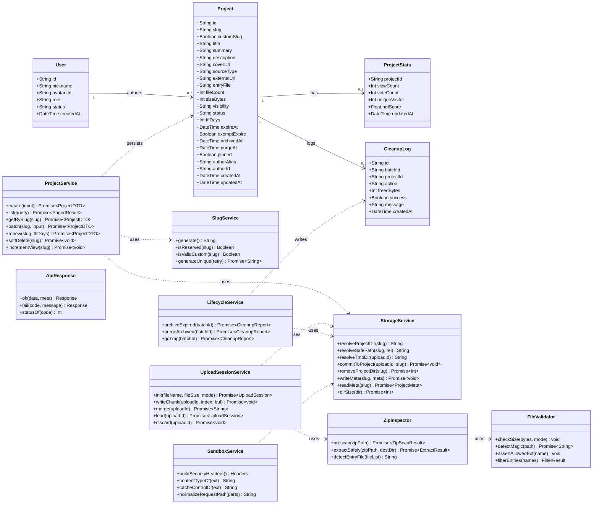
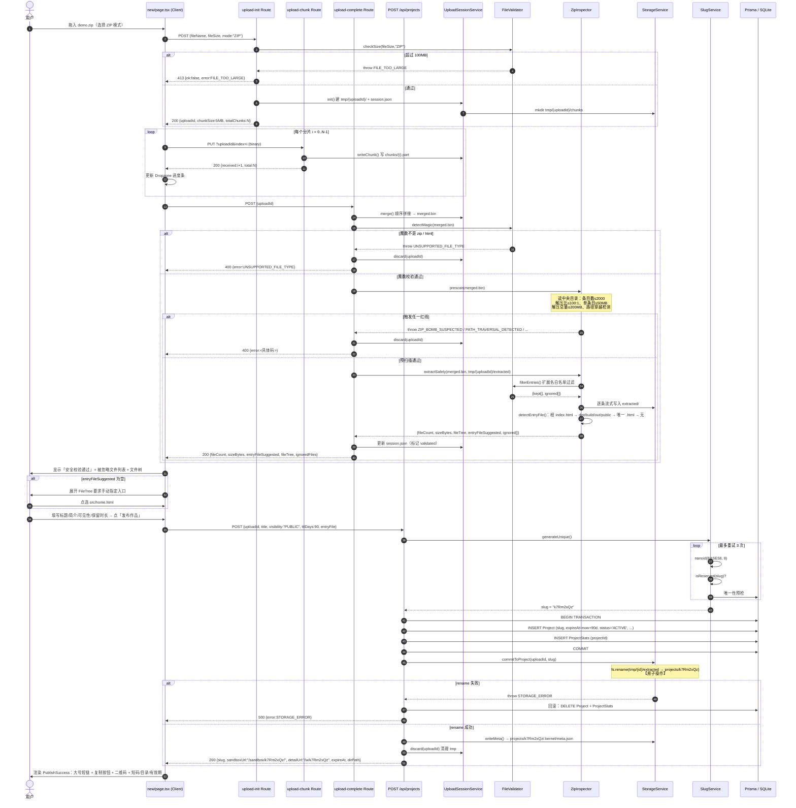
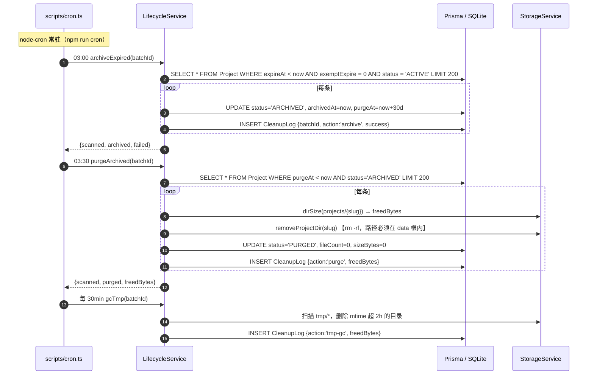
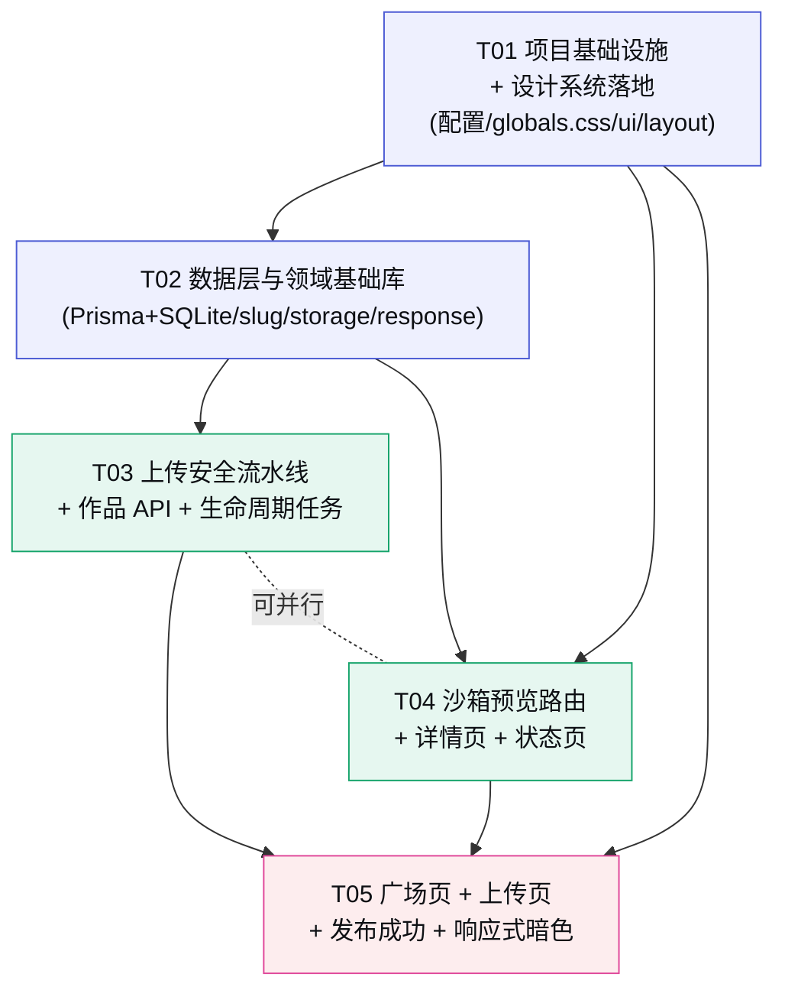

# Kernel · 创意种子 — P0 骨架 · 架构设计与任务分解

> 架构师：高见远　|　阶段：**P0 · 骨架跑通**　|　运行形态：**本地 Node.js 轻量桩（非生产部署）**
>
> P0 目标（对齐 `docs/04-实施路线图.md`）：**能上传、能出链接、能访问、能过期**。不做投票、登录、活动、排行榜、后台。
>
> 视觉真源：`DESIGN.md`　|　结构基准：`prototype/Kernel-创意种子-优化版.html`　|　数据/接口基准：`docs/03-数据模型与API.md`
>
> 本文档只做**设计与分解**，不含任何实现代码。所有 `⬆️ 生产化替换点` 标记处均为本地桩降级，切生产时按标注还原。

---

## 〇、P0 范围锁定（先划边界，避免蔓延）

### 做（P0 In Scope）

| 能力 | 说明 |
|------|------|
| 上传发布 | 单 HTML / ZIP / 外链三种投稿方式（对齐 `01-产品方案 4.1`） |
| 安全流水线 | 大小校验 · 魔数校验 · ZIP 预扫描（炸弹/穿越/条目数）· 扩展名白名单 · 原子落盘 |
| 短码 | Base58 8 位 + DB 唯一索引 + 冲突重试 + 保留词校验 |
| 沙箱访问 | 本地子路径 `/sandbox/{slug}/*` 直出静态文件 + 全套安全响应头 |
| 生命周期 | `expireAt` + 每日 `expire-archive` + `purge-files` + 回收站（30 天） |
| 页面 | 广场 `/` · 上传 `/new`（含发布成功）· 详情 `/w/[slug]` · 状态页 `/_status/[slug]` |
| 主题 | 浅色/暗色双主题一键切换 + 375px 起响应式 |

### 不做（P0 Out of Scope，全部推 P1+）

投票 / 登录鉴权 / 活动 Campaign / 标签体系 / 排行榜 / 后台管理 UI / OG 图与海报服务端生成 / Playwright 自动截图 / 私密作品签名 token / 微信相关全部链路 / Redis / BullMQ / 分布式部署。

> **对应关系**：不做的部分在 Prisma schema 中**保留字段占位**（如 `Project.visibility`、`ProjectStats.voteCount`），保证 P1 只加逻辑不改表。

---

## 一、实现方案与框架选型

### 1.1 核心技术难点

| # | 难点 | P0 解法 |
|---|------|--------|
| D1 | **不可信 HTML 的隔离** —— 用户上传的 JS 会在我们的域上执行 | 生产是独立注册域；本地桩用 `/sandbox/{slug}` 子路径 + **CSP `sandbox` 指令强制不透明源** + iframe 不给 `allow-same-origin` + 零 Cookie（见 §1.4） |
| D2 | **ZIP 炸弹与路径穿越** | 用 **流式 ZIP 读取器（yauzl）** 先读中央目录做预扫描（条目数 / 解压比 / 单条目大小 / 路径规范化），全部通过后才逐条落盘；绝不用「先全解压再检查」 |
| D3 | **落盘的原子性** —— 半个目录比没有目录更糟 | 一律「解压到 `tmp/{uploadId}/extracted` → 校验通过 → 单次 `fs.rename` 原子搬到 `projects/{slug}`」；rename 失败即回滚 DB 行 |
| D4 | **短码唯一性**（无 Redis） | Base58 `nanoid(8)` + DB `UNIQUE` 索引兜底 + 冲突重试 3 次；唯一性由数据库保证，不依赖内存 |
| D5 | **设计系统 1:1 落地** —— DESIGN.md 有 100+ token 且要支持暗色 | CSS 变量为唯一真源（`:root` / `[data-theme="dark"]`），Tailwind v4 只接管布局/间距/断点，颜色一律走 `var()`（见 §7.1） |
| D6 | **SQLite 与 Postgres 的差异** | 枚举 → String + 常量；`Json` → String（JSON 字符串）；`BigInt` → `Int`；去掉全部 `@db.*` 修饰（见 §3.1） |

### 1.2 选型结论（P0 · 本地桩）

| 层 | 生产设计（docs/02） | **P0 本地桩选型** | 取舍说明 |
|----|--------------------|------------------|---------|
| 框架 | Next.js 15 App Router + TS | **同左** ✅ 不降级 | Server Component 直读 DB 渲染首屏，Route Handlers 写 API，一体化 |
| 样式 | Tailwind CSS 4 + CSS Variables | **同左** ✅ 不降级 | Tailwind v4 CSS-first，无 `tailwind.config.ts` |
| 组件库 | shadcn/ui（Radix） | **不引入**，改为 `src/components/ui/*` **自写基础组件** | P0 只需 Button/Input/Select/Textarea/Badge/Chip/RadioCard/Progress/Toast/Card 十来个，全部由 DESIGN.md §4 的 CSS 直译；引 Radix 反而要花时间改样式。P1 需要 Dialog/Popover/Tooltip 可访问性时再接入 shadcn，届时只替换 `ui/` 目录 ⬆️ |
| 动效 | Motion (Framer Motion) | **不引入**，纯 CSS transition | DESIGN.md 规定过渡统一 `160–240ms / cubic-bezier(.16,1,.3,1)`，CSS 足够。榜单换位动画是 P3 需求 ⬆️ |
| 数据请求 | TanStack Query + Server Actions | **原生 `fetch` + Server Component** | P0 无乐观更新场景（投票才需要）。上传页用受控 client component + `fetch` ⬆️ |
| ORM | Prisma | **同左** ✅ | |
| 数据库 | PostgreSQL 16 | **SQLite**（`prisma/dev.db`） | 见 §3.1 差异清单，切 Postgres 改动 = 换 provider + 恢复枚举/Json/BigInt ⬆️ |
| 缓存/榜单/限流 | Redis 7 | **不引入** | P0 无投票、无榜单、无会话；短码唯一性由 DB 唯一索引保证 ⬆️ |
| 队列 | BullMQ | **`node-cron` 常驻 + 一次性 npm script** | 见 §2 `scripts/cron.ts` ⬆️ |
| 对象存储 | S3 / MinIO | **本地磁盘** `./.kernel-data/` | 所有 fs 操作收敛在 `src/lib/storage.ts` 单一模块，换 S3 只改这一个文件 ⬆️ |
| 静态分发 | Nginx 泛域名 + CDN | **Next Route Handler** `/sandbox/[slug]/[[...path]]` | 见 §1.4 ⬆️ |
| 截图/图片生成 | Playwright / Satori | **不引入**；封面用**确定性渐变占位**，二维码用 `qrcode` 前端 canvas 生成 | 对齐原型（原型的二维码就是内联库前端画的） ⬆️ |
| 鉴权 | Auth.js + 微信 Provider | **不引入**；seed 一个本地占位用户 `local-demo-user` | 见 §3.2 与 §8-Q3 ⬆️ |
| 部署 | Docker Compose | **`npm run dev` / `npm run build && npm start`** | 零外部依赖，克隆即跑 |

### 1.3 架构模式

**分层单体（Layered Monolith）**，四层严格单向依赖，禁止反向引用：

```
┌──────────────────────────────────────────────────────────┐
│  展示层  app/**/page.tsx  +  components/**               │  ← 只消费 DTO
├──────────────────────────────────────────────────────────┤
│  接口层  app/api/**/route.ts  +  app/sandbox/**/route.ts │  ← 只做 参数解析/鉴权/响应封装
├──────────────────────────────────────────────────────────┤
│  领域层  lib/upload/*  lib/lifecycle  lib/slug  lib/sandbox │  ← 全部业务规则在这里，纯函数优先
├──────────────────────────────────────────────────────────┤
│  基础层  lib/prisma  lib/storage  lib/response  lib/constants │  ← 唯一与 DB / 磁盘 对话的地方
└──────────────────────────────────────────────────────────┘
```

**两条数据通路，不重复造**：

- **首屏渲染**（广场、详情）→ Server Component **直接调 Prisma**，不经过 `/api`（省一次 HTTP 往返，且 SSR 有利于后续分享抓取）
- **客户端交互**（上传三段式、续期、删除）→ 调 `/api/*` Route Handlers

> 两条通路共用 `lib/` 领域层，业务规则只写一份。

### 1.4 沙箱隔离方案（P0 本地桩 · 最关键的降级点）

**生产设计**（`docs/02` §3.1–3.3）：`*.demo-sandbox.com` 独立注册域 + Nginx 泛域名 + 零 Cookie + CSP。

**P0 本地桩**：`http://localhost:3000/sandbox/{slug}/{path}` —— 与主站**同源**，这是一个**真实的安全降级**，必须靠三层补偿：

| 层 | 措施 | 作用 |
|----|------|------|
| ① 响应头 | `Content-Security-Policy: sandbox allow-scripts allow-popups allow-popups-to-escape-sandbox allow-forms` | **关键**：CSP `sandbox` 指令让浏览器把该文档置于**不透明源（opaque origin）**，即使用户直接在地址栏访问，它也读不到主站 `document.cookie` / `localStorage`，也发不出同源凭证请求。**注意不含 `allow-same-origin`** |
| ② 响应头 | `form-action 'none'` · `X-Content-Type-Options: nosniff` · `Referrer-Policy: no-referrer` · `Permissions-Policy: camera=(), microphone=(), geolocation=(), payment=()` · `Cross-Origin-Opener-Policy: same-origin` | 防钓鱼、防 MIME 嗅探、防信息泄漏（与生产 Nginx 配置逐条对齐） |
| ③ iframe | `sandbox="allow-scripts allow-popups allow-popups-to-escape-sandbox allow-forms"`，**绝不给 `allow-same-origin`**，`referrerpolicy="no-referrer"` | 与生产完全一致，无降级 |

**已知副作用**：不透明源下作品无法使用 `localStorage` / `indexedDB`。提供 env 开关 `SANDBOX_CSP_STRICT`（默认 `true`，**已确认·主理人拍板：安全姿势优先于 demo 便利性**）；调试需要时可临时关闭，但必须在文档与 UI 上提示风险。

> ⬆️ **生产化替换点（P0→上线必做，验收清单硬项）**
> 1. 沙箱域必须是与主域**不同的注册域**（不能是 `demo.kernel.xxx.com`）
> 2. 静态文件改由 Nginx `root /data/projects/$slug` 直出，不经 Node
> 3. 安全响应头搬到 Nginx（`docs/02` §3.2 配置可直接用），CSP 的 `frame-ancestors` 收紧到主站域
> 4. 沙箱域上永不下发 `Set-Cookie`（curl 验证）
> 5. `error_page 403 404 410 → @fallback → /_status/$slug`（P0 已实现该状态页，直接复用）

---

## 二、文件列表（P0 全量，含职责）

> 目录结构裁剪自 `docs/03` §五。**⭐ = P0 新增（非 docs/03 原有）**

```
kernel/
├── package.json                      # 依赖与脚本（dev / build / db:push / db:seed / cron / cleanup:once）
├── tsconfig.json                     # TS 严格模式，path alias @/* → src/*
├── next.config.ts                    # 关闭 x-powered-by；serverExternalPackages: ['yauzl']
├── postcss.config.mjs                # 仅一行 @tailwindcss/postcss
├── .env.example                      # 环境变量样例（见 §7.6）
├── .env.local                        # 本地实际值（gitignore）
├── .gitignore                        # 含 .kernel-data/ 与 prisma/*.db
├── README.md                         # 本地启动三步走
│
├── prisma/
│   ├── schema.prisma                 # ⭐ SQLite 版 P0 裁剪 schema（4 模型，见 §3.1）
│   ├── seed.ts                       # ⭐ 建占位用户 local-demo-user + 3 条示例作品（供广场非空，素材由工程师自制入 prisma/fixtures/，见 §8-Q11 已确认）
│   └── dev.db                        # SQLite 文件库（gitignore）
│
├── .kernel-data/                     # ⭐ 本地存储根（gitignore）⬆️ 生产 = /data 或 S3 bucket
│   ├── projects/{slug}/              #   作品目录，slug 即目录名
│   │   ├── index.html                #   （或 meta 中记录的 entryFile）
│   │   ├── assets/…                  #   ZIP 内相对路径原样保留
│   │   └── .kernel/meta.json         #   入口文件 / 大小 / 文件数 / 上传时间 / 被忽略的文件列表
│   ├── tmp/{uploadId}/               #   上传中转：chunks/ + merged.bin + extracted/，2h 自动回收
│   └── covers/{slug}.svg             #   P0 占位封面（确定性渐变），P1 换 Playwright 截图 ⬆️
│
├── scripts/
│   ├── cron.ts                       # ⭐ node-cron 常驻进程：03:00 archive / 03:30 purge / 每 30min tmp-gc
│   └── cleanup-once.ts               # ⭐ 一次性手动触发（npm run cleanup:once -- --task=archive|purge|tmp）
│
└── src/
    ├── app/
    │   ├── layout.tsx                # 根布局：<html data-theme> + 字体 + TechBg + SiteHeader + SiteFooter
    │   ├── page.tsx                  # 【广场】Server Component，直读 Prisma 取 ACTIVE+PUBLIC 列表
    │   ├── loading.tsx               # 广场骨架屏
    │   ├── not-found.tsx             # 全局 404
    │   ├── error.tsx                 # 全局错误边界
    │   │
    │   ├── new/page.tsx              # 【上传发布】Client Component 三步流（对齐原型 steps）
    │   │
    │   ├── w/[slug]/page.tsx         # 【作品详情】Server Component + generateMetadata
    │   ├── w/[slug]/not-found.tsx    #   作品不存在
    │   │
    │   ├── _status/[slug]/page.tsx   # ⭐【状态页】410 已归档 / 404 不存在的友好页（复刻生产 Nginx fallback 契约）
    │   │
    │   ├── sandbox/[slug]/[[...path]]/route.ts   # ⭐【沙箱静态直出】GET，见 §1.4 ⬆️ 生产由 Nginx 接管
    │   │
    │   └── api/
    │       ├── projects/route.ts                 # GET 列表 / POST 创建作品
    │       ├── projects/[slug]/route.ts          # GET 详情 / PATCH 编辑 / DELETE 软删除
    │       ├── projects/[slug]/renew/route.ts    # POST 续期
    │       ├── projects/upload-init/route.ts     # POST 初始化上传会话
    │       ├── projects/upload-chunk/route.ts    # PUT 上传分片
    │       ├── projects/upload-complete/route.ts # POST 合并+安全校验+解压+入口识别（不入库）
    │       └── admin/cleanup/run/route.ts        # ⭐ POST 手动触发清理，X-Admin-Token 保护，仅 dev
    │
    ├── components/
    │   ├── ui/                       # 自写基础组件，逐条直译 DESIGN.md §4
    │   │   ├── Button.tsx            #   variant: primary|secondary|ghost|danger, size: sm|md|lg
    │   │   ├── Input.tsx             #   含 aria-invalid 错误态
    │   │   ├── Textarea.tsx
    │   │   ├── Select.tsx
    │   │   ├── Badge.tsx             #   variant: campaign|live|expiring|private
    │   │   ├── Chip.tsx              #   保留时长选择用（7/30/90/180/365）
    │   │   ├── RadioCard.tsx         #   可见性三选一
    │   │   ├── Progress.tsx          #   上传进度条 h6 r999
    │   │   ├── Card.tsx              #   .side-card 通用容器
    │   │   ├── Toast.tsx             #   全局轻提示（Context + Provider）
    │   │   ├── Skeleton.tsx
    │   │   └── EmptyState.tsx        #   DESIGN.md Do's #8：图标 + 一句引导 + 一个主 CTA
    │   │
    │   ├── layout/
    │   │   ├── SiteHeader.tsx        #   60px sticky + blur(16px)；P0 导航仅【作品广场】，其余 P1 项不渲染
    │   │   ├── MobileDrawer.tsx      #   ≤768px 汉堡 → 右侧抽屉 min(82vw,320px)
    │   │   ├── ThemeToggle.tsx       #   切 data-theme + localStorage 持久化 + 防 FOUC 内联脚本
    │   │   ├── TechBg.tsx            #   #techBg 三色极低透明度径向渐变，z-index:-1
    │   │   └── SiteFooter.tsx        #   Core. Code. Create. / 核心 · 代码 · 创造
    │   │
    │   ├── project/
    │   │   ├── ProjectCard.tsx       #   16:10 缩略图 + 卡片整体可点（无「全屏运行」按钮）；P0 无投票按钮
    │   │   ├── ProjectGrid.tsx       #   1/2/3/4 列响应式网格，gap 20px
    │   │   ├── CoverPlaceholder.tsx  # ⭐ 基于 slug hash 的确定性品牌渐变占位图
    │   │   ├── PreviewFrame.tsx      #   浏览器外壳（三点 + mono URL 条 + 刷新/新窗口）+ iframe（无 same-origin）
    │   │   ├── ProjectMetaPanel.tsx  #   作品信息卡：作者/发布于/浏览/有效期至 + ExpiryBadge
    │   │   ├── ShareCard.tsx         #   二维码 canvas + 复制链接 + 直接访问
    │   │   └── ExpiryBadge.tsx       #   剩余天数徽章，≤7 天转 warning 态
    │   │
    │   └── upload/
    │       ├── Steps.tsx             #   三步指示器（选择来源 → 填写信息 → 发布完成）
    │       ├── UploadModeTabs.tsx    #   ZIP / 单 HTML / 仅提供链接
    │       ├── Dropzone.tsx          #   拖拽区 + 进度条（DESIGN.md §9 提示词②逐条实现）
    │       ├── SecurityCheckResult.tsx # 校验通过/失败反馈条 + 被忽略文件列表（透明告知）
    │       ├── FileTree.tsx          #   文件树浏览 + 手动指定入口文件
    │       ├── PublishForm.tsx       #   标题/简介/说明/可见性/保留时长/署名
    │       └── PublishSuccess.tsx    #   大号短链 + 复制 + 二维码 + 短码/目录/有效期 + 双 CTA
    │
    ├── lib/
    │   ├── prisma.ts                 # PrismaClient 单例（dev 下挂 globalThis 防热重载泄漏）
    │   ├── constants.ts              # ⭐ 全部魔法值收口：枚举常量、扩展名白名单、保留短码、限额、TTL 档位
    │   ├── response.ts               # ⭐ ok()/fail()/ErrorCode/HTTP 状态映射，统一响应体（§7.4）
    │   ├── types.ts                  # ⭐ DTO 与领域类型（ProjectDTO / UploadSession / ZipScanResult / FileNode）
    │   ├── slug.ts                   # ⭐ Base58 生成 + 保留词校验 + 自定义短码格式校验 + 冲突重试
    │   ├── storage.ts                # ⭐ 唯一 fs 出口：路径解析(防穿越)/原子 rename/递归删除/meta.json 读写/用量统计
    │   ├── format.ts                 # 字节/日期/剩余天数格式化（统一 Asia/Shanghai 展示）
    │   ├── sandbox.ts                # ⭐ 安全响应头组装 + 扩展名→MIME 映射 + 缓存策略 + 路径归一化
    │   ├── lifecycle.ts              # ⭐ archiveExpired() / purgeArchived() / gcTmp()，被 cron 与 API 共用
    │   ├── project-service.ts        # ⭐ 作品领域服务：create/list/getBySlug/patch/renew/softDelete
    │   └── upload/
    │       ├── session.ts            # ⭐ uploadId 生命周期、分片写入与合并、会话元数据（存 tmp/{id}/session.json）
    │       ├── validate.ts           # ⭐ 大小校验 + 魔数(file-type)校验 + 扩展名白名单判定
    │       └── zip.ts                # ⭐ yauzl 预扫描（条目数/解压比/单条目/路径穿越）+ 安全解压 + 入口识别
    │
    └── styles/
        └── globals.css               # ⭐ DESIGN.md token 全量落地 + @theme 映射 + .t-* 排版类 + 组件基类
```

**文件计数**：配置 8 · Prisma 2 · 脚本 2 · 路由/页面 14 · 组件 30 · lib 12 · 样式 1 ≈ **69 个文件**。

---

## 三、数据结构与接口

### 3.1 Prisma Schema（P0 裁剪 · SQLite 版）

**P0 只保留 4 个模型**：`User`（占位）· `Project`（主体）· `ProjectStats`（1:1，P0 只写 viewCount）· `CleanupLog`（生命周期留痕）。
`Campaign` / `Tag` / `ProjectTag` / `ProjectCampaign` / `Vote` / `AuditLog` **P0 不建表**，P1 再加（纯新增，不改现有表）。

#### SQLite 差异改造清单 ⬆️

| docs/03 原写法 | SQLite 下改为 | 切 Postgres 时还原方式 |
|---------------|--------------|----------------------|
| `enum Role/Visibility/...` | **删除 enum**，字段改 `String` + `@default("USER")`；取值常量集中在 `lib/constants.ts` | 恢复 enum 块，字段类型改回；数据已是同名字符串，`prisma migrate` 可平滑转换 |
| `@db.VarChar(200)` / `@db.Text` | **去掉修饰**，纯 `String`；长度限制在**应用层**（Zod-like 手写校验，`constants.ts` 定义 `MAX_SUMMARY_LEN=200`） | 加回修饰即可，应用层校验保留（双保险） |
| `sizeBytes BigInt` | **改 `Int`** —— P0 单项目硬上限 200MB < 2^31，绰绰有余；避开 `JSON.stringify(BigInt)` 抛错 | 改回 `BigInt` + 在 `response.ts` 统一序列化 |
| `detail Json?`（CleanupLog/AuditLog） | **改 `String?`**，存 `JSON.stringify(...)`；读时 `JSON.parse` | 改回 `Json`，`lib/` 层封装的 `readDetail()/writeDetail()` 保证调用点不变 |
| `@@index([...])` | ✅ SQLite 支持，原样保留 | 无需改动 |
| `@default(cuid())` / `@updatedAt` | ✅ 原样保留 | 无需改动 |

#### 模型定义（结构说明，非代码）

**User**（P0 占位，只有一条 seed 记录 `local-demo-user`）

| 字段 | 类型 | 说明 |
|------|------|------|
| `id` | String @id @default(cuid()) | |
| `nickname` | String | seed 为「本地创作者」 |
| `avatarUrl` | String? | |
| `role` | String @default("USER") | `USER \| JUDGE \| ADMIN \| SUPER_ADMIN` |
| `status` | String @default("ACTIVE") | `ACTIVE \| BANNED` |
| `createdAt` | DateTime @default(now()) | |
| ~~unionid / openidMp / openidOpen / phone / riskLevel / lastLoginAt~~ | — | **P0 不建**，P1 接微信登录时新增（可空字段，无损迁移） |

**Project**（P0 核心，字段与 docs/03 **完全对齐**，仅做类型降级）

| 字段 | 类型 | P0 状态 |
|------|------|--------|
| `id` | String @id @default(cuid()) | ✅ |
| `slug` | String @unique | ✅ 8 位 Base58，= 目录名 |
| `customSlug` | Boolean @default(false) | ✅ 占位（P0 UI 不暴露自定义短码） |
| `title` | String | ✅ 必填，≤60 字（应用层） |
| `summary` | String? | ✅ ≤200 字 |
| `description` | String? | ✅ Markdown 原文存储；**P0 详情页按纯文本渲染**（不引 markdown 解析器）⬆️ |
| `coverUrl` | String? | ✅ 空则前端用 `CoverPlaceholder` |
| `ogImageUrl` | String? | ⏸ 占位，P0 恒 null |
| `sourceType` | String | ✅ `SINGLE_FILE \| ZIP \| EXTERNAL_URL` |
| `externalUrl` | String? | ✅ 外链模式使用 |
| `entryFile` | String @default("index.html") | ✅ |
| `fileCount` | Int @default(0) | ✅ |
| `sizeBytes` | Int @default(0) | ✅（BigInt→Int）|
| `visibility` | String @default("PUBLIC") | ✅ 三态字段落库；P0 行为：`PUBLIC` 进广场、`UNLISTED` 不进广场但链接可达、`PRIVATE` **一律 404**（签名访问是 P1）⬆️ |
| `accessKey` | String? | ⏸ 占位，P0 恒 null |
| `status` | String @default("ACTIVE") | ✅ `ACTIVE \| ARCHIVED \| PURGED \| BLOCKED` |
| `ttlDays` | Int @default(90) | ✅ 档位 7/30/90/180/365 |
| `expireAt` | DateTime | ✅ = 发布时刻 + ttlDays |
| `exemptExpire` | Boolean @default(false) | ✅ 归档任务读取（P0 无自动打标来源，手动可改） |
| `archivedAt` / `purgeAt` | DateTime? | ✅ 归档时写入，purgeAt = archivedAt + 30d |
| `pinned` | Boolean @default(false) | ⏸ 占位 |
| `authorAlias` | String? | ✅ 表单可填，覆盖署名 |
| `authorId` → `author` | String → User | ✅ P0 恒为 `local-demo-user` |
| `createdAt` / `updatedAt` | DateTime | ✅ |
| 索引 | `@@index([visibility,status,createdAt])` `@@index([expireAt,status])` `@@index([status,purgeAt])` `@@index([authorId])` | ✅ 第三个索引为 purge 任务新增 |
| ~~tags / campaigns / votes~~ | — | P0 不建关系 |
| `stats` | ProjectStats? | ✅ |
| `cleanupLogs` | CleanupLog[] | ✅ |

**ProjectStats**（1:1，`onDelete: Cascade`）

| 字段 | P0 状态 |
|------|--------|
| `projectId` @id + `project` 关系 | ✅ |
| `viewCount` Int @default(0) | ✅ 详情页 SSR 时 +1（P0 不去重，`uniqueVisitor` 留 0）|
| `voteCount` / `voteInvalid` / `uniqueVisitor` / `deepViewCount` / `hotScore` / `firstVoteAt` | ⏸ 建列占位，P0 恒默认值 |
| `updatedAt` @updatedAt | ✅ |
| `@@index([hotScore])` `@@index([voteCount])` | ✅ 保留 |

**CleanupLog**（生命周期留痕，`detail` 改 String）

| 字段 | 说明 |
|------|------|
| `id` / `batchId` / `projectId` | `batchId` = 单次任务运行 id，便于聚合查看 |
| `action` | `archive \| purge \| tmp-gc \| notify`（P0 无 notify）|
| `freedBytes` Int @default(0) | BigInt→Int |
| `success` Boolean @default(true) / `message` String? | |
| `createdAt` / `@@index([batchId])` | |

### 3.2 类图（数据模型 + 领域服务）



### 3.3 P0 REST 端点清单（裁剪自 docs/03 §3.1）

统一前缀 `/api`，统一响应体见 §7.4。**P0 无鉴权**，"鉴权"列标注 P1 应加的约束。

| 方法 | 路径 | 说明 | P0 行为 | P1 鉴权 ⬆️ |
|------|------|------|--------|-----------|
| `GET` | `/api/projects` | 广场列表 | 参数 `sort=new\|hot`（P0 `hot` 降级为按 `createdAt` 排，UI 置灰）、`q`（title/summary LIKE）、`page`、`pageSize`（默认 12）。只返回 `status=ACTIVE && visibility=PUBLIC` | 公开 |
| `GET` | `/api/projects/:slug` | 作品详情 | `PRIVATE` → 404；`ARCHIVED` → 410 + `{purgeAt}` | 按可见性 |
| `POST` | `/api/projects/upload-init` | 初始化上传 | 入参 `{fileName, fileSize, mode}` → 出参 `{uploadId, chunkSize, totalChunks, expiresAt}` | 登录 |
| `PUT` | `/api/projects/upload-chunk` | 上传分片 | Query `uploadId` + `index`，body = 二进制。返回 `{received, total}` | 登录 |
| `POST` | `/api/projects/upload-complete` | 合并+校验+解压 | **不入库**。返回 `{uploadId, fileCount, sizeBytes, entryFileSuggested, fileTree, ignoredFiles[], warnings[]}` | 登录 |
| `POST` | `/api/projects` | 创建作品 | 入参 `{uploadId? \| externalUrl?, title, summary?, description?, visibility, ttlDays, entryFile?, authorAlias?}` → 生成 slug、原子落盘、入库 → 返回 `{slug, sandboxUrl, detailUrl, expireAt, dirPath}` | 登录 |
| `PATCH` | `/api/projects/:slug` | 编辑元信息 | 可改 `title/summary/description/visibility/authorAlias`；**不可改** `slug/sourceType` | 作者/管理员 |
| `POST` | `/api/projects/:slug/renew` | 续期 | 入参 `{ttlDays}` → `expireAt = now + ttlDays`；若当前 `ARCHIVED` 且文件未 purge → 恢复为 `ACTIVE` 并清空 `archivedAt/purgeAt` | 作者/管理员 |
| `DELETE` | `/api/projects/:slug` | 软删除 | → `ARCHIVED`，`purgeAt = now + 30d`（进回收站，非物理删除） | 作者/管理员 |
| `GET` | `/sandbox/:slug/*path` | **沙箱静态直出** | 见 §1.4。空 path → `entryFile` | 公开（生产走 Nginx）⬆️ |
| `POST` | `/api/admin/cleanup/run` | 手动触发清理 | Header `X-Admin-Token` 校验（值取 `.env` 的 `ADMIN_TOKEN`）；入参 `{task: 'archive'\|'purge'\|'tmp'\|'all'}`；`NODE_ENV=production` 时直接 403 | 仅本地 ⬆️ |

**P1 及以后不在 P0 实现的端点**（留位说明，避免工程师顺手写掉）：
`/api/votes/*`、`/api/rank*`、`/api/campaigns/*`、`/api/auth/*`、`/api/admin/*`（除 cleanup/run）、`/og/:slug.png`、`/poster/*`、`/api/projects/:slug/access-token`、`/api/projects/:slug/report`。

### 3.4 P0 定时任务（裁剪自 docs/03 §四）

| 任务 | 频率 | P0 实现 | 逻辑 |
|------|------|--------|------|
| `expire-archive` | 每日 03:00 | ✅ node-cron | `expireAt < now && !exemptExpire && status='ACTIVE'` → `status='ARCHIVED'`、`archivedAt=now`、`purgeAt=now+30d`；单批 200 条；写 CleanupLog |
| `purge-files` | 每日 03:30 | ✅ node-cron | `purgeAt < now && status='ARCHIVED'` → 递归删 `projects/{slug}` → `status='PURGED'`、`fileCount=0`、`sizeBytes=0`；元数据行**保留**（审计）；写 CleanupLog（含 freedBytes） |
| `tmp-gc` | 每 30 分钟 | ✅ node-cron ⭐ | 删除 `tmp/` 下 `mtime > 2h` 的目录（对齐 docs/02 §3.5「2 小时自动清理」） |
| `expire-notify` | 每日 09:00 | ❌ P0 不做 | 依赖微信模板消息 ⬆️ P1 |
| `rank-recalc` / `vote-reconcile` / `risk-scan` | — | ❌ P0 不做 | 依赖投票与 Redis ⬆️ P1/P2 |
| `orphan-scan` | 每周日 04:00 | ⚠️ 仅实现为 `cleanup:once --task=orphan`（不排程） | 扫描磁盘上无 DB 记录的目录，**只报告不删除** |
| `db-backup` | 每日 02:00 | ❌ P0 不做 | SQLite 直接复制 `dev.db` 即可 ⬆️ 生产用 pg_dump |

---

## 四、程序调用流程（时序图）

### 4.1 上传 → 校验 → 解压 → 落盘 → 生成 slug → 入库 → 返回链接



### 4.2 详情页加载 → iframe 沙箱预览

```mermaid
sequenceDiagram
    autonumber
    actor U as 用户
    participant B as 浏览器
    participant DP as w/[slug]/page.tsx (RSC)
    participant PS as ProjectService
    participant DB as Prisma / SQLite
    participant SB as sandbox Route
    participant SD as SandboxService
    participant ST as StorageService
    participant FS as .kernel-data 磁盘

    U->>B: 访问 /w/k7Rm2xQz
    B->>DP: GET (SSR)
    DP->>PS: getBySlug("k7Rm2xQz")
    PS->>DB: SELECT Project + ProjectStats WHERE slug
    DB-->>PS: row

    alt 不存在 或 visibility=PRIVATE
        PS-->>DP: null
        DP-->>B: 404 → w/[slug]/not-found.tsx
    else status = ARCHIVED / PURGED
        PS-->>DP: {status:'ARCHIVED', purgeAt}
        DP-->>B: 302 → /_status/k7Rm2xQz（410 语义友好页 + 恢复提示）
    else status = ACTIVE
        PS->>DB: UPDATE ProjectStats SET viewCount = viewCount + 1
        PS-->>DP: ProjectDTO
        DP->>DP: generateMetadata() 写 title/description/OG
        DP-->>B: HTML（面包屑 + 标题 + PreviewFrame + 说明 + 右侧面板）
    end

    Note over B: PreviewFrame 渲染 iframe<br/>src="/sandbox/k7Rm2xQz/"<br/>sandbox="allow-scripts allow-popups<br/>allow-popups-to-escape-sandbox allow-forms"<br/>【不给 allow-same-origin】<br/>referrerpolicy="no-referrer" loading="lazy"

    B->>SB: GET /sandbox/k7Rm2xQz/  （iframe 首帧）
    SB->>PS: getBySlug(slug) 轻查（仅 status/visibility/entryFile）
    alt PRIVATE 或 不存在
        SB-->>B: 404（不泄露存在性）
    else ARCHIVED / PURGED
        SB-->>B: 410 + 指向 /_status/{slug} 的极简 HTML
    else ACTIVE
        SB->>SD: normalizeRequestPath([]) → entryFile "index.html"
        SB->>ST: resolveSafePath(slug, "index.html")
        Note over ST: path.resolve 后必须 startsWith(projectDir)<br/>否则 throw PATH_TRAVERSAL_DETECTED
        ST->>FS: createReadStream(...)
        FS-->>ST: stream
        SB->>SD: buildSecurityHeaders() + contentTypeOf(".html") + cacheControlOf(".html")
        Note over SD: CSP: sandbox allow-scripts allow-popups<br/>allow-popups-to-escape-sandbox allow-forms;<br/>default-src 'self' data: blob:;<br/>form-action 'none'; base-uri 'self'<br/>+ nosniff / no-referrer / Permissions-Policy<br/>+ 绝不 Set-Cookie<br/>html: no-cache, must-revalidate
        SB-->>B: 200 text/html + 安全头 + 文件流
    end

    loop iframe 内相对资源 assets/app.js、assets/style.css …
        B->>SB: GET /sandbox/k7Rm2xQz/assets/app.js
        SB->>ST: resolveSafePath(slug, "assets/app.js")
        alt 路径穿越 或 扩展名不在白名单
            SB-->>B: 403
        else 正常
            SB-->>B: 200 + Cache-Control: public, max-age=2592000, immutable
        end
    end

    U->>B: 点右上「新窗口全屏打开」
    B->>SB: GET /sandbox/k7Rm2xQz/ （target=_blank rel="noopener noreferrer"）
    Note over B,SB: 直接导航同样带 CSP sandbox 指令<br/>→ 不透明源，读不到主站 cookie/localStorage
```

### 4.3 生命周期定时任务



---

## 五、任务分解

> **分组原则**：按「层次 + 可独立验收」分块，共 **5 个主任务块（T01–T05）**，每块内含子项。
> 主理人建议的 T1–T12 全部被覆盖，映射见 §5.7。

### T01 · 项目基础设施 + 设计系统落地

| 项 | 内容 |
|----|------|
| **优先级** | P0（阻塞全部） |
| **依赖** | 无 |
| **产出文件** | `package.json` `tsconfig.json` `next.config.ts` `postcss.config.mjs` `.env.example` `.gitignore` `README.md` `src/app/layout.tsx` `src/app/loading.tsx` `src/app/error.tsx` `src/app/not-found.tsx` `src/styles/globals.css` `src/components/ui/*`（12 个）`src/components/layout/*`（5 个）`src/lib/format.ts` |
| **要点** | ① Next.js 15 App Router + TS strict + `@/*` alias<br/>② Tailwind v4 CSS-first（**不建 tailwind.config.ts**），`globals.css` 按 §7.1 组织<br/>③ DESIGN.md §2 全量色板 + §3 排版 + §5 间距 + §6 阴影/层级 + §8 断点，**逐条落成 CSS 变量**，暗色覆盖写在 `[data-theme="dark"]`<br/>④ `.t-*` 排版类名与原型保持一致（`t-display-hero` / `t-headline` / `t-card-title` / `t-body` / `t-caption` / `t-overline` / `mono`）<br/>⑤ ui 组件逐条直译 DESIGN.md §4 的 CSS（按钮 38px/8px 圆角、卡片 14px 圆角 + 1px 边框 + shadow-xs、输入框 40px…）<br/>⑥ ThemeToggle：`data-theme` 属性 + localStorage + **`<head>` 内联同步脚本防 FOUC** |
| **验收点** | ✅ `npm run dev` 起得来，首页显示 Header + Footer + TechBg<br/>✅ 主题按钮切换后**无任何硬编码色值残留**（暗色下无白块）<br/>✅ 375px 宽度无横向滚动，汉堡抽屉可开合<br/>✅ 用 DESIGN.md §9 的「作品卡片」提示词逐条比对 Button/Card 的像素值一致 |

### T02 · 数据层与领域基础库

| 项 | 内容 |
|----|------|
| **优先级** | P0 |
| **依赖** | T01 |
| **产出文件** | `prisma/schema.prisma` `prisma/seed.ts` `src/lib/prisma.ts` `src/lib/constants.ts` `src/lib/response.ts` `src/lib/types.ts` `src/lib/slug.ts` `src/lib/storage.ts` |
| **要点** | ① Schema 按 §3.1 写（4 模型，SQLite 兼容改造全部落实）<br/>② `constants.ts` 收口全部魔法值：`VISIBILITY/STATUS/SOURCE_TYPE` 常量对象、`ALLOWED_EXTENSIONS`（docs/02 §3.4 白名单原样）、`RESERVED_SLUGS`、`BASE58_ALPHABET`、`LIMITS`（100MB/200MB/2000/100:1/50MB）、`TTL_OPTIONS=[7,30,90,180,365]`<br/>③ `slug.ts`：Base58 字符集去 `0 O I l`，8 位；`generateUnique()` 冲突重试 3 次后抛 `SLUG_CONFLICT`<br/>④ `storage.ts` 是**唯一** import `node:fs` 的模块；`resolveSafePath()` 必须 `path.resolve` 后校验前缀，任何越界抛错；`commitToProject()` 用 `fs.rename` 保证原子<br/>⑤ `response.ts`：`ok()/fail()` + `ErrorCode` 枚举 + code→HTTP 状态映射表（§7.4）<br/>⑥ `seed.ts`：建 `local-demo-user` + 3 条示例作品（对应 3 个真实小 demo 目录，让广场首启非空） |
| **验收点** | ✅ `npm run db:push && npm run db:seed` 成功，`prisma/dev.db` 生成<br/>✅ Prisma Studio 能看到 3 条作品 + 3 条 stats<br/>✅ 单测：`resolveSafePath('abc','../../etc/passwd')` 抛 `PATH_TRAVERSAL_DETECTED`<br/>✅ 单测：连续生成 10000 个 slug 无重复、无保留词、无 `0OIl` |

### T03 · 上传安全流水线 + 作品 API + 生命周期任务

| 项 | 内容 |
|----|------|
| **优先级** | P0（P0 的技术核心） |
| **依赖** | T02 |
| **产出文件** | `src/lib/upload/session.ts` `src/lib/upload/validate.ts` `src/lib/upload/zip.ts` `src/lib/project-service.ts` `src/lib/lifecycle.ts` `src/app/api/projects/route.ts` `src/app/api/projects/[slug]/route.ts` `src/app/api/projects/[slug]/renew/route.ts` `src/app/api/projects/upload-init/route.ts` `src/app/api/projects/upload-chunk/route.ts` `src/app/api/projects/upload-complete/route.ts` `src/app/api/admin/cleanup/run/route.ts` `scripts/cron.ts` `scripts/cleanup-once.ts` |
| **要点** | ① **ZIP 必须先预扫描再解压**：用 yauzl 读中央目录拿 `uncompressedSize/compressedSize`，任何一条红线不过就整包拒绝，绝不部分落盘<br/>② 路径穿越检测覆盖：`../`、绝对路径、Windows 盘符、`\` 分隔符、符号链接条目、`..` 出现在归一化后的任意段<br/>③ 扩展名白名单外的条目**丢弃但不报错**，收集进 `ignoredFiles[]` 返回给前端（docs/02 §3.4「透明告知」）<br/>④ 入口识别按 `01-产品方案 4.1` 四级顺序；全不命中返回 `entryFileSuggested: null` 让前端弹文件树<br/>⑤ 单 HTML 模式：直接重命名为 `index.html`，`sourceType=SINGLE_FILE`<br/>⑥ 外链模式：不落盘，`sourceType=EXTERNAL_URL`，`externalUrl` 需校验 http(s) 协议 + 非内网地址<br/>⑦ 创建作品的**事务 + 回滚**顺序严格按 §4.1 时序图<br/>⑧ `lifecycle.ts` 三个函数被 cron 与 `/api/admin/cleanup/run` 复用，单批 200 条，单条失败不中断整批 |
| **验收点** | ✅ 传正常 zip → 拿到 slug，`.kernel-data/projects/{slug}/index.html` 存在，`.kernel/meta.json` 内容正确<br/>✅ **炸弹样本**（10KB 压缩 → 10GB 解压）→ 返回 `ZIP_BOMB_SUSPECTED`，磁盘零残留<br/>✅ **穿越样本**（含 `../../evil.html` 条目）→ 返回 `PATH_TRAVERSAL_DETECTED`，磁盘零残留<br/>✅ 改扩展名的 exe（`a.zip` 实为 PE）→ 返回 `UNSUPPORTED_FILE_TYPE`<br/>✅ 手动把某作品 `expireAt` 改到过去 → `npm run cleanup:once -- --task=archive` → 状态变 ARCHIVED、purgeAt = +30d、CleanupLog 有记录<br/>✅ 再把 `purgeAt` 改到过去 → `--task=purge` → 目录消失、状态 PURGED、freedBytes > 0 |

### T04 · 沙箱预览路由 + 作品详情页 + 状态页

| 项 | 内容 |
|----|------|
| **优先级** | P0 |
| **依赖** | T02（可与 T03 并行，联调时需 T03 产出的数据） |
| **产出文件** | `src/lib/sandbox.ts` `src/app/sandbox/[slug]/[[...path]]/route.ts` `src/app/w/[slug]/page.tsx` `src/app/w/[slug]/not-found.tsx` `src/app/_status/[slug]/page.tsx` `src/components/project/PreviewFrame.tsx` `src/components/project/ProjectMetaPanel.tsx` `src/components/project/ShareCard.tsx` `src/components/project/ExpiryBadge.tsx` |
| **要点** | ① 沙箱响应头按 §1.4 **逐条实现**，含 CSP `sandbox` 指令；`SANDBOX_CSP_STRICT` env 可关（默认开）<br/>② 状态分支：不存在/PRIVATE → 404（**不泄露存在性**，对齐 04 上线清单）；ARCHIVED/PURGED → 410<br/>③ 缓存：`.html` → `no-cache, must-revalidate`；静态资源 → `public, max-age=2592000, immutable`<br/>④ **绝不下发 Set-Cookie**（Route Handler 里显式不写 cookie）<br/>⑤ 详情页布局对齐原型 `#view-detail`：面包屑 → 徽章行 → 标题 → 简介 → 浏览器框预览 → 隔离说明小字 → 作品说明卡；右侧竖排 side-card（**P0 顶部卡片不是投票卡，改为「访问与分享」卡**：二维码 + 复制链接 + 直接访问）→ 作品信息卡（作者/发布于/浏览/有效期至 + ExpiryBadge + 续期按钮）<br/>⑥ 预览容器严格按 DESIGN.md §9 提示词④：外框 16px 圆角 + 1px 边框 + `--surface-sunken` 底 + shadow-md；40px 工具条（三个 10px 灰点 + mono 短码 URL 胶囊 + 刷新/新窗口 28px 图标按钮）；iframe `aspect-ratio: 16/10`<br/>⑦ 外链模式作品：不渲染 iframe，改渲染「新标签页跳转」卡片（`rel="noopener noreferrer"`） |
| **验收点** | ✅ `curl -I http://localhost:3000/sandbox/{slug}/` 六个安全响应头齐全，**无 Set-Cookie**<br/>✅ 详情页 iframe 里作品正常渲染，相对路径资源（css/js/图片/字体）全部加载成功<br/>✅ 浏览器 DevTools 检查 iframe 属性**不含 `allow-same-origin`**<br/>✅ 恶意样本（`<script>document.cookie</script>` + 表单 POST 到外站）在沙箱内被 CSP 拦下<br/>✅ 请求 `/sandbox/{slug}/../../../prisma/dev.db` 返回 403<br/>✅ 已归档作品访问详情页 → 跳 `/_status/{slug}` 显示友好页与恢复提示 |

### T05 · 广场页 + 上传页 + 发布成功 + 响应式暗色收尾

| 项 | 内容 |
|----|------|
| **优先级** | P0 |
| **依赖** | T01 · T02 · T03（上传接口）· T04（详情页链接） |
| **产出文件** | `src/app/page.tsx` `src/app/new/page.tsx` `src/components/project/ProjectCard.tsx` `src/components/project/ProjectGrid.tsx` `src/components/project/CoverPlaceholder.tsx` `src/components/upload/*`（7 个） |
| **要点** | ① **广场**对齐原型 `#view-plaza`：Hero（eyebrow 胶囊 + 中文大标题「每一件杰作，都始于一颗**种子**」，"种子"用品牌渐变 `background-clip:text`——**全站唯一一处渐变文字** + Slogan 胶囊 + 双 CTA + 三项统计）；筛选条 P0 只保留「最新」可用，「热门/票数」置灰 disabled + tooltip「投票功能开放后启用」；活动/分类标签行 **P0 不渲染**（无 Campaign 表）<br/>② 卡片：16:10 缩略图（`--surface-sunken` 打底 + `CoverPlaceholder`）、标题 17px/600/-0.2px 单行省略、描述 13px 双行省略、**整卡可点进详情**、**无「全屏运行」按钮**、**P0 无投票按钮**；左上角徽章 P0 用于展示可见性/即将过期<br/>③ 空状态用 `EmptyState`：图标 + 「还没有作品，发布第一颗种子」+ 主 CTA「上传我的作品」<br/>④ **上传页**对齐原型 `#view-upload`：`Cultivate the future.` 青色大写副标题 + 三步指示器 + 三模式卡 + Dropzone（DESIGN.md §9 提示词② 逐条：2px dashed `#D8DCE3`、16px 圆角、48px 内边距、拖拽悬停变 `#4C5BD4` 实线 + `#EEF0FE` 底）+ 进度条 + 校验结果条 + 文件树 + 表单 + 发布成功面板<br/>⑤ 发布成功面板：成功环 + 大号短链 linkbox + 复制 + 二维码 canvas（`qrcode` 库前端生成）+ 短码/存储目录/有效期至三行 meta + 双 CTA（查看作品页 / 再发一个）；支持 `/new?published={slug}` 深链恢复，刷新不丢<br/>⑥ 响应式：网格 1/2/3/4 列（480/768/1024/1280）；移动端主 CTA ≥44px；标题按 DESIGN.md §8 缩放（hero 64→40px，字距收至 -1.4px），**正文永不小于 15px** |
| **验收点** | ✅ 广场展示 seed 的 3 条作品，点卡片进详情<br/>✅ 完整走通：拖 zip → 进度条 → 校验通过 → 填表 → 发布 → 成功页显示 `http://localhost:3000/sandbox/{slug}/` + 二维码可扫<br/>✅ 375 / 768 / 1280 三档截图无横向滚动、无重叠<br/>✅ 暗色主题下全站无硬编码色残留<br/>✅ 强调色（青/品红/金）单页面积目测 < 5%；一屏只有一个主色按钮 |

### 5.6 任务依赖图



**关键路径**：`T01 → T02 → T03 → T05`。T04 可与 T03 并行开工（两人协作时的天然切分点）。

### 5.7 与主理人建议 T1–T12 的映射（确保零遗漏）

| 主理人建议 | 归属主任务块 | 说明 |
|-----------|------------|------|
| T1 脚手架 + Prisma + SQLite 初始化 | **T01**（脚手架）+ **T02**（Prisma/SQLite） | 拆两块：配置与设计系统 / 数据层 |
| T2 短码生成 lib | **T02** | `lib/slug.ts` |
| T3 上传安全流水线 + Route Handler | **T03** | `lib/upload/*` + 三段式 API |
| T4 作品 API | **T03** | `project-service.ts` + `api/projects/**` |
| T5 生命周期定时任务 | **T03** | `lib/lifecycle.ts` + `scripts/cron.ts` |
| T6 沙箱预览路由 | **T04** | `lib/sandbox.ts` + `app/sandbox/**` |
| T7 设计系统 globals.css 落地 | **T01** | 前置于所有页面，故并入基础设施块 |
| T8 广场页 | **T05** | |
| T9 上传页 | **T05** | |
| T10 发布成功页 | **T05** | 组件形态，内嵌 `/new` 第三步（对齐原型 steps），不单独占路由 |
| T11 详情页 | **T04** | 与沙箱路由强耦合（iframe + 预览框），合并验收更高效 |
| T12 移动端响应式 + 暗色主题开关 | **T01**（主题开关与断点变量）+ **T05**（页面级响应式打磨） | |

> **合并理由**：12 个细任务里有 7 个产出不足 3 个文件，且存在密集线性依赖。按层次合并为 5 块后，每块都能独立验收、可并行、交接成本更低。

---

## 六、依赖包列表

### 生产依赖 `dependencies`

| 包 | 版本 | 用途 |
|----|------|------|
| `next` | `^15.5.0` | App Router 全栈框架 |
| `react` | `^19.0.0` | — |
| `react-dom` | `^19.0.0` | — |
| `@prisma/client` | `^6.x` | ORM 客户端 |
| `nanoid` | `^5.0.0` | Base58 短码生成（`customAlphabet`） |
| `yauzl` | `^3.2.0` | **流式 ZIP 读取**：可先读中央目录做预扫描，是防炸弹的关键。**不用 adm-zip**（全量载入内存，炸弹样本会直接打爆进程） |
| `file-type` | `^19.6.0` | 魔数（magic number）检测，不信任扩展名。注意为纯 ESM 包 |
| `qrcode` | `^1.5.4` | 发布成功页 / 详情页分享二维码（canvas，前端生成） |
| `node-cron` | `^3.0.3` | 本地定时任务调度 ⬆️ 生产换 BullMQ |
| `clsx` | `^2.1.1` | 条件类名拼接（可选，但能显著简化组件） |

### 开发依赖 `devDependencies`

| 包 | 版本 | 用途 |
|----|------|------|
| `typescript` | `^5.6.0` | |
| `@types/node` | `^22.x` | |
| `@types/react` `@types/react-dom` | `^19.x` | |
| `@types/yauzl` | `^2.10.3` | |
| `@types/qrcode` | `^1.5.5` | |
| `@types/node-cron` | `^3.0.11` | |
| `prisma` | `^6.x` | CLI（`db push` / `studio` / `generate`） |
| `tailwindcss` | `^4.0.0` | **v4，CSS-first，无需 config 文件** |
| `@tailwindcss/postcss` | `^4.0.0` | PostCSS 插件 |
| `tsx` | `^4.19.0` | 直接跑 TS 脚本（seed / cron / cleanup-once） |
| `eslint` `eslint-config-next` | `^9` / `^15` | 可选 |

### package.json scripts 约定

| 脚本 | 命令语义 |
|------|---------|
| `dev` | `next dev`（默认 3000 端口） |
| `build` / `start` | `next build` / `next start` |
| `db:push` | `prisma db push`（P0 用 push，不建 migration 目录；切 Postgres 时再引入 migrate）⬆️ |
| `db:seed` | `tsx prisma/seed.ts` |
| `db:studio` | `prisma studio` |
| `cron` | `tsx scripts/cron.ts`（另开一个终端常驻） |
| `cleanup:once` | `tsx scripts/cleanup-once.ts`（`-- --task=archive\|purge\|tmp\|orphan\|all`） |

### 明确不装的包（避免工程师顺手引入）

`redis` / `ioredis` · `bullmq` · `@aws-sdk/*` / `minio` · `playwright` · `satori` / `@resvg/resvg-js` · `next-auth` · `@tanstack/react-query` · `framer-motion` / `motion` · `adm-zip` · `jszip` · 任何 shadcn/Radix 包。
**理由**：P0 不需要，且每个都会带来构建体积与心智负担。P1 按需再加。

---

## 七、共享知识（跨文件约定）

### 7.1 CSS 变量与 Tailwind v4 落地方式（DESIGN.md 映射）

**核心原则：CSS 变量是唯一色彩真源，Tailwind 不接管颜色。**

`src/styles/globals.css` 组织顺序：

```
1) @import "tailwindcss";
2) @custom-variant dark (&:where([data-theme="dark"], [data-theme="dark"] *));
3) :root { … DESIGN.md §2 全量色板 / §6 阴影 / 品牌渐变 / --ease / 容器宽度，变量名逐字照抄 … }
4) [data-theme="dark"] { … DESIGN.md §2 Dark Theme Overrides 逐条覆盖 … }
5) @theme { … 只放"与主题无关的静态尺度" … }
6) @layer base    { html/body 基线、字体、tabular-nums、focus-visible 环 }
7) @layer components { .t-* 排版类、.btn-* .card .input .badge .tag .side-card .browser .dropzone … }
8) @layer utilities  { .mono、.muted、.container-max/.container-wide/.container-prose }
```

**为什么颜色不进 `@theme`**：Tailwind v4 的 `@theme` 会把颜色值**固化**进生成的工具类，`[data-theme="dark"]` 覆盖变量对已生成的工具类无效；若改用 `@theme inline` 又会与 DESIGN.md 的 `--color-*` 命名产生自引用。**结论**：

- `@theme` 里**只放**：`--font-sans` / `--font-mono`、`--spacing-*`（4px 基数）、`--radius-*`（8/14/999px）、`--breakpoint-*`（480/768/1024/1280/1536）、`--container-*`
- 需要主题色时，二选一：
  - **优先**：用 `@layer components` 里的语义类（`.btn-primary` `.card` `.input` `.badge--expiring` …，直接照抄 DESIGN.md §4 的 CSS）
  - **次选**：JSX 里写 `bg-[var(--color-primary)]` / `text-[var(--text-tertiary)]` / `border-[var(--border-default)]`
- **禁止**在 TSX/CSS 任何位置写十六进制色值。交付前全局搜 `#` 开头的 6 位色值，命中即为缺陷（对应 DESIGN.md §9 Iteration Guide #10）。

**排版类命名与原型保持一致**（便于对照原型调样式）：
`t-display-hero` `t-display-xl` `t-display-lg` `t-headline` `t-title` `t-card-title` `t-subtitle` `t-body-lg` `t-body` `t-body-sm` `t-label` `t-caption` `t-overline` `t-nano` `mono`

**硬性视觉规则（写进 code review checklist）**：
1. 圆角只用 `8 / 14 / 999px` 三档
2. 字重只用 `400 / 500 / 600`
3. 过渡统一 `160–240ms` + `cubic-bezier(.16,1,.3,1)`（变量 `--ease`），禁止 `ease-in-out`
4. 渐变文字**全站仅** Hero 标题「种子」一处
5. 短码 / 文件大小 / 计数一律 `font-mono` + `tabular-nums`
6. 强调色（青/品红/金）单页面积 < 5%
7. 一屏只有一个主色按钮

### 7.2 短码（slug）规则

| 项 | 约定 |
|----|------|
| 字符集 | Base58 = `123456789ABCDEFGHJKLMNPQRSTUVWXYZabcdefghijkmnopqrstuvwxyz`（去 `0 O I l`） |
| 长度 | 8 位（`58^8 ≈ 1.28×10^14`） |
| 生成 | `nanoid` 的 `customAlphabet(BASE58, 8)` |
| 唯一性 | **DB `@unique` 索引为唯一权威**；生成后 insert，捕获唯一冲突重试，最多 3 次，仍冲突抛 `SLUG_CONFLICT` |
| 保留词 | `api admin www static og p w new sandbox _status _next rank c me login register health favicon assets public robots sitemap` —— 命中即重新生成（自定义短码则直接拒绝 `SLUG_RESERVED`） |
| 自定义短码 | P0 **字段保留、UI 不暴露**。格式规则先定死：3–32 位，`^[a-zA-Z0-9][a-zA-Z0-9_-]{1,30}[a-zA-Z0-9]$`，大小写敏感存储、**大小写不敏感查重** ⬆️ P1 开放 |
| 展示 | 一律 mono + tabular-nums，详情页 URL 条中短码部分加粗（对齐原型 `<b>k7Rm2xQz</b>.demo-sandbox.com`） |

### 7.3 存储目录与 slug 映射约定

```
${KERNEL_DATA_DIR}/                       # 默认 ./.kernel-data（相对项目根）
├── projects/{slug}/                      # ← 唯一由 slug 决定，1:1 映射
│   ├── {entryFile}                       #   默认 index.html
│   ├── …原样保留 ZIP 内相对路径…
│   └── .kernel/meta.json                 #   平台元数据，不对外暴露（沙箱路由硬拒 .kernel/ 前缀）
├── tmp/{uploadId}/
│   ├── session.json                      #   {uploadId, fileName, fileSize, mode, chunks, status, createdAt}
│   ├── chunks/{index}.part
│   ├── merged.bin
│   └── extracted/                        #   校验通过后整体 rename 成 projects/{slug}
└── covers/{slug}.svg                     #   P0 确定性渐变占位
```

**`.kernel/meta.json` 结构**（作为磁盘侧的自描述，便于 orphan-scan 与灾后重建）：

```
{
  "slug", "title", "sourceType", "entryFile",
  "fileCount", "sizeBytes",
  "uploadedAt", "expireAt",
  "ignoredFiles": [...],       // 被白名单过滤掉的文件，供发布结果页透明告知
  "kernelVersion": "p0"
}
```

**铁律**：
1. 任何 `node:fs` 调用**只能**出现在 `src/lib/storage.ts`。其他文件一律通过它。⬆️ 换 S3 只改这一个文件
2. 所有对外路径参数（slug、相对路径）进入 fs 前必须过 `resolveSafePath()`，该函数 `path.resolve` 后校验 `startsWith(projectDir + path.sep)`，越界抛 `PATH_TRAVERSAL_DETECTED`
3. 删除操作前必须二次断言目标路径在 `KERNEL_DATA_DIR` 内，防止配置错误导致 `rm -rf /`
4. 沙箱路由对 `.kernel/` 与任何以 `.` 开头的目录段一律 403

### 7.4 统一响应体与错误码

**成功**（对齐 docs/03 §三）：
```
{ "ok": true, "data": { … }, "meta": { "page": 1, "pageSize": 12, "total": 128 } }   // meta 可选
```

**失败**：
```
{ "ok": false, "error": { "code": "ZIP_BOMB_SUSPECTED", "message": "压缩包解压后体积异常（超过 100:1），已拒绝" } }
```

**约定**：
- `message` 一律**中文、面向用户、可直接展示在 Toast 上**；技术细节走服务端日志，不进响应体
- `code` 一律大写下划线，前端按 code 分支处理，**不解析 message**
- Route Handler 里禁止直接 `NextResponse.json()`，一律走 `ok()` / `fail()`

**P0 错误码 → HTTP 状态映射表**：

| code | HTTP | 触发点 |
|------|------|--------|
| `VALIDATION_FAILED` | 400 | 参数缺失/超长/格式错 |
| `UNSUPPORTED_FILE_TYPE` | 400 | 魔数检测非 zip/html |
| `ZIP_INVALID` | 400 | ZIP 结构损坏 |
| `ZIP_TOO_MANY_ENTRIES` | 400 | 条目 > 2000 |
| `ZIP_ENTRY_TOO_LARGE` | 400 | 单条目 > 50MB |
| `ZIP_BOMB_SUSPECTED` | 400 | 解压比 > 100:1 或解压总量 > 200MB |
| `PATH_TRAVERSAL_DETECTED` | 400 | ZIP 条目或请求路径含穿越 |
| `ENTRY_FILE_NOT_FOUND` | 400 | 指定入口文件不在包内 |
| `INVALID_EXTERNAL_URL` | 400 | 外链非 http(s) 或指向内网 |
| `SLUG_RESERVED` | 400 | 自定义短码命中保留词 |
| `FILE_TOO_LARGE` | 413 | 单文件 > 100MB |
| `FORBIDDEN` | 403 | 沙箱访问受限路径 / admin token 错 |
| `NOT_FOUND` | 404 | 作品不存在、PRIVATE、已 PURGED |
| `GONE_ARCHIVED` | 410 | 作品已归档（response 附带 `purgeAt`） |
| `SLUG_CONFLICT` | 409 | 短码 3 次重试仍冲突 |
| `UPLOAD_SESSION_NOT_FOUND` | 404 | uploadId 无效 |
| `UPLOAD_SESSION_EXPIRED` | 410 | 会话超 2h 已被 gc |
| `STORAGE_ERROR` | 500 | 磁盘操作失败 |
| `INTERNAL_ERROR` | 500 | 兜底 |

> **保留存在性不可泄露原则**（对齐 04 上线清单）：`PRIVATE` 与「不存在」必须返回**完全一致**的 404 响应体，不得用 403 区分。

### 7.5 其他跨文件约定

| 主题 | 约定 |
|------|------|
| **枚举取值** | SQLite 无原生 enum。`lib/constants.ts` 导出 `as const` 常量对象 + `type X = typeof X[keyof typeof X]`，DB 存字符串。取值与 docs/03 的 enum 成员**逐字一致**（`SINGLE_FILE` / `ZIP` / `EXTERNAL_URL` / `PUBLIC` / `UNLISTED` / `PRIVATE` / `ACTIVE` / `ARCHIVED` / `PURGED` / `BLOCKED`），保证切 Postgres 时数据零转换 |
| **时间** | DB 存 UTC `DateTime`；API 出参一律 **ISO 8601 UTC 字符串**；前端展示统一 `Asia/Shanghai`，格式 `YYYY-MM-DD`（`lib/format.ts` 单点负责）。`expireAt = createdAt + ttlDays`，按**自然日 24h** 计算，不做当日 0 点对齐 |
| **分页** | 统一 `page`（从 1 起）+ `pageSize`（默认 12，上限 48），`meta` 回传 `{page,pageSize,total}` |
| **上传分片** | `chunkSize` 固定 5MB。文件 ≤ 5MB 时 `totalChunks=1`，走同一套三段式契约（**不做单独的"小文件直传"分支**，避免两条代码路径）⬆️ P1 接 S3 分片时契约不变 |
| **URL 构造** | `sandboxUrl` / `detailUrl` 一律由 `lib/constants.ts` 的 `SITE_URL` + `SANDBOX_BASE_PATH` 拼接，**不在组件里硬编码 localhost** ⬆️ 生产改成 `https://{slug}.${SANDBOX_DOMAIN}` 只改这一处 |
| **数据获取** | 页面首屏 = Server Component 直调 `lib/project-service.ts`；客户端交互 = `fetch('/api/...')`。**禁止**在 Server Component 里 fetch 自己的 `/api` |
| **日志** | P0 用 `console.*` 但格式统一：`[模块][动作] key=value`，例 `[upload][zip-prescan] uploadId=xx entries=132 ratio=8.4`。安全事件（穿越/炸弹/白名单拦截）必须 `console.warn` 打全上下文 ⬆️ 生产换 Pino |
| **Route Handler 运行时** | 涉及 `node:fs` / `yauzl` 的一律 `export const runtime = 'nodejs'`；上传与沙箱路由加 `export const dynamic = 'force-dynamic'` |
| **可访问性** | 所有交互元素 `focus-visible` 显示 `0 0 0 3px var(--focus-ring)`；图标按钮必须有 `aria-label`；触摸目标 ≥ 44×44px |

### 7.6 环境变量（`.env.example`）

| 变量 | 默认值 | 说明 |
|------|--------|------|
| `DATABASE_URL` | `file:./dev.db` | SQLite ⬆️ 生产 `postgresql://…` |
| `KERNEL_DATA_DIR` | `./.kernel-data` | 本地存储根 ⬆️ 生产 `/data` 或 S3 配置 |
| `SITE_URL` | `http://localhost:3000` | 主站根 |
| `SANDBOX_MODE` | `subpath` | `subpath`（本地）/ `subdomain`（生产）⬆️ |
| `SANDBOX_BASE_PATH` | `/sandbox` | 仅 `subpath` 模式生效 |
| `SANDBOX_DOMAIN` | `demo-sandbox.com` | 仅 `subdomain` 模式生效 ⬆️ |
| `SANDBOX_CSP_STRICT` | `true` | 是否下发 CSP `sandbox` 指令（关闭后作品可用 localStorage，但本地隔离降级） |
| `DEFAULT_TTL_DAYS` | `90` | |
| `MAX_UPLOAD_MB` | `100` | |
| `MAX_EXTRACTED_MB` | `200` | |
| `MAX_ZIP_ENTRIES` | `2000` | |
| `MAX_ZIP_RATIO` | `100` | |
| `ADMIN_TOKEN` | `dev-only-token` | `/api/admin/cleanup/run` 的 `X-Admin-Token` |
| ~~`REDIS_URL` / `S3_*` / `WECHAT_*` / `AUTH_SECRET`~~ | — | **P0 不需要**，`.env.example` 中注释保留占位 ⬆️ |

---

## 八、待明确事项（需主理人 / 用户拍板）

> 每条我都给了**默认建议**。若无异议，工程师按建议执行，不必等回复。
> **Q2 / Q10 / Q11 已由主理人拍板确认**（见各行 ✅ 标记），其余维持默认建议执行。

| # | 议题 | 我的建议（默认执行） | 影响面 |
|---|------|---------------------|--------|
| **Q1** | SQLite 下 `Json` 字段（`CleanupLog.detail`）如何处理？ | **存 `String` + `JSON.stringify`**，读写封装在 `lib/lifecycle.ts` 的 `readDetail()/writeDetail()`，调用点不感知。切 Postgres 时只改 schema 类型与这两个函数 | 低 |
| **Q2** ✅ | P0 是否内置极简管理员入口？ | **不做 UI（已确认·主理人拍板）**。仅保留 ① `POST /api/admin/cleanup/run`（`X-Admin-Token` 保护 + 生产环境直接 403）② `npm run cleanup:once` ③ `npm run db:studio` 看数据。理由：管理员后台是 P2 完整模块，P0 提前做会污染路由与布局，故只留运维入口。 | 中 · 已确认 |
| **Q3** | P0 无登录，`authorId` 从哪来？ | seed 一个固定用户 `local-demo-user`（昵称「本地创作者」），所有上传归属它；署名由表单 `authorAlias` 覆盖显示。P1 接微信登录时只需把 `authorId` 换成会话用户 | 低 |
| **Q4** | 可见性三态 P0 做到什么程度？ | 字段全落库。行为：`PUBLIC` 进广场；`UNLISTED` 不进广场但链接可达；`PRIVATE` **一律 404**（含沙箱与详情页）。**不实现**签名 token 访问（`?k=<signed>` 是 P1） | 中 |
| **Q5** | 卡片封面怎么办（P0 无 Playwright 截图）？ | 用 `CoverPlaceholder`：以 slug 做 hash → 从品牌三色（靛/青/品红）取两色生成**低透明度确定性渐变** + 居中 mono 短码文字。同一作品每次渲染一致。**不允许**手动上传封面（多一条上传链路不划算），P1 上 Playwright 后自动替换 | 中 |
| **Q6** | 广场排序 P0 只有「最新」，「热门/票数」tab 怎么处理？ | **保留但置灰 disabled**，hover 提示「投票功能开放后启用」。理由：保住原型的视觉骨架与信息架构，P1 只需去掉 disabled | 低 |
| **Q7** | 外链模式（`EXTERNAL_URL`）P0 是否纳入？ | **纳入**。零落盘成本极低，且原型三个模式卡都在，缺一个会显得残缺。详情页不渲染 iframe，改渲染跳转卡片（`target=_blank rel="noopener noreferrer"`）。需校验协议为 http(s) 且非内网地址（防 SSRF 式误导） | 低 |
| **Q8** | 分片上传 P0 是否必要？ | **保留三段式契约**（init/chunk/complete），`chunkSize` 固定 5MB，小文件走单片。理由：契约先立住，P1 换 S3 分片直传时前端与 API 形状不变；且原型的进度条需要真实分片进度 | 低 |
| **Q9** | 详情页 `description` 是 Markdown，P0 要不要解析？ | **不解析**，按纯文本 `white-space: pre-wrap` 渲染，保留换行。引 markdown 渲染器要连带处理 XSS 净化（`rehype-sanitize`），成本与风险不匹配 P0 收益。P1 一并做 | 低 |
| **Q10** ✅ | `SANDBOX_CSP_STRICT` 默认开会让作品用不了 `localStorage`，可接受吗？ | **默认开（已确认·主理人拍板）**。P0 是"骨架跑通"，安全姿势从第一天就正确；开发者调试可临时关并在 UI 提示风险。理由：安全姿势优先于 demo 便利性，不透明源隔离是本地桩唯一真实妥协。 | 中 · 已确认 |
| **Q11** ✅ | seed 的 3 条示例作品用什么内容？ | **工程师自制（已确认·主理人拍板）**：3 个极小静态 demo（各 < 50KB：canvas 动画 / CSS 落地页 / 数据图表），随仓库进 `prisma/fixtures/`。理由：素材制作是低风险实现细节，工程师顺手自制即可，无需主理人另备。 | 低 · 已确认 |
| **Q12** | 端口与并发运行方式 | 主站 `npm run dev`（3000），cron **另开终端** `npm run cron`。是否需要用 `concurrently` 一条命令起两个进程？建议**不需要**（cron 常驻会干扰 dev 热重载日志） | 低 |

---

## 九、P0 验收标准

> **在本地 `npm run dev` 起站后，拖入一个 zip，能立刻拿到一条 `http://localhost:3000/sandbox/{8位短码}/` 链接，浏览器打开作品正常运行且被沙箱隔离，详情页 iframe 预览正常，90 天后（或手动触发清理任务后）自动归档下线、30 天后物理清除文件 —— 全流程零手工介入、零外部依赖。**

---

### 附：交付文件

| 文件 | 内容 |
|------|------|
| `docs/P0-架构与任务分解.md` | 本文档（设计 + 分解全量） |
| `docs/class-diagram.mermaid` | §3.2 类图独立文件 |
| `docs/sequence-diagram.mermaid` | §4 全部时序图独立文件 |
