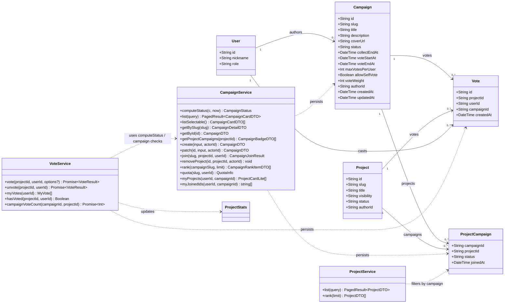
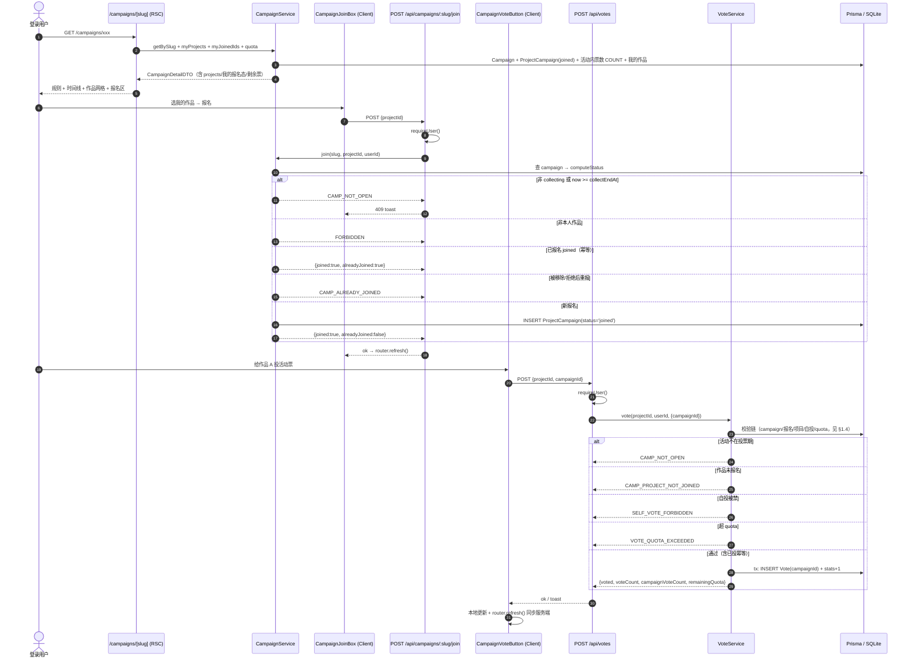
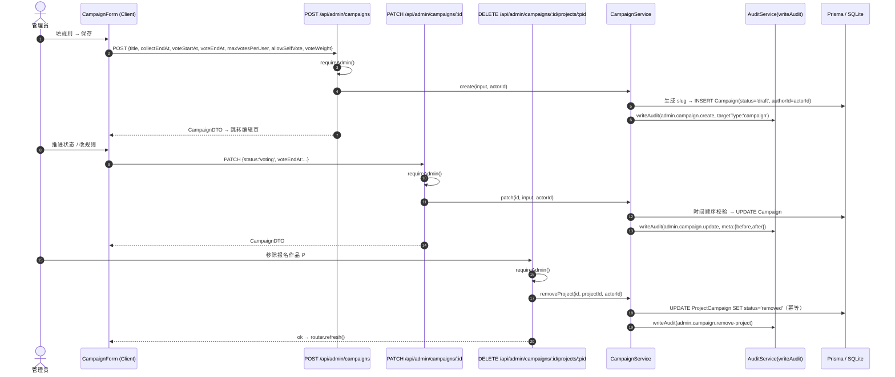
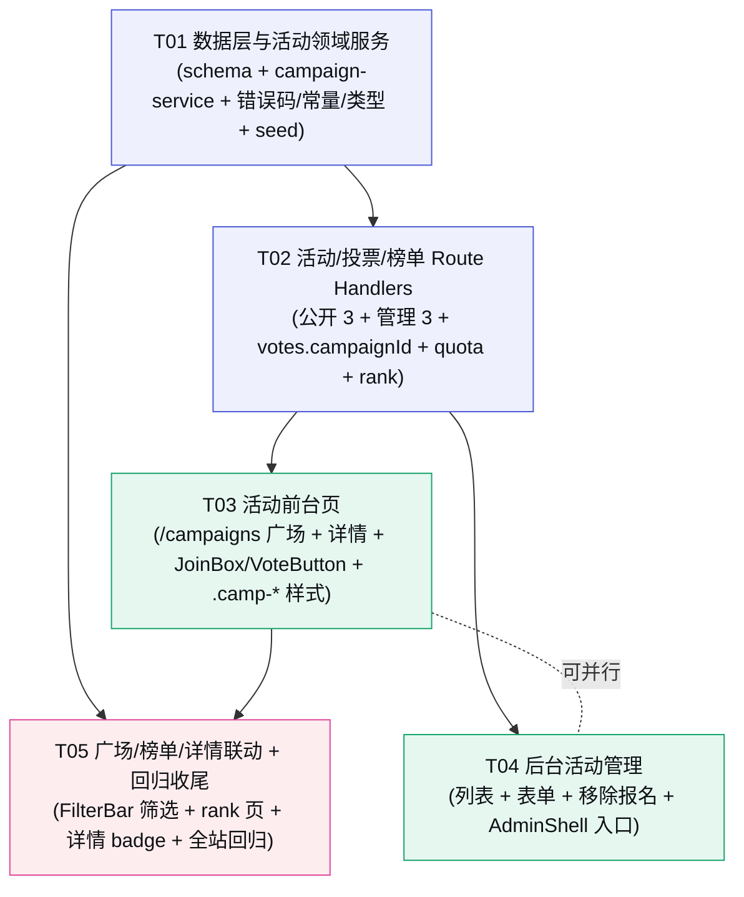

# Kernel · 创意种子 — P1 增量设计 · 活动 Campaign 模块

> 架构师：高见远　|　阶段：**P1 · 社区闭环（增量）**　|　运行形态：**本地 Node.js 轻量桩（非生产部署）**
>
> P1 目标（对齐 `docs/04-实施路线图.md`）：**能登录、能投票、能上榜、能办活动**。本文档只覆盖**活动 Campaign 模块**（投票/登录/鉴权/排行榜/后台管理已在既有轮次交付）。
>
> 前置依赖：P0（上传/沙箱/过期/生命周期）+ P1 既有（登录/鉴权/投票/排行榜）+ P2（后台管理/审计）已交付。
> 本文档是**增量设计**，只描述「在现有代码上新增/修改什么」，已存在的能力不再重复描述。
>
> 设计基准：`docs/P0-架构与任务分解.md`（分层单体/文件结构/共享知识/约束）· `docs/P2-后台管理设计.md`（增量设计体例/后台模式）· `docs/03-数据模型与API.md` §2（Campaign/ProjectCampaign/Vote 裁剪源）§3.2/3.3/3.4（活动/投票/榜单 API 裁剪源）
> 视觉真源：`DESIGN.md` + `prototype/Kernel-创意种子-优化版.html`（`#view-campaign` 活动广场 / `#view-campaign-form` 活动表单 / `#view-rank` 活动榜 / 详情页活动 badge）

---

## 〇、本轮范围锁定（先划边界，避免蔓延）

### 做（P1 活动模块 In Scope）

| 能力 | 说明 |
|------|------|
| 数据层 | `Campaign` + `ProjectCampaign` 两表；`Vote.campaignId` 可空扩展（兼容全站赞）；关联关系与索引补全 |
| 活动 API | 公开 `GET /api/campaigns`、`GET /api/campaigns/:slug`、`POST /api/campaigns/:slug/join`；管理 `POST /api/admin/campaigns`、`PATCH /api/admin/campaigns/:id`、`DELETE /api/admin/campaigns/:id/projects/:projectId`（移除/拒绝报名） |
| 投票关联活动 | `POST /api/votes` 支持 `body.campaignId`（可选）；新增 `GET /api/votes/quota?campaign=`；**不带 campaignId 保持现有全站赞行为完全不变** |
| 活动榜 | 榜单页支持 `?scope=campaign&campaign=slug` 活动内排名；新增轻量 `GET /api/rank` |
| 活动前台页 | `/campaigns` 活动广场 + `/campaigns/[slug]` 活动详情（规则/时间线/已报名作品/报名/投票引导） |
| 后台活动管理 | `/admin/campaigns` 列表 + 新建/编辑表单 + 移除报名作品，复用 AdminShell/Table/ConfirmDialog |
| 广场联动 | `PlazaFilterBar` 加活动筛选（`?campaign=slug`，仅投票中/已结束活动可筛）；作品详情页显示所属活动 badge |
| 审计 | 后台活动写操作统一 `writeAudit(admin.campaign.*)` |

### 不做（Out of Scope，推后续轮次）

活动成绩导出 xlsx（`GET /api/admin/campaigns/:id/export`）· 活动封面图片上传（本轮用确定性渐变占位）· 评委加权计票差异化（`voteWeight` 字段落库但本轮恒 1）· 报名审核流（`requireAudit`/`rejected` 前端流程）· 活动大屏 · 结果可见性配置（`resultVisible`）· 活动类型（线下/线上）字段。

---

## 一、增量设计要点

### 1.1 总体思路与难点

| # | 难点 | 本轮解法 |
|---|------|--------|
| D1 | **活动状态随时间自动推进，但不引入 cron**（本地桩无队列，cron 漂移会让写操作读到过期状态） | **懒计算 effective status**：`lib/campaign-service.ts` 提供纯函数 `computeStatus(campaign, now)`，所有**展示与写操作校验**统一用它；DB `status` 只存「管理员设定的状态」，时间窗到点即自动切到投票/结束，无需定时任务 |
| D2 | **`Vote` 唯一约束与「活动票 + 全站赞」并存**（SQLite 的 UNIQUE 对 NULL 不生效，`@@unique([projectId,userId,campaignId])` 会破坏全站赞幂等） | **不改唯一约束**，沿用 `@@unique([projectId,userId])`：一用户对一作品**一生一票**，该票可归属某活动（campaignId=X）或全站（null）。活动票同时计入 `ProjectStats.voteCount`（作品总票），活动内票数用 `COUNT(Vote where campaignId)` **实时聚合**，不维护冗余计数器 |
| D3 | **quota 并发安全**（maxVotesPerUser 跨作品累计，SQLite 无部分唯一索引可硬约束） | 「计数检查 + 插入 + stats 递增」放**同一交互事务**；极端并发最多超 1 票（本地桩可接受），⬆️ 生产用 Redis INCR 或部分唯一索引兜底 |
| D4 | **报名去重幂等**（重复报名不报错，对齐 vote-service「重复操作不报错」铁律） | `@@id([campaignId, projectId])` 兜底唯一；已报名（joined）重复报名返回 `200 {joined:true, alreadyJoined:true}`；被移除/拒绝（removed/rejected）后重复报名返回 `409 CAMP_ALREADY_JOINED` |
| D5 | **避免破坏现有投票/榜单消费方** | `vote()` 签名改为 `vote(projectId, userId, options?: { campaignId })`，`campaignId` 缺省时**代码路径与现在完全一致**；`VoteResult` 只做**加法**（新增可选 `campaignVoteCount` / `remainingQuota`）；`DELETE /api/votes/:projectId` 不改（按 projectId+userId 删票，活动内票数自然减少） |
| D6 | **活动封面无上传链路** | 复用 `lib/cover.ts` 的确定性渐变思路，新增 `buildCampaignCoverSvg(slug, title)`，走既有 `/api/covers/[file]` 路由输出；同一活动每次渲染一致，零新增依赖 |
| D7 | **活动 slug 路由安全** | `Campaign.slug` 独立命名空间（`/campaigns/[slug]`），与 8 位 Base58 作品短码不冲突；格式 `^[a-z0-9][a-z0-9-]{1,31}$`，保留词复用 `RESERVED_SLUGS` 校验（见 §八 Q1） |

### 1.2 Prisma Schema（增量 · SQLite 兼容）

**全部沿用 P0 既定 SQLite 降级手法**：无 enum（String + 常量）、无 `@db.*`、无 `BigInt`、`Json→String`。

#### Campaign（⭐ 新增）

| 字段 | 类型 | 说明 |
|------|------|------|
| `id` | String @id @default(cuid()) | |
| `slug` | String @unique | 路由标识：小写字母数字连字符，见 §八 Q1 |
| `title` | String | 必填，≤60 字（应用层 `MAX_CAMPAIGN_TITLE_LEN`） |
| `description` | String? | ≤2000 字 |
| `coverUrl` | String? | 空则前端渐变占位 |
| `status` | String @default("draft") | `draft \| collecting \| voting \| ended`（`CAMPAIGN_STATUS` 常量） |
| `collectEndAt` | DateTime? | 作品征集/报名截止 |
| `voteStartAt` | DateTime? | 投票开始（可空；空视为与 collectEndAt 同刻） |
| `voteEndAt` | DateTime? | 投票结束 |
| `maxVotesPerUser` | Int @default(3) | 每人限投票数 |
| `allowSelfVote` | Boolean @default(true) | 是否允许投自己 |
| `voteWeight` | Int @default(1) | 评委加权（本轮恒 1，字段落库供后续） |
| `authorId` → `author` | String → User | 创建管理员 |
| `createdAt` / `updatedAt` | DateTime | `updatedAt` 与 Project 等模型一致（§八 Q5） |
| 关系 | `projects ProjectCampaign[]`、`votes Vote[]` | |
| 索引 | `@@index([status, createdAt])`（广场按状态+时间）`@@index([authorId])` | |

#### ProjectCampaign（⭐ 新增）

| 字段 | 类型 | 说明 |
|------|------|------|
| `campaignId` / `projectId` | String | 复合主键 |
| `status` | String @default("joined") | `joined \| rejected \| removed`（`PROJECT_CAMPAIGN_STATUS`） |
| `joinedAt` | DateTime @default(now()) | 报名时间（活动榜同票数时按此排序） |
| 关系 | `campaign` / `project` 均 `onDelete: Cascade` | 活动/作品删除时级联清理 |
| 索引 | `@@id([campaignId, projectId])`、`@@index([projectId])`（作品详情 badge）、`@@index([campaignId, status])`（活动报名列表） | |

#### Vote（修改 · 纯加法）

| 变更 | 说明 |
|------|------|
| `+ campaignId String?` | 该票归属活动；**null = 全站赞**（兼容现有行为） |
| `+ campaign Campaign? @relation(...)` | 关联活动 |
| `+ @@index([campaignId])` | 活动内票数 COUNT / 活动榜查询 |
| ~~唯一约束~~ | **不改**：沿用 `@@unique([projectId, userId])`（见 D2） |

#### User（修改 · 纯加法）

`+ campaigns Campaign[]`（作者关系）。

> ⬆️ 切 Postgres 还原清单：无额外动作（本模块未引入 enum/BigInt/Json 新字段）；恢复 docs/03 的 `ResultVisibility`/`CampaignStatus` enum 时，`status` 已是同名字符串可平滑转换。

### 1.3 活动状态机（draft → collecting → voting → ended）

**核心约定：展示与写操作一律使用 `computeStatus(campaign, now)` 的返回值，DB `status` 仅作「管理员设定值」。**

```
computeStatus(c, now):
  1. c.status === 'ended'          → 'ended'   // 手动结束为终态，不自动复活
  2. c.status === 'draft'          → 'draft'   // 草稿不自动推进，不对公开侧暴露
  3. c.status === 'collecting':
       voteStartAt 为空 → 视为 = collectEndAt
       now >= collectEndAt 且 now >= voteStartAt → 'voting'
       否则 → 'collecting'
  4. c.status === 'voting':
       now >= voteEndAt → 'ended'
       否则 → 'voting'
```

| 状态 | 可报名 | 可投票 | 公开可见（广场/详情） | 说明 |
|------|:---:|:---:|:---:|------|
| `draft` | ✗ | ✗ | ✗（详情 404） | 创建后初始态；仅后台可见 |
| `collecting` | ✅（且 `now < collectEndAt`） | ✗ | ✅ | 征集期 |
| `voting` | ✗ | ✅（且 `now < voteEndAt`） | ✅ | 投票期 |
| `ended` | ✗ | ✗ | ✅ | 终态，可看结果 |

**手动推进**（管理员 PATCH `status`）：
- 允许任意取值，但写操作仍受 `computeStatus` 时间窗**双重校验**兜底（例如管理员把 status 设为 `collecting` 但 `collectEndAt` 已过 → 实际对外仍是 voting/ended）。
- 典型用法：draft→collecting 开始征集；collecting→voting 提前开投；voting→ended 提前结束；任意→draft 回草稿编辑。
- **不引入 cron**：到点自动进投票/结束由 `computeStatus` 天然完成。

### 1.4 投票 quota 检查逻辑（跨作品累计 + 并发安全）

`vote(projectId, userId, { campaignId })` 带 campaignId 时的校验链（顺序即优先级）：

```
① campaign = findUnique(campaignId)
     不存在                          → 404 CAMP_NOT_FOUND
② computeStatus(campaign) !== 'voting'
   或 now >= voteEndAt               → 409 CAMP_NOT_OPEN（附 extra: {status}）
③ projectCampaign(campaignId, projectId) 不存在
   或 status !== 'joined'            → 409 CAMP_PROJECT_NOT_JOINED
④ assertVotable(projectId)（复用现有）  → 404 NOT_FOUND / 410 GONE_ARCHIVED
⑤ !allowSelfVote && project.authorId === userId
                                     → 403 SELF_VOTE_FORBIDDEN
⑥ used = COUNT(Vote where userId + campaignId)
     used >= maxVotesPerUser         → 409 VOTE_QUOTA_EXCEEDED（附 extra: {max, used}）
⑦ 已存在 (projectId, userId) 的票    → 幂等返回当前状态（不重复计票）
⑧ 交互事务：
      INSERT Vote { projectId, userId, campaignId }
      ProjectStats.voteCount + 1     // 活动票计入作品总票（§七 7.6）
   P2002 唯一冲突 → 幂等返回
```

- **quota 口径**：同一活动内、同一用户、**跨作品累计**有效投票数（`COUNT(Vote where userId AND campaignId)`），与 `maxVotesPerUser` 比较。
- **并发安全**：⑧ 用交互事务把「⑥计数检查 + 插入」合并；SQLite 本地并发极低，极端情况下最多超 1 票，可接受。⬆️ 生产替换为 Redis `INCR userId:campaignId` 或「活动内每用户最多 N 条」的部分唯一索引。
- **取消投票**：`DELETE /api/votes/:projectId` **不改**——按 (projectId, userId) 删除该票并 `ProjectStats.voteCount - 1`（下限 0）；活动内票数是 COUNT 实时聚合，删除后自然回落。活动页取消后 `router.refresh()` 同步。
- **移除报名后的存量票**：管理员移除作品只**阻止新投票**（③ 校验失败），已投的票保留、仍计入活动累计（本轮不追回，§八 Q8）。

### 1.5 活动 API 契约

统一前缀 `/api`，统一响应体 `{ok, data, meta}`；`message` 中文面向用户；`code` 大写下划线。**全部走既有 `ok()/fail()/toErrorResponse()`**，route 层禁止裸 `NextResponse.json()`。

#### 公开

| 端点 | 鉴权 | 入参 | 出参 | 错误码 |
|------|------|------|------|--------|
| `GET /api/campaigns` | 公开 | `status?`（单值过滤，缺省全部非草稿）、`page`、`pageSize`（默认 12/上限 48）、`sort`（默认 `new`=createdAt desc） | `data.items: CampaignCardDTO[]`（含 `status`(effective)/`projectCount`(joined 作品数)/`voteCount`(活动内 COUNT)），`meta:{page,pageSize,total}` | — |
| `GET /api/campaigns/:slug` | 公开 | 路径 slug | `data: CampaignDetailDTO`（规则 + 时间线 + `projects: CampaignProjectItem[]`（joined，按活动内票数 desc、joinedAt asc）） | 404 `CAMP_NOT_FOUND`（草稿/不存在统一 404，不泄漏存在性） |
| `POST /api/campaigns/:slug/join` | 登录 | `{ projectId }` | `data: { joined:true, alreadyJoined:boolean, projectCount }` | 401 `NOT_LOGGED_IN` / 404 `CAMP_NOT_FOUND` / 409 `CAMP_NOT_OPEN` / 404 `NOT_FOUND`(作品不存在或不可见) / 403 `FORBIDDEN`(非本人作品) / 409 `CAMP_ALREADY_JOINED`(removed/rejected 后重复报名) |

#### 管理（全部 `requireAdmin()` 首行鉴权）

| 端点 | 鉴权 | 入参 | 出参 | 错误码 |
|------|------|------|------|--------|
| `POST /api/admin/campaigns` | ADMIN | `{ title, description?, coverUrl?, slug?, collectEndAt?, voteStartAt?, voteEndAt?, maxVotesPerUser?, allowSelfVote?, voteWeight? }` → 初始 `status='draft'`、`authorId=session.userId` | `data: CampaignDTO` | 400 `VALIDATION_FAILED` / 401 / 403 |
| `PATCH /api/admin/campaigns/:id` | ADMIN | 上述任意规则字段 + `status?`（draft/collecting/voting/ended） | `data: CampaignDTO` | 400 `VALIDATION_FAILED`（含时间顺序校验）/ 404 `CAMP_NOT_FOUND` / 401 / 403 |
| `DELETE /api/admin/campaigns/:id/projects/:projectId` | ADMIN | 路径参数 | `data: { removed:true }`（幂等） | 404 `CAMP_NOT_FOUND` / 404 `NOT_FOUND`(未报名) / 401 / 403 |

**时间顺序校验**（create/patch 共用）：`collectEndAt <= voteStartAt <= voteEndAt`（voteStartAt 可空，空则忽略该比较）；`voteEndAt > collectEndAt`。均为 ISO 8601 UTC 字符串入参。

#### 投票扩展 + 榜单

| 端点 | 鉴权 | 入参 | 出参 | 错误码 |
|------|------|------|------|--------|
| `POST /api/votes`（修改） | 登录 | `{ projectId, campaignId? }` | 不带 campaignId：`VoteResult`（现有，行为不变）；带：`VoteResult + campaignVoteCount + remainingQuota` | 新增：404 `CAMP_NOT_FOUND` / 409 `CAMP_NOT_OPEN` / 409 `CAMP_PROJECT_NOT_JOINED` / 403 `SELF_VOTE_FORBIDDEN` / 409 `VOTE_QUOTA_EXCEEDED`；沿用 401 / 404 / 410 |
| `GET /api/votes/quota?campaign=`（⭐新增） | 登录 | query `campaign` = 活动 **slug**（与广场/榜单参数一致） | `data: { campaignId, slug, maxVotesPerUser, used, remaining }` | 401 `NOT_LOGGED_IN` / 404 `CAMP_NOT_FOUND` |
| `GET /api/rank?scope=global\|campaign&campaign=&limit=`（⭐新增，轻量） | 公开 | `scope`（缺省 global）、`campaign`（scope=campaign 时必填，**slug**）、`limit`（默认 12/上限 48） | `scope=global`：现有 `ProjectDTO[]`（按 ProjectStats.voteCount，含活动票）；`scope=campaign`：`CampaignRankItemDTO[]`（`{rank, project, campaignVoteCount, joinedAt}`） | 404 `CAMP_NOT_FOUND` / 400 `VALIDATION_FAILED` |

> **榜单数据通路**：页面首屏 = Server Component **直调 `campaignService.rank()`**（不 fetch 自家 API，对齐 §7.5 约定）；`GET /api/rank` 仅作对外契约/未来客户端场景，共用同一 service 函数。

### 1.6 页面与组件结构

#### 前台

```
src/app/campaigns/page.tsx           # 活动广场（RSC）：searchParams(status/page) → campaignService.list()
src/app/campaigns/[slug]/page.tsx    # 活动详情（RSC）：规则 + 时间线 + 作品网格 + 报名区 + 投票引导
src/components/campaign/
├── index.ts                         # 桶导出
├── CampaignCard.tsx                 # 活动卡片（camp-cover + 状态徽章 + 标题 + 作品数/票数）
├── CampaignGrid.tsx                 # 响应式网格（复用 .camp-grid 样式）
├── CampaignTimeline.tsx             # 时间线（.camp-flow：报名→征集→投票→结束，含 done/active 态）
├── CampaignJoinBox.tsx              # 'use client'：我的可报名作品下拉 + 报名按钮 → POST join
└── CampaignVoteButton.tsx           # 'use client'：活动内投票/取消 → POST /api/votes {campaignId} / DELETE → 刷新
```

- **活动详情页 SSR 数据**（一次取全）：`campaignService.getBySlug()` + 登录态下 `myProjects`（本人 ACTIVE 且未报名该活动的作品，供 JoinBox）+ `myJoinedIds`（本人已报名作品，标记已报名态）+ `quota`（本人剩余票数）。
- **投票交互**：作品网格每件已报名作品显示「活动内票数 + CampaignVoteButton」；未登录点击跳 `/login?next=/campaigns/{slug}`；超 quota 前端先禁（`remaining<=0`），服务端仍二次校验。

#### 后台（复用 P2 模式）

```
src/app/admin/campaigns/page.tsx             # 活动列表（RSC 首屏 + CampaignsTable client）
src/app/admin/campaigns/new/page.tsx         # 新建表单页（RSC 壳 + CampaignForm client）
src/app/admin/campaigns/[id]/edit/page.tsx   # 编辑页（RSC 直调 campaignService.getById + CampaignForm）
src/components/admin/
├── tables/CampaignsTable.tsx                # 活动列表表格：名称/状态/作品数/票数/规则/周期/操作（编辑）
└── campaigns/CampaignForm.tsx               # 建/改表单（client）：slug/标题/简介/三时间/投票规则/自投/加权 + 状态推进 Select
```

- **编辑页同时承载「报名作品管理」**：已报名作品列表 + 每行「移除」按钮（ConfirmDialog → DELETE 端点），避免另开页面。
- 列表列对齐原型 admin 表格：活动名称 / 状态（Badge）/ 关联作品 / 票数 / 投票规则 / 周期 / 操作。

#### 联动（最小变更）

- `PlazaFilterBar`：新增活动筛选（tag 行或 Select）——选项来自 `campaignService.listSelectable()`（**effective voting/ended** 的活动，对齐「仅投票中/已结束可筛」）；选择写回 `?campaign=slug`。
- `projectService.list()`：新增 `campaign?: string`（slug）过滤 → `where.campaigns = { some: { campaign: { slug }, status: 'joined' } }`。
- 作品详情页 `/w/[slug]`：`campaignService.getProjectCampaigns(projectId)` → 面包屑/标题下渲染活动 badge（链接到 `/campaigns/{slug}`；有效状态非 draft 才显示）。
- `Nav`：`/campaign`（disabled）改为 `/campaigns`（启用）。
- `rank/page.tsx`：支持 `?scope=campaign&campaign=slug`，调 `campaignService.rank()`；缺省保持总榜。

---

## 二、文件列表及相对路径

> ⭐ = 新增；其余为修改。全部相对项目根。

```
prisma/
├── schema.prisma                   # 修改：+Campaign +ProjectCampaign +Vote.campaignId +User.campaigns（§1.2）
├── seed.ts                         # 修改：+1 个演示活动（collecting）+ 报名 1~2 件 seed 作品（验收非空）

src/
├── lib/
│   ├── constants.ts                # 修改：+CAMPAIGN_STATUS / PROJECT_CAMPAIGN_STATUS / AUDIT_ACTION 扩展 / 活动长度限额 / CAMPAIGN_SLUG_PATTERN / 默认值常量
│   ├── response.ts                 # 修改：+6 错误码（CAMP_NOT_FOUND/CAMP_NOT_OPEN/CAMP_ALREADY_JOINED/CAMP_PROJECT_NOT_JOINED/VOTE_QUOTA_EXCEEDED/SELF_VOTE_FORBIDDEN）+ STATUS_MAP + DEFAULT_MESSAGE
│   ├── types.ts                    # 修改：+Campaign DTO 族（CampaignDTO/CampaignCardDTO/CampaignDetailDTO/CampaignProjectItem/CampaignRankItemDTO/CampaignJoinResult/CampaignInput/QuotaInfo）+ VoteResult 加法扩展 + AuditLogInput.targetType 加 'campaign'
│   ├── campaign-service.ts         # ⭐ 新增：活动领域服务（computeStatus/list/listSelectable/getBySlug/getById/getProjectCampaigns/create/patch/join/removeProject/rank/quota/myProjects/myJoinedIds）
│   ├── vote-service.ts             # 修改：vote() 支持 campaignId 校验链 + quota + 活动内票数；unvote/myVotes/hasVoted 不变
│   ├── project-service.ts          # 修改：list() 支持 campaign(slug) 过滤（广场联动）
│   └── cover.ts                    # 修改：+buildCampaignCoverSvg(slug,title)（确定性渐变，复用既有 /api/covers/[file] 路由）
│
├── app/api/
│   ├── campaigns/route.ts          # ⭐ 新增：GET 活动列表
│   ├── campaigns/[slug]/route.ts   # ⭐ 新增：GET 活动详情
│   ├── campaigns/[slug]/join/route.ts  # ⭐ 新增：POST 报名
│   ├── admin/campaigns/route.ts    # ⭐ 新增：POST 创建活动
│   ├── admin/campaigns/[id]/route.ts # ⭐ 新增：PATCH 改规则/推进状态
│   ├── admin/campaigns/[id]/projects/[projectId]/route.ts  # ⭐ 新增：DELETE 移除/拒绝报名
│   ├── votes/route.ts              # 修改：POST 支持 body.campaignId
│   ├── votes/quota/route.ts        # ⭐ 新增：GET 剩余票数
│   └── rank/route.ts               # ⭐ 新增：GET scope=global|campaign
│
├── app/
│   ├── campaigns/page.tsx          # ⭐ 新增：活动广场（RSC）
│   ├── campaigns/[slug]/page.tsx   # ⭐ 新增：活动详情（RSC）
│   ├── (feed)/page.tsx             # 修改：广场支持 ?campaign= 过滤 + 传可筛活动列表给 FilterBar
│   ├── w/[slug]/page.tsx           # 修改：所属活动 badge
│   ├── rank/page.tsx               # 修改：活动榜筛选（scope/campaign）
│   └── admin/campaigns/
│       ├── page.tsx                # ⭐ 新增：活动管理列表
│       ├── new/page.tsx            # ⭐ 新增：新建活动
│       └── [id]/edit/page.tsx      # ⭐ 新增：编辑活动 + 报名作品管理
│
├── components/
│   ├── campaign/                   # ⭐ 新增 6 个：index / CampaignCard / CampaignGrid / CampaignTimeline / CampaignJoinBox / CampaignVoteButton
│   ├── project/PlazaFilterBar.tsx  # 修改：活动筛选
│   ├── admin/AdminShell.tsx        # 修改：侧栏 +「活动管理」
│   ├── admin/tables/CampaignsTable.tsx    # ⭐ 新增：活动列表表格（client）
│   ├── admin/campaigns/CampaignForm.tsx   # ⭐ 新增：建/改表单（client）
│   └── ui/Nav.tsx                  # 修改：/campaigns 启用
│
└── styles/
    └── globals.css                 # 修改：移植 .camp-* 全套 + .badge--campaign（prototype 625-678 行直译，全 token 化零 hex）+ 活动榜筛选小样式
```

**计数**：新增 ≈ 20 · 修改 ≈ 15 ≈ **35 个文件**。

---

## 三、数据结构与接口



**关键 DTO**（`lib/types.ts` 新增，均为纯类型，时间字段 ISO 8601 UTC）：

| 类型 | 字段 |
|------|------|
| `CampaignDTO` | `id / slug / title / description / coverUrl / status(effective) / storedStatus / collectEndAt / voteStartAt / voteEndAt / maxVotesPerUser / allowSelfVote / voteWeight / authorId / createdAt / updatedAt` |
| `CampaignCardDTO` | = `CampaignDTO` + `projectCount`(joined) + `voteCount`(活动内 COUNT) |
| `CampaignDetailDTO` | = `CampaignCardDTO` + `projects: CampaignProjectItem[]` |
| `CampaignProjectItem` | `{ project: ProjectCardLite, campaignVoteCount, joinedAt }`；`ProjectCardLite = {id, slug, title, summary, coverUrl, authorName, detailUrl, voteCount(全站)}` |
| `CampaignRankItemDTO` | `{ rank, project: ProjectCardLite, campaignVoteCount, joinedAt }` |
| `CampaignJoinResult` | `{ joined: true, alreadyJoined: boolean, projectCount }` |
| `CampaignInput` | `{ title, description?, coverUrl?, slug?, collectEndAt?, voteStartAt?, voteEndAt?, maxVotesPerUser?, allowSelfVote?, voteWeight?, status? }` |
| `QuotaInfo` | `{ campaignId, slug, maxVotesPerUser, used, remaining }` |
| `VoteResult`（扩展） | 现有 `{voted, voteCount}` + 可选 `{campaignVoteCount?, remainingQuota?}`（带 campaignId 时返回） |

---

## 四、程序调用流程

### 4.1 报名 + 活动投票（前台主链路）



### 4.2 后台创建 / 推进 / 移除报名



---

## 五、任务分解

> **分组原则**：按「层次 + 可独立验收」分块，共 **5 个主任务块（T01–T05）**，每块 ≥ 3 文件。
> 本轮为增量模块、无新增配置文件/依赖，「项目基础设施」语义由 **T01（数据层与领域服务）** 承担（对齐 P2 体例）。
> 主理人建议的 T1–T7 全部被覆盖，映射见 §5.5。

### T01 · 数据层与活动领域服务

| 项 | 内容 |
|----|------|
| **优先级** | P0（阻塞全部） |
| **依赖** | 无（在 P0/P1/P2 既有代码之上） |
| **产出文件** | `prisma/schema.prisma`（+Campaign/ProjectCampaign/Vote.campaignId/User.campaigns）· `prisma/seed.ts`（+演示活动与报名）· `src/lib/constants.ts` · `src/lib/response.ts` · `src/lib/types.ts` · `src/lib/campaign-service.ts`（⭐）· `src/lib/project-service.ts`（list 支持 campaign 过滤）· `src/lib/cover.ts`（buildCampaignCoverSvg） |
| **要点** | ① Schema 按 §1.2 写，SQLite 兼容（String 枚举/无 BigInt/Json）；`Vote` 只加 campaignId + 索引，**不动唯一约束**<br/>② `computeStatus` 纯函数 + 全部校验规则收敛在 campaign-service（写操作双重校验口径见 §1.3/1.4）<br/>③ `CampaignService` 方法覆盖前台/后台/联动全部读与写；`vote-service` 的校验链只调 campaign-service 暴露的查询（不重复写 prisma）<br/>④ 新错误码 6 个进 `STATUS_MAP` + 中文 `DEFAULT_MESSAGE`<br/>⑤ `seed.ts` 增加 1 个 collecting 演示活动并报名 1~2 件 seed 作品，保证 T02 起即可验收 |
| **验收点** | ✅ `npm run db:push && npm run db:seed` 成功；Prisma Studio 可见 Campaign/ProjectCampaign/Vote.campaignId<br/>✅ 单测 `computeStatus`：collecting 到期→voting、voting 到期→ended、draft/ended 不自动推进<br/>✅ `join` 幂等：重复报名返回 alreadyJoined=true；removed 后重报抛 CAMP_ALREADY_JOINED<br/>✅ `list` 带 campaign 过滤只返回该活动 joined 作品 |

### T02 · 活动 / 投票 / 榜单 Route Handlers（接口层）

| 项 | 内容 |
|----|------|
| **优先级** | P0 |
| **依赖** | T01 |
| **产出文件** | `src/app/api/campaigns/route.ts` · `src/app/api/campaigns/[slug]/route.ts` · `src/app/api/campaigns/[slug]/join/route.ts` · `src/app/api/admin/campaigns/route.ts` · `src/app/api/admin/campaigns/[id]/route.ts` · `src/app/api/admin/campaigns/[id]/projects/[projectId]/route.ts` · `src/app/api/votes/route.ts`（修改）· `src/app/api/votes/quota/route.ts` · `src/app/api/rank/route.ts` |
| **要点** | ① 每个 route 只做「解析入参 → 鉴权 → 调 service → ok()/toErrorResponse()」，业务规则全部在 T01 的 service<br/>② `/api/admin/campaigns/*` 首行 `requireAdmin()`；公开端点对 draft 一律 404（不泄漏存在性）<br/>③ `POST /api/votes` 兼容：无 campaignId 走原路径；有 campaignId 走 §1.4 校验链<br/>④ 时间入参一律 ISO 8601 UTC 字符串；PATCH 做时间顺序校验（§1.5）<br/>⑤ admin 写操作写 AuditLog（`admin.campaign.*`） |
| **验收点** | ✅ curl 全链路：创建→列表→详情→报名（幂等两次）→PATCH 推进→DELETE 移除报名，错误码与契约一致<br/>✅ 无会话访问 admin 端点 401；USER 会话 403；ADMIN 会话 200<br/>✅ 带 campaignId 投票各分支（未开始/未报名/自投/quota/幂等）正确；不带 campaignId 行为与改造前完全一致（回归）<br/>✅ `GET /api/votes/quota?campaign=xx` 返回 used/remaining 与 DB 一致<br/>✅ `GET /api/rank?scope=campaign` 排序 = 活动内票数 desc、joinedAt asc |

### T03 · 活动前台页（活动广场 + 详情 + 报名/投票交互）

| 项 | 内容 |
|----|------|
| **优先级** | P1 |
| **依赖** | T01 · T02 |
| **产出文件** | `src/app/campaigns/page.tsx` · `src/app/campaigns/[slug]/page.tsx` · `src/components/campaign/index.ts` · `CampaignCard.tsx` · `CampaignGrid.tsx` · `CampaignTimeline.tsx` · `CampaignJoinBox.tsx` · `CampaignVoteButton.tsx` · `src/components/ui/Nav.tsx`（/campaigns 启用）· `src/styles/globals.css`（.camp-* 移植） |
| **要点** | ① 广场对齐原型 `#view-campaign`：pg-head + 状态/时间筛选 + 卡片网格；只显示非草稿（effective）<br/>② 详情页对齐原型 `renderCampaignDetail`：状态徽章 + 标题 + CTA + 简介 + camp-flow 时间线 + 数字卡（作品数/累计票）+ 已报名作品网格（每件含活动内票数 + CampaignVoteButton）<br/>③ JoinBox：登录后 SSR 注入「我的可报名作品」；未登录点击报名 → 跳登录（next 回跳）；报名后 refresh<br/>④ VoteButton：未登录跳登录；超 quota 前端禁用；投票/取消走 T02 端点，成功后本地更新 + refresh<br/>⑤ globals.css 从 prototype 625-678 行直译 `.camp-*`，**全 token 化（零 hex）**，暗色主题可读；`.badge--campaign` 一并落地<br/>⑥ Nav：活动入口启用（`/campaigns`） |
| **验收点** | ✅ `/campaigns` 展示演示活动卡片（状态/作品数/票数正确）；draft 不出现在广场<br/>✅ `/campaigns/[slug]` 时间线按当前状态高亮；作品网格按活动内票数排序<br/>✅ 登录后报名自己作品 → 网格出现该作品并标记「已报名」；重复报名幂等<br/>✅ 活动投票全交互：投票/取消/剩余票数实时正确；未登录与超 quota 引导正确<br/>✅ 375 / 768 / 1280 三档无横向滚动；暗色无硬编码色残留 |

### T04 · 后台活动管理

| 项 | 内容 |
|----|------|
| **优先级** | P1 |
| **依赖** | T01 · T02 |
| **产出文件** | `src/app/admin/campaigns/page.tsx` · `new/page.tsx` · `[id]/edit/page.tsx` · `src/components/admin/tables/CampaignsTable.tsx` · `src/components/admin/campaigns/CampaignForm.tsx` · `src/components/admin/AdminShell.tsx`（侧栏 +活动管理） |
| **要点** | ① 页面层复用 P2 门禁（admin/layout 已统一鉴权），RSC 首屏直调 service，交互走 `/api/admin/campaigns/*`<br/>② CampaignsTable：列对齐原型 admin 表格（名称/状态 Badge/作品数/票数/规则/周期/操作=编辑）；状态 → Badge tone 映射（draft→archived 弱化、collecting→campaign、voting→live、ended→archived）<br/>③ CampaignForm：slug（可留空自动生成）/标题/简介/collectEndAt/voteStartAt/voteEndAt（datetime-local）/每人限票（1/3/5）/允许自投/评委加权 + 状态推进 Select；保存走 POST/PATCH<br/>④ 编辑页含「报名作品管理」：已报名列表 + 行内「移除」（ConfirmDialog → DELETE 端点）<br/>⑤ 每次写操作 AuditLog 留痕（admin.campaign.create/update/remove-project） |
| **验收点** | ✅ admin 侧栏出现「活动管理」，非 ADMIN 不可见/不可达<br/>✅ 建活动 → 编辑规则 → 推进状态 → 列表状态正确；时间顺序非法被拒（400）<br/>✅ 移除报名作品后：前台不再显示该作品、投票接口拒绝新票；AuditLog 有 `admin.campaign.remove-project`<br/>✅ 复用 ConfirmDialog/Table/Pagination 无样式回归 |

### T05 · 广场/榜单/详情联动 + 回归收尾

| 项 | 内容 |
|----|------|
| **优先级** | P1 |
| **依赖** | T01 · T03 |
| **产出文件** | `src/components/project/PlazaFilterBar.tsx`（活动筛选）· `src/app/(feed)/page.tsx`（?campaign= 支持）· `src/app/rank/page.tsx`（活动榜筛选）· `src/app/w/[slug]/page.tsx`（活动 badge）· `src/styles/globals.css`（少量补充，尽量复用）· `prisma/seed.ts`（联调数据微调） |
| **要点** | ① PlazaFilterBar：新增活动筛选（选项 = `campaignService.listSelectable()`：effective voting/ended）；选择写回 `?campaign=slug`，与 q/sort/page 共存<br/>② 广场：`?campaign=slug` → `projectService.list({campaign})` 只显示该活动 joined 作品；无活动时不变<br/>③ rank 页：支持 `?scope=campaign&campaign=slug` → `campaignService.rank()`；缺省保持总榜；活动榜头展示活动名/截止时间<br/>④ 作品详情页：`getProjectCampaigns(projectId)` → 非 draft 活动 badge（≤2 个 +「+N」）链接 `/campaigns/{slug}`<br/>⑤ 全站回归：广场/详情/上传/登录/投票/总榜/后台不受影响；Nav 改动仅启用活动入口 |
| **验收点** | ✅ 广场按活动筛选只出该活动作品；无匹配时 EmptyState 引导<br/>✅ rank 页活动榜排序与活动详情页作品网格一致<br/>✅ 报名某活动的作品详情页出现活动 badge，点击进入活动详情<br/>✅ 全站三档宽度 + 暗色回归无布局错乱、无硬编码色残留 |

### 5.5 与主理人建议 T1–T7 的映射

| 主理人建议 | 归属任务 | 说明 |
|-----------|---------|------|
| T1 schema + service | **T01** | +constants/response/types/cover/seed/project-service 过滤（数据与领域层合并） |
| T2 活动 API | **T02** | 公开 3 端点 + 管理 3 端点 |
| T3 投票 campaign 扩展 + quota | **T02** | 校验链在 T01 领域层，route 层仅透传（与 T2 同属接口层，合并验收更高效） |
| T4 活动榜 | **T02**（/api/rank）+ **T05**（rank 页筛选） | API 契约在接口层，页面入口在联动收尾 |
| T5 活动广场 + 详情页 | **T03** | |
| T6 后台活动管理 | **T04** | |
| T7 广场筛选 + 收尾 | **T05** | |

> **合并理由**：7 个细任务里 T2/T3/T4 同属接口层且共享同一 service 校验链，合并为 T02 后每块 ≥ 6 文件、可独立验收；按「层次（数据→接口→页面→后台→联动）」重组为 5 块，T03/T04 可并行。

### 5.6 任务依赖图



**关键路径**：`T01 → T02 → T03 → T05`。T03 与 T04 在 T02 后可并行。

---

## 六、依赖包列表

**无新增依赖**。全部复用现有栈（Next.js 15 / Prisma / SQLite / 自写 ui 组件 / node:crypto 会话）。明确不装：任何图表/表格库、任何 UI 库、`exceljs`/`xlsx`（export 本轮不做）、Redis 客户端（quota 用交互事务兜底）。

---

## 七、共享知识（跨文件约定）

### 7.1 活动状态与时间窗校验约定
- **唯一权威 = `campaignService.computeStatus(campaign, now)`**：展示（广场/详情/后台列表）与写操作（join/vote）都使用它；DB `status` 仅是管理员设定值。
- `draft` 不对公开侧暴露（广场不展示、详情 404）；`ended` 为终态不自动复活。
- 写操作**双重校验**：join 要求 `computeStatus==='collecting'` **且** `now < collectEndAt`；vote 要求 `computeStatus==='voting'` **且** `now < voteEndAt`。
- 时间字段：DB 存 UTC `DateTime`，API 入参/出参一律 **ISO 8601 UTC 字符串**，前端按 Asia/Shanghai 展示（`formatDate/formatDateTime`）。
- 时间顺序约束：`collectEndAt <= voteStartAt(可空) <= voteEndAt`，create/patch 校验，违者 `VALIDATION_FAILED`。

### 7.2 投票 quota 口径
- **used = `COUNT(Vote where userId AND campaignId)`**（同一活动、同一用户、跨作品累计有效投票数）；`remaining = maxVotesPerUser - used`。
- 活动内某作品票数 = `COUNT(Vote where campaignId AND projectId)`，**实时聚合**，不维护冗余计数器（投票/取消后自动一致）。
- 并发安全：计数检查 + 插入在**同一交互事务**；极端并发最多超 1 票，本地桩可接受 ⬆️ 生产 Redis。

### 7.3 报名幂等约定
- 唯一性由 `@@id([campaignId, projectId])` 保证。
- `joined` 重复报名 → `200 {joined:true, alreadyJoined:true}`（对齐 vote-service「重复操作不报错」铁律）。
- `removed/rejected` 后重复报名 → `409 CAMP_ALREADY_JOINED`（管理员移除是处置动作，作者不可绕过重报）。

### 7.4 投票兼容性铁律
- `POST /api/votes` 不带 `campaignId` → 代码路径与现有完全一致（全站赞），回归时必须逐条验证。
- `@@unique([projectId, userId])` **不改**：一用户对一作品一生一票；活动票与全站赞互斥（作品详情页 VoteHero 的已投态覆盖两种票）。
- 取消投票 `DELETE /api/votes/:projectId` **不改**：按 (projectId,userId) 删票，活动内 COUNT 自然回落。
- `VoteResult` 只做加法扩展（`campaignVoteCount`/`remainingQuota`），现有消费方零改动。

### 7.5 错误码（新增 6 个，`response.ts` 收口）

| code | HTTP | 触发点 | 默认文案 |
|------|------|--------|---------|
| `CAMP_NOT_FOUND` | 404 | 活动不存在 / draft 详情 | 活动不存在或已下线 |
| `CAMP_NOT_OPEN` | 409 | 报名/投票窗口外（附 extra: status） | 活动当前不在报名/投票阶段 |
| `CAMP_ALREADY_JOINED` | 409 | removed/rejected 后重复报名 | 该作品已在活动中，无法重复报名 |
| `CAMP_PROJECT_NOT_JOINED` | 409 | 给未报名作品投票 | 该作品未报名此活动，无法投票 |
| `VOTE_QUOTA_EXCEEDED` | 409 | 超 maxVotesPerUser（附 extra: max,used） | 本活动每人最多投 N 票，已达上限 |
| `SELF_VOTE_FORBIDDEN` | 403 | allowSelfVote=false 投自己 | 本活动不支持给自己投票 |

### 7.6 计票口径
- `ProjectStats.voteCount` = 该作品**全部**有效投票（全站赞 + 各活动票）→ 总榜/详情页/活动票都从它读总票数。
- 活动榜 = `Vote where campaignId` 的 COUNT（与 `ProjectStats` 无关）。
- 管理员移除报名：只阻止新投票，**存量票保留**（不追回，§八 Q8）。

### 7.7 AuditLog 约定（扩展）
- action 命名新增：`admin.campaign.create` / `admin.campaign.update` / `admin.campaign.remove-project`；targetType 新增 `campaign`，targetId 用 `Campaign.id`。
- meta 快照：`{ before, after, ... }` 由 `writeAudit` 统一序列化；写失败不阻断主流程。

### 7.8 页面/组件约定
- 活动前台页 = Server Component 直调 `campaignService`；交互（报名/投票/筛选）走 `/api/*`，成功后 `router.refresh()` 同步服务端口径。
- 后台页面复用 P2 门禁与组件（AdminShell/Table/ConfirmDialog/Pagination/Badge）；列表页 `pageSize` 默认 20/上限 100。
- `.camp-*` 样式从 prototype 直译，**全 token 化（零 hex）**；圆角 8/14/999px、字重 400/500/600、过渡 `--ease`。
- 数字（票数/作品数/剩余票）一律 `mono` + `tabular-nums`。
- 活动 slug 命名空间 `/campaigns/[slug]`；活动封面用 `buildCampaignCoverSvg` 确定性渐变占位。

### 7.9 沿用既有硬性约定
统一响应体 `{ok,data,meta}` · `message` 中文面向用户 · `code` 大写下划线 · 时间 ISO 8601 UTC · `node:fs` 仅 `storage.ts` · 无硬编码 hex · 日志 `[模块][动作] key=value` · 可访问性（focus-visible/aria-label/触摸目标 ≥44px）。

---

## 八、待明确事项（需主理人拍板）

> 每条均给**默认建议**，若无异议工程师按建议执行。

| # | 议题 | 我的建议（默认执行） | 影响面 |
|---|------|---------------------|--------|
| **Q1** | 活动 slug 生成方式？ | **表单可手动填，留空自动生成 `camp-{Base58 6位}`**（复用 nanoid）；格式 `^[a-z0-9][a-z0-9-]{1,31}$`，保留词复用 `RESERVED_SLUGS`。理由：中文标题无法可靠转英文 slug，手动可读 slug 更利于分享 | 低 |
| **Q2** | 活动封面怎么做（无上传链路）？ | **复用确定性渐变占位**：`cover.ts` 新增 `buildCampaignCoverSvg(slug,title)`，走既有 `/api/covers/[file]`；不做上传（对齐 P0 作品封面 Q5 的取舍）。若后续要真实封面，字段已就位 | 低 |
| **Q3** | 活动结束后投票是否立即禁？ | **是**：`computeStatus` 到 `voteEndAt` 即 `ended`，投票校验 `CAMP_NOT_OPEN`。不提供「宽限期」 | 低 |
| **Q4** | 成绩导出 export 本轮做吗？ | **不做**（brief 已定 export 暂略）；字段与契约留位，后续轮次补 `GET /api/admin/campaigns/:id/export` | 中 |
| **Q5** | Campaign 是否加 `updatedAt`？ | **加**（与 Project 等模型一致，后台「最近修改」有用）；brief 字段清单未列，属低成本一致性补充 | 低 |
| **Q6** | 活动票是否计入全站 voteCount/总榜？ | **计入**：活动票同样 `ProjectStats.voteCount +1`，总榜自然包含活动票；活动榜单独 COUNT。若主理人希望「活动票只算活动内」，需在 vote-service 区分两套计数，成本 +1 任务 | 中 |
| **Q7** | 广场活动筛选只放「投票中/已结束」？ | **是**（对齐 brief）：collecting 活动作品量少且未开投；`listSelectable()` 只返回 effective voting/ended | 低 |
| **Q8** | 移除报名后存量票如何处理？ | **保留**：只阻止新投票；活动累计票不再剔除（对账简单、不篡改历史）。若要求剔除，需在活动 COUNT 上按 joined 过滤并连带处理 ProjectStats，成本 +0.5 任务 | 中 |

---

## 九、P1 活动模块验收标准

> **管理员在 `/admin/campaigns` 建一场活动（draft→collecting→voting），创作者登录后在活动详情页用自己作品报名；投票期其他用户按规则（限票/自投开关）投票；榜单页切到该活动看到按活动内票数排序的作品；广场可按活动筛选、作品详情页出现活动 badge——全程零新增依赖，不带 campaignId 的全站赞行为与改造前完全一致。**

- [ ] `npm run db:push && npm run db:seed` 后活动/报名/票数据可见；演示活动可完整走通
- [ ] 报名幂等：重复报名不重复计数；被移除后不可重报
- [ ] 活动投票全规则：窗口外/未报名/自投被禁/超 quota 分别返回约定错误码
- [ ] 不带 campaignId 投票回归：与改造前行为逐条一致（幂等/取消/票数）
- [ ] 活动榜与活动详情页作品排序一致；总榜包含活动票
- [ ] 广场 `?campaign=` 筛选、作品详情活动 badge 生效
- [ ] 后台活动管理全操作 AuditLog 留痕；非 ADMIN 不可达
- [ ] 全局搜 `#` 6 位色值零命中；暗色/375px 回归无异常

---

### 附：交付文件

| 文件 | 内容 |
|------|------|
| `docs/P1-活动模块设计.md` | 本文档（增量设计 + 任务分解全量） |
| `docs/P1-class-diagram.mermaid` | §3 类图独立文件 |
| `docs/P1-sequence-diagram.mermaid` | §4 时序图独立文件 |
