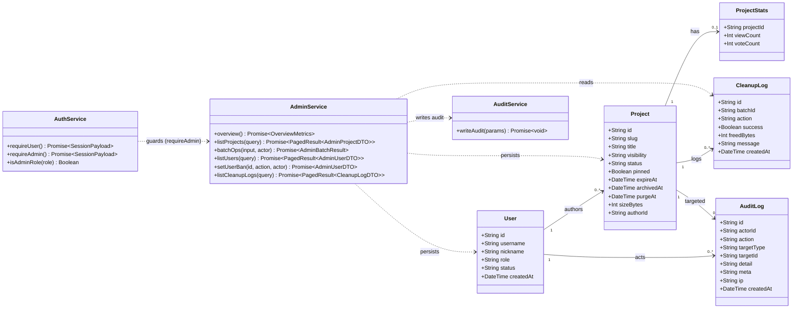
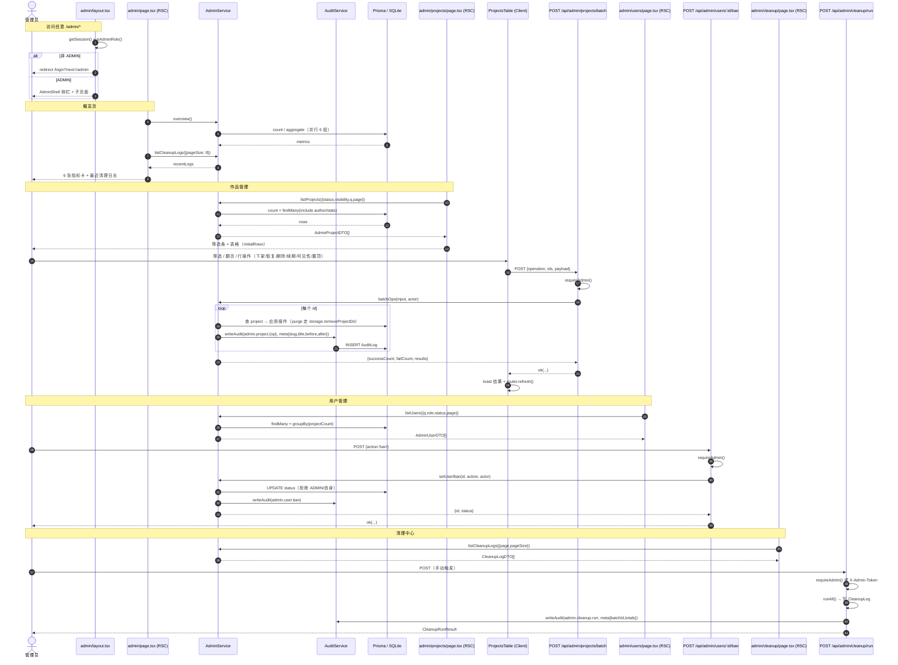
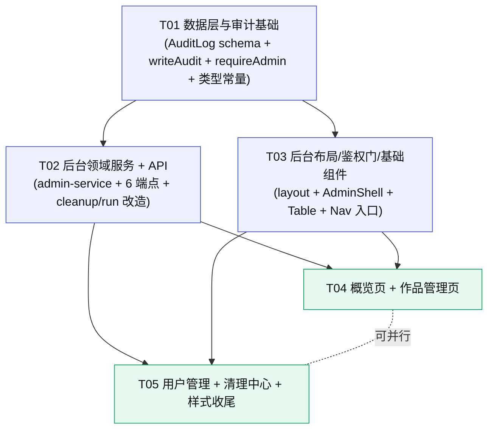

# Kernel · 创意种子 — P2 增量设计 · 后台管理模块

> 架构师：高见远　|　阶段：**P2 · 运营与治理（增量）**　|　运行形态：**本地 Node.js 轻量桩（非生产部署）**
>
> P2 目标（对齐 `docs/04-实施路线图.md`）：**管理员能管、能查、能防**。
>
> 前置依赖：P0（上传/沙箱/过期/生命周期）+ P1（登录/鉴权/投票/排行榜）已交付。
> 本文档是**增量设计**，只描述「在现有代码上新增/修改什么」，已存在的能力不再重复描述。
>
> 设计基准：`docs/P0-架构与任务分解.md`（分层单体/文件结构/共享知识/约束）· `docs/03-数据模型与API.md` §3.6（后台 API 裁剪源）
> 视觉真源：`DESIGN.md` + `prototype/Kernel-创意种子-优化版.html`（admin 无独立原型，页面沿用全站 token 体系）

---

## 〇、P2 范围锁定

### 做（P2 In Scope）

| 能力 | 说明 |
|------|------|
| Admin 路由组 + 鉴权 | `/admin/*` 页面层 + `/api/admin/*` 接口层，双处 ADMIN 校验，非 ADMIN 一律拒绝/重定向 |
| 概览页 | 6 张指标卡（总作品/在线/已归档/投票总数/用户数/存储用量）+ 最近清理日志 |
| 作品管理页 | 表格（slug/标题/作者/可见性/状态/票数/有效期）+ 筛选（状态/可见性/搜索）+ 操作（下架 BLOCK/恢复、物理删除 PURGE、续期、改可见性、置顶） |
| 用户管理页 | 列表（用户名/昵称/角色/状态/作品数/注册时间）+ 封禁/解封（status BANNED/ACTIVE） |
| 清理中心 | 手动触发清理（复用 `/api/admin/cleanup/run`）+ CleanupLog 列表 |
| 审计留痕 | 新增 `AuditLog` 模型 + `writeAudit()`；后台全部写操作统一留痕 |
| 后台 API 裁剪 | `GET overview` / `GET projects` / `POST projects/batch` / `GET users` / `POST users/:id/ban` / `GET cleanup/logs`，全部 ADMIN 鉴权 |

### 不做（P2 Out of Scope，推后续轮次）

风控设备指纹 / 风险评分 / 可疑票聚合 / 批量作废 / 存储策略配置界面 / 豁免规则界面 / 到期微信提醒 / 审计日志查看页（P2 只**写**不留 UI）/ 后台暗色/移动端深度打磨。

---

## 一、增量设计要点

### 1.1 总体思路与难点

| # | 难点 | P2 解法 |
|---|------|--------|
| D1 | **管理员身份判定有两处边界**：页面（Server Component）与 API（Route Handler）行为不同 | 页面层用 `getSession() + isAdminRole() + redirect()`；API 层新增 `requireAdmin()`（`requireUser()` 之上叠加角色校验，抛 `FORBIDDEN`）。两处共用 `isAdminRole()`，判定逻辑只写一份 |
| D2 | **后台表格的「多行操作 + 逐条留痕 + 单条失败不中断」** | 收敛为**单一批量端点** `POST /api/admin/projects/batch`：`{operation, ids, payload}`，逐条 try/catch，返回 `results[]`（含逐条 ok/code），服务端逐条写 AuditLog。单行操作 = `ids:[id]`，不另拆端点 |
| D3 | **物理删除 PURGE 涉及磁盘** | `node:fs` 唯一出口仍是 `storage.ts`；`admin-service.batchOps` 的 purge 分支调用 `removeProjectDir()`，不在 route 层碰 fs |
| D4 | **AuditLog 的 SQLite 兼容** | 沿 P0 既定降级手法：`Json → String`（`meta` 存 `JSON.stringify` 快照）、无 enum（action 用字符串 + `AUDIT_ACTION` 常量收口）、`BigInt → Int`（无 BigInt 字段） |
| D5 | **避免给现有 DTO/页面引入破坏性变更** | `ProjectDTO` 只做**加法**：补 `pinned: boolean`（toDTO 一行映射），后台列表直接复用 `toDTO()`；不新增平行 DTO 体系 |
| D6 | **客户端组件不能 import `lib/auth.ts`**（内含 `node:crypto`/`next/headers`） | Nav 的后台入口用内联角色判断（`role === 'ADMIN' || role === 'SUPER_ADMIN'`），不引入 auth.ts |

### 1.2 admin 路由组织与鉴权约定

**路由组织**（与 docs/03 §五 前端目录 `admin/` 对齐）：

```
src/app/admin/                     # 后台页面（挂在根布局下，最小变更）
├── layout.tsx                     # 鉴权门 + AdminShell 侧栏
├── page.tsx                       # 概览
├── projects/page.tsx              # 作品管理
├── users/page.tsx                 # 用户管理
└── cleanup/page.tsx               # 清理中心

src/app/api/admin/                 # 后台 API（统一前缀 /api/admin）
├── overview/route.ts
├── projects/route.ts
├── projects/batch/route.ts
├── users/route.ts
├── users/[id]/ban/route.ts
├── cleanup/logs/route.ts
└── cleanup/run/route.ts           # 已存在，P2 改造
```

**鉴权两处约定（铁律）**：

1. **API 层**：每个 `/api/admin/*` Route Handler 第一行 `const session = await requireAdmin()`。
   - 未登录 → `AppError(NOT_LOGGED_IN)` → 401
   - 已登录但非 ADMIN/SUPER_ADMIN → `AppError(FORBIDDEN, '需要管理员权限')` → 403
   - 全部走 `toErrorResponse()`，禁止裸 `NextResponse.json()`
2. **页面层**：`app/admin/layout.tsx`（Server Component）：
   ```ts
   const session = await getSession();
   if (!session || !isAdminRole(session.role)) redirect('/login?next=/admin');
   ```
   - 非 ADMIN 一律重定向登录页（`next` 回跳 `/admin`）；子页面无需再判，继承 layout 门禁
   - 页面首屏**直调 `lib/admin-service.ts`**（不 fetch 自己的 `/api`，对齐 §7.5 数据获取约定）；客户端交互（筛选/翻页/操作）走 `/api/admin/*`

**`lib/auth.ts` 新增**（纯 cookie 角色判定，与 `canManageProject` 一致，不引 prisma）：
```ts
/** 强制要求管理员会话。未登录抛 NOT_LOGGED_IN；非 ADMIN/SUPER_ADMIN 抛 FORBIDDEN。 */
export async function requireAdmin(): Promise<SessionPayload> {
  const session = await requireUser();
  if (!isAdminRole(session.role)) throw new AppError(ERROR_CODE.FORBIDDEN, '需要管理员权限');
  return session;
}
```
> ⬆️ 生产化加固点：cookie 中 role 可能滞后于 DB 变更，生产环境应在 `requireAdmin()` 内回查 DB（role + status=ACTIVE）再放行。

### 1.3 AuditLog 模型（SQLite 兼容，裁剪自 docs/03）

```prisma
/// 管理员操作审计留痕。detail 由 Json 降级为 String（JSON.stringify）。
model AuditLog {
  id         String   @id @default(cuid())
  actorId    String
  actor      User     @relation(fields: [actorId], references: [id])
  /// 见 lib/constants.ts AUDIT_ACTION：admin.project.block / admin.user.ban / admin.cleanup.run ...
  action     String
  /// project | user | cleanup
  targetType String
  targetId   String
  /// 简短人类可读说明（中文，面向未来审计页直接展示）
  detail     String?
  /// JSON.stringify 的结构化快照（before/after/原因/请求体）
  meta       String?
  ip         String?
  createdAt  DateTime @default(now())

  @@index([actorId, createdAt])
  @@index([targetType, targetId])
  @@index([action, createdAt])
}
```

- 同时给 `User` 增加关系：`auditLogs AuditLog[]`
- 索引裁剪说明：`[action, createdAt]` 服务「按动作查最近记录」；`[targetType, targetId]` 服务「查某作品的处置史」；`[actorId, createdAt]` 服务「查某管理员的操作史」
- ⬆️ 切 Postgres 还原清单：`meta String? → Json?`，其余不变

**`lib/audit.ts` 新增**（全站写 AuditLog 的唯一入口，与 `lifecycle.writeLog` 同构）：
```ts
export async function writeAudit(params: {
  actorId: string;
  action: AuditAction;            // AUDIT_ACTION 常量值
  targetType: 'project' | 'user' | 'cleanup';
  targetId: string;
  detail?: string;                // 人读摘要
  meta?: Record<string, unknown>; // 结构化快照 → JSON.stringify
  ip?: string;
}): Promise<void>
```
- 失败**不阻断主流程**，仅 `console.warn`（对齐 CleanupLog 写日志的容错姿势）
- `meta` 序列化收敛在本函数内，调用点只传对象

**AuditLog action 命名规范**（写进共享知识）：
```
admin.{domain}.{action}
  admin.project.block / admin.project.unblock
  admin.project.purge
  admin.project.renew
  admin.project.visibility
  admin.project.pin / admin.project.unpin
  admin.user.ban / admin.user.unban
  admin.cleanup.run
```
> 全小写 + 点分；非后台的领域动作（未来 `vote.invalidate` 等）沿用 docs/03 的 `{domain}.{action}` 风格，与 `admin.` 前缀区分「谁发起的」。

### 1.4 后台 API 清单（裁剪自 docs/03 §3.6）

统一前缀 `/api/admin`，统一响应体 `{ok, data, meta}`，全部 `requireAdmin()`。

#### ① `GET /api/admin/overview` — 概览指标
| 项 | 内容 |
|----|------|
| 入参 | 无 |
| 出参 | `data.metrics = { projects: { total, active, archived, blocked, purged }, votes, users: { total, banned }, storageBytes }` |
| 口径 | `votes` = `ProjectStats.voteCount` 全量求和；`storageBytes` = `Project.sizeBytes` 全量求和（≈磁盘用量） |
| 错误码 | 401 NOT_LOGGED_IN / 403 FORBIDDEN |

#### ② `GET /api/admin/projects` — 全量作品（含私密/已归档/已封禁）
| 项 | 内容 |
|----|------|
| 入参 | `status`（单值或多值逗号分隔，如 `ACTIVE,BLOCKED`；缺省=全部）、`visibility`、`q`（slug/title/authorName 模糊）、`sort`（`createdAt`\|`expireAt`\|`voteCount`，缺省 createdAt desc）、`page`、`pageSize` |
| 出参 | `data.items: AdminProjectDTO[]`（复用 `ProjectDTO` + 新增 `pinned`），`meta: {page,pageSize,total}` |
| 错误码 | 400 VALIDATION_FAILED / 401 / 403 |

#### ③ `POST /api/admin/projects/batch` — 批量操作（**单一变更端点**）
| 项 | 内容 |
|----|------|
| 入参 | `{ operation: 'block'\|'unblock'\|'purge'\|'renew'\|'visibility'\|'pin'\|'unpin', ids: string[], payload?: { ttlDays?, visibility? } }`；`ids` 用 **Project.id**（cuid，短码变更不受影响），1..100 条 |
| 行为 | `block`→status=BLOCKED（下架，不可访问）；`unblock`→仅 BLOCKED 恢复 ACTIVE（清空 archivedAt/purgeAt）；`purge`→`removeProjectDir` + status=PURGED + fileCount/sizeBytes=0（DB 行保留占位）；`renew`→payload.ttlDays 必填，复用 `projectService.renew`（ARCHIVED 自动复活）；`visibility`→payload.visibility 必填；`pin`/`unpin`→pinned 布尔 |
| 出参 | `data = { operation, successCount, failCount, results: [{ id, ok, slug?, code?, message? }] }`；**单条失败不中断整批**，逐条结果在 `results` 内 |
| 留痕 | 每个 id 成功即 `writeAudit(admin.project.{op}, meta: {slug, title, before, after})` |
| 错误码 | 400 VALIDATION_FAILED（op/ids/payload 非法）/ 401 / 403；单条 NOT_FOUND 落入 `results[i].code`，不整单 404 |

#### ④ `GET /api/admin/users` — 用户列表
| 项 | 内容 |
|----|------|
| 入参 | `q`（username/nickname 模糊）、`role`、`status`、`page`、`pageSize` |
| 出参 | `data.items: AdminUserDTO[]`（含 `projectCount`，用 `project.groupBy({by:['authorId'], _count})` 一次取齐），`meta` |
| 错误码 | 400 / 401 / 403 |

#### ⑤ `POST /api/admin/users/:id/ban` — 封禁 / 解封
| 项 | 内容 |
|----|------|
| 入参 | `{ action: 'ban'\|'unban' }` |
| 出参 | `data = { id, status: 'BANNED'\|'ACTIVE' }` |
| 校验 | **禁止对 ADMIN/SUPER_ADMIN 执行 ban**；**禁止对自己执行 ban**（均抛 FORBIDDEN） |
| 留痕 | `writeAudit(admin.user.ban / admin.user.unban)` |
| 错误码 | 400 / 401 / 403 / 404 NOT_FOUND |

#### ⑥ `GET /api/admin/cleanup/logs` — 清理日志列表
| 项 | 内容 |
|----|------|
| 入参 | `action`、`success`、`page`、`pageSize`（概览页复用本端点 `pageSize=8` 取最近日志） |
| 出参 | `data.items: CleanupLogDTO[]`（`detail` 已 `JSON.parse` 还原为对象，供展示），`meta` |
| 错误码 | 400 / 401 / 403 |

#### ⑦ `POST /api/admin/cleanup/run` — 手动触发（**改造既有端点**）
- 现状：仅 `X-Admin-Token` / `Authorization: Bearer` 校验
- P2 改造：**鉴权放宽为「ADMIN 会话 或 管理员 token 任一通过」**（后台 UI 用会话，运维脚本继续用 token）；`NODE_ENV=production` 仍直接 403
- 新增：成功后写 `writeAudit(admin.cleanup.run, meta: {batchId, totals})`；保留 `{at}` 注入能力
- 出参：现有 `CleanupRunResult` 不变（含 batchId/reports/totals）

### 1.5 admin 页面与组件结构

```
src/components/admin/
├── AdminShell.tsx        # 后台壳（'use client'，usePathname 高亮侧栏）：侧栏（概览/作品/用户/清理）+ 内容区
├── MetricCard.tsx        # 指标卡：大数字（mono + tabular-nums）+ 标签 + 可选副文案
├── ConfirmDialog.tsx     # 危险操作二次确认（基于 Modal，danger 按钮 + 必填原因文案）
├── Pagination.tsx        # 分页条：page/pageSize/total + 上一页/下一页/页码
└── tables/
    ├── ProjectsTable.tsx # 作品管理（client，自包含）：筛选条 + 表格 + 分页 + 行操作
    ├── UsersTable.tsx    # 用户管理（client）：表格 + 分页 + 封禁/解封
    └── CleanupPanel.tsx  # 清理中心（client）：触发按钮 + 运行中态 + 日志表格 + 分页
```

- **数据流约定**：页面（Server Component）SSR 首屏数据 → 传给 client 表格组件作 `initialRows`；筛选/翻页/操作在 client 侧 `fetch('/api/admin/...')`，成功后 `router.refresh()` 或本地替换列表
- **页面布局**：页面级 `Card` 包裹 + 标题行（`.admin-page-head`）；表格用新增 `components/ui/Table.tsx` 原语（Table/THead/TBody/Tr/Th/Td）
- **状态/可见性 → Badge tone 映射**（沿用现有 Badge）：
  - `status`：ACTIVE→`live`、ARCHIVED→`archived`、PURGED→`archived`（弱化）、BLOCKED→**新增 `blocked` tone**（danger 色系）
  - `visibility`：PUBLIC 不显示（或 `live`）、UNLISTED→`unlisted`、PRIVATE→`private`
- **有效期列**：`formatDate(expireAt)` + `describeExpiry()` 语义（≤7 天 warning）；BLOCKED 行整行降透明度
- **操作按钮**：行内 `Button size=sm`（ghost/secondary/danger）；PURGE 与 BLOCK 必须过 `ConfirmDialog`；续期用 `Select`（TTL_OPTIONS）弹确认

---

## 二、文件列表及相对路径

> ⭐ = 新增；其余为修改。全部相对项目根。

```
prisma/
├── schema.prisma                   # 修改：+ AuditLog 模型 + User.auditLogs 关系（§1.3）

src/
├── lib/
│   ├── constants.ts                # 修改：+ AUDIT_ACTION 常量 / ADMIN_DEFAULT_PAGE_SIZE=20 / ADMIN_MAX_PAGE_SIZE=100
│   ├── types.ts                    # 修改：+ AdminProjectDTO / AdminUserDTO / CleanupLogDTO / OverviewMetrics / AdminBatchInput / AdminBatchResult / AuditLogInput；ProjectDTO + pinned
│   ├── auth.ts                     # 修改：+ requireAdmin()
│   ├── audit.ts                    # ⭐ 新增：writeAudit()（写 AuditLog 唯一入口，meta 序列化收敛于此）
│   └── admin-service.ts            # ⭐ 新增：后台领域服务（overview/listProjects/batchOps/listUsers/setUserBan/listCleanupLogs）
│
├── app/
│   ├── admin/
│   │   ├── layout.tsx              # ⭐ 新增：ADMIN 鉴权门（redirect /login?next=/admin）+ AdminShell
│   │   ├── page.tsx                # ⭐ 新增：概览页（6 指标卡 + 最近清理日志）
│   │   ├── projects/page.tsx       # ⭐ 新增：作品管理页（SSR 首屏 + 表格组件）
│   │   ├── users/page.tsx          # ⭐ 新增：用户管理页
│   │   └── cleanup/page.tsx        # ⭐ 新增：清理中心页
│   └── api/admin/
│       ├── overview/route.ts       # ⭐ 新增：GET 概览
│       ├── projects/route.ts       # ⭐ 新增：GET 列表（筛选+分页）
│       ├── projects/batch/route.ts # ⭐ 新增：POST 批量操作（唯一写操作端点）
│       ├── users/route.ts          # ⭐ 新增：GET 用户列表
│       ├── users/[id]/ban/route.ts # ⭐ 新增：POST 封禁/解封
│       ├── cleanup/logs/route.ts   # ⭐ 新增：GET 清理日志
│       └── cleanup/run/route.ts    # 修改：鉴权兼容会话 + 写 AuditLog
│
├── components/
│   ├── ui/
│   │   ├── Table.tsx               # ⭐ 新增：表格原语（Table/THead/TBody/Tr/Th/Td，.admin-table 样式）
│   │   └── Nav.tsx                 # 修改：ADMIN/SUPER_ADMIN 可见「后台管理」入口（内联角色判断）
│   └── admin/
│       ├── AdminShell.tsx          # ⭐ 新增：后台侧栏 + 内容区（usePathname 高亮）
│       ├── MetricCard.tsx          # ⭐ 新增：指标卡
│       ├── ConfirmDialog.tsx       # ⭐ 新增：危险操作二次确认
│       ├── Pagination.tsx          # ⭐ 新增：分页条
│       └── tables/
│           ├── ProjectsTable.tsx   # ⭐ 新增：作品表格（筛选/分页/行操作，client）
│           ├── UsersTable.tsx      # ⭐ 新增：用户表格（封禁/解封，client）
│           └── CleanupPanel.tsx    # ⭐ 新增：清理面板（触发 + 日志，client）
│
└── styles/
    └── globals.css                 # 修改：+ .admin-* 表格/侧栏/指标卡/blocked 徽章样式（全部走 CSS 变量，零 hex）
```

**计数**：新增 20 · 修改 7 ≈ **27 个文件**。

---

## 三、数据结构与接口



**关键 DTO**（`lib/types.ts` 新增，均为纯类型）：

| 类型 | 字段 |
|------|------|
| `AdminProjectDTO` | = `ProjectDTO`（含新增 `pinned: boolean`） |
| `AdminUserDTO` | `id / username / nickname / role / status / projectCount / createdAt(ISO)` |
| `CleanupLogDTO` | `id / batchId / action / projectId / freedBytes / success / message / detail(已 parse) / createdAt(ISO)` |
| `OverviewMetrics` | `projects{total,active,archived,blocked,purged} / votes / users{total,banned} / storageBytes` |
| `AdminBatchInput` | `operation: 'block'\|'unblock'\|'purge'\|'renew'\|'visibility'\|'pin'\|'unpin'`、`ids: string[]`、`payload?: {ttlDays?, visibility?}` |
| `AdminBatchResult` | `operation / successCount / failCount / results: {id, ok, slug?, code?, message?}[]` |

---

## 四、程序调用流程



---

## 五、任务分解

> **分组原则**：按「层次 + 可独立验收」分块，共 **5 个主任务块（T01–T05）**。
> P2 无新增配置/依赖文件，故「项目基础设施」语义由 **T01（数据层与审计基础）** 承担——它是全部后续任务的唯一地基。
> 主理人建议的 T1–T8 全部被覆盖，映射见 §5.6。

### T01 · 数据层与审计基础

| 项 | 内容 |
|----|------|
| **优先级** | P0（阻塞全部） |
| **依赖** | 无 |
| **产出文件** | `prisma/schema.prisma`（+AuditLog + User.auditLogs）· `src/lib/constants.ts`（+AUDIT_ACTION / ADMIN_DEFAULT_PAGE_SIZE=20 / ADMIN_MAX_PAGE_SIZE=100）· `src/lib/types.ts`（+Admin DTO 类型 + ProjectDTO.pinned）· `src/lib/auth.ts`（+requireAdmin）· `src/lib/audit.ts`（+writeAudit） |
| **要点** | ① AuditLog 按 §1.3 建表（SQLite 兼容：meta 存 JSON 字符串、无 enum、3 索引）<br/>② `writeAudit` 与 `lifecycle.writeLog` 同构：meta 序列化收敛函数内、失败仅 console.warn 不阻断<br/>③ `ProjectDTO` 只加 `pinned`（toDTO 补一行映射），后台列表复用现有 `toDTO()`<br/>④ `requireAdmin` 基于 cookie 角色判定，不引 prisma（⬆️ 生产回查 DB 见 §1.2 备注）<br/>⑤ `npm run db:push` 后 `prisma generate` 使 client 类型含 AuditLog |
| **验收点** | ✅ `npx prisma studio` 可见 AuditLog 表与索引<br/>✅ `writeAudit` 单测：写入成功；DB 故障时主流程不抛错<br/>✅ `requireAdmin`：USER 角色抛 FORBIDDEN、未登录抛 NOT_LOGGED_IN、ADMIN 通过 |

### T02 · 后台领域服务 + API

| 项 | 内容 |
|----|------|
| **优先级** | P0 |
| **依赖** | T01 |
| **产出文件** | `src/lib/admin-service.ts`（overview/listProjects/batchOps/listUsers/setUserBan/listCleanupLogs）· `src/app/api/admin/overview/route.ts` · `src/app/api/admin/projects/route.ts` · `src/app/api/admin/projects/batch/route.ts` · `src/app/api/admin/users/route.ts` · `src/app/api/admin/users/[id]/ban/route.ts` · `src/app/api/admin/cleanup/logs/route.ts` · `src/app/api/admin/cleanup/run/route.ts`（改造） |
| **要点** | ① 每个 route 首行 `requireAdmin()`，全部走 `ok()/toErrorResponse()`<br/>② `batchOps` 为**唯一写操作入口**：逐条 try/catch、单条失败入 `results`、成功即 `writeAudit`；purge 调 `storage.removeProjectDir`（route 层不碰 fs）<br/>③ `renew` 分支复用 `projectService.renew(slug, ttlDays)`（含 ARCHIVED 复活）；`visibility` 复用 `patch`<br/>④ `listUsers` 用 `groupBy({by:['authorId'], _count})` 一次取 projectCount<br/>⑤ `setUserBan` 校验：禁止 ADMIN/SUPER_ADMIN 与自身（FORBIDDEN）<br/>⑥ cleanup/run 改造：会话或 token 任一通过 + 写 AuditLog + production 仍 403 |
| **验收点** | ✅ curl 无会话访问任一 /api/admin/* → 401；USER 会话 → 403；ADMIN 会话 → 200<br/>✅ batch：`{operation:'purge', ids:[id]}` 后作品目录消失、status=PURGED、AuditLog 有 `admin.project.purge` 记录<br/>✅ batch 混入不存在 id → 整单 200、该条 `results[i].ok=false, code=NOT_FOUND`<br/>✅ ban ADMIN → 403；ban 普通用户 → BANNED + AuditLog<br/>✅ cleanup/run：会话可触发；返回 CleanupRunResult；AuditLog 有 `admin.cleanup.run` |

### T03 · 后台布局 / 鉴权门 / 基础组件

| 项 | 内容 |
|----|------|
| **优先级** | P0 |
| **依赖** | T01 |
| **产出文件** | `src/app/admin/layout.tsx`（鉴权门 + AdminShell）· `src/components/admin/AdminShell.tsx` · `src/components/ui/Table.tsx` · `src/components/ui/Nav.tsx`（ADMIN 入口）· `src/components/admin/Pagination.tsx` · `src/components/admin/ConfirmDialog.tsx` · `src/components/admin/MetricCard.tsx` |
| **要点** | ① layout：`getSession()+isAdminRole()` 不过则 `redirect('/login?next=/admin')`<br/>② AdminShell：侧栏 4 项（概览/作品/用户/清理），`usePathname` 高亮，内容区 `children`；挂在根布局下（保留站点头部 Nav/Footer，最小变更）<br/>③ Nav 后台入口：`sessionUser.role` 内联判断 ADMIN/SUPER_ADMIN（**禁止 import auth.ts**，避 node:crypto 进客户端 bundle）<br/>④ Table 原语 + `.admin-table` 样式骨架（颜色走 var()，圆角 8/14px、字重 400/500/600）<br/>⑤ MetricCard：mono + tabular-nums 大数字 + 标签 |
| **验收点** | ✅ 未登录访问 /admin → 跳 /login?next=/admin；USER 登录访问 → 同样跳转；ADMIN 登录 → 见侧栏<br/>✅ Nav 在 ADMIN 会话下多出「后台管理」入口，普通用户不可见<br/>✅ 侧栏点击高亮正确，375px 下无横向滚动（表格允许横向滚动容器） |

### T04 · 概览页 + 作品管理页

| 项 | 内容 |
|----|------|
| **优先级** | P1 |
| **依赖** | T02 · T03 |
| **产出文件** | `src/app/admin/page.tsx`（概览）· `src/app/admin/projects/page.tsx` · `src/components/admin/tables/ProjectsTable.tsx`（筛选/分页/行操作，client） |
| **要点** | ① 概览页 Server Component：`adminService.overview()` + `listCleanupLogs({pageSize:8})` 并行；6 张 MetricCard + 最近清理日志 Card<br/>② 作品页 SSR 首屏 `listProjects` → `initialRows` 传入 ProjectsTable<br/>③ ProjectsTable：筛选条（状态 Select 多选/可见性 Select/q Input/排序 Select）+ Table（slug mono/标题/作者/可见性 Badge/状态 Badge/票数/有效期）+ 分页 + 行操作（BLOCK/恢复 danger 走 ConfirmDialog；PURGE 走 ConfirmDialog；续期 Select 确认；可见性 Select 即时；置顶 toggle）<br/>④ 操作统一走 `POST /api/admin/projects/batch`，响应后 `toast` + `router.refresh()` |
| **验收点** | ✅ 概览 6 卡数字与 DB 口径一致（对照 prisma studio）<br/>✅ 作品页可筛选 status/visibility/q、翻页；BLOCK 后详情页 404、广场消失；unblock 恢复<br/>✅ PURGE 需二次确认，成功后行消失、AuditLog 留痕<br/>✅ 续期/改可见性/置顶即时生效且留痕 |

### T05 · 用户管理 + 清理中心 + 样式联调收尾

| 项 | 内容 |
|----|------|
| **优先级** | P1 |
| **依赖** | T02 · T03 |
| **产出文件** | `src/app/admin/users/page.tsx` · `src/app/admin/cleanup/page.tsx` · `src/components/admin/tables/UsersTable.tsx` · `src/components/admin/tables/CleanupPanel.tsx` · `src/styles/globals.css`（.admin-* 全量样式收尾） |
| **要点** | ① 用户页：SSR 首屏 + UsersTable（用户名/昵称/角色 Badge/状态/作品数/注册时间）；封禁/解封走 `POST /api/admin/users/:id/ban`，ConfirmDialog 确认，BANNED 行降透明度<br/>② 清理中心：CleanupPanel（「立即清理」按钮 → `POST /api/admin/cleanup/run` → 运行中禁用态 → 展示 CleanupRunResult summary）+ 日志 Table（action/成功/释放字节/时间/明细）<br/>③ globals.css 收尾：`.admin-*` 表格/侧栏/指标卡/blocked 徽章样式**全 token 化（零 hex）**；暗色主题下验证无硬编码残留<br/>④ 全站回归：广场/详情/上传/登录不受影响（Nav 改动仅追加条件入口） |
| **验收点** | ✅ 封禁普通用户后其作品作者名仍在（不删数据）；解封恢复；AuditLog 有 admin.user.ban<br/>✅ 触发清理后 CleanupLog 新增记录；日志分页正常<br/>✅ 全局搜 `#` 6 位色值零命中；暗色下后台无白块<br/>✅ 375 / 768 / 1280 三档后台截图无布局错乱 |

### 5.6 与主理人建议 T1–T8 的映射

| 主理人建议 | 归属任务 | 说明 |
|-----------|---------|------|
| T1 schema + audit lib | **T01** | +constants/types/auth 增量（同层合并） |
| T2 admin API | **T02** | 6 新端点 + cleanup/run 改造 |
| T3 admin 布局 + 鉴权 | **T03** | layout + AdminShell + Nav 入口 |
| T4 概览页 | **T04** | 与作品管理页同块（同为「读 + 表格」形态，共用 Pagination/ConfirmDialog） |
| T5 作品管理页 | **T04** | |
| T6 用户管理页 | **T05** | 与清理中心同块（同为「写操作 + 列表」形态） |
| T7 清理中心 | **T05** | |
| T8 联调 + 样式收尾 | **T05** | globals.css 收尾 + 全站回归 |

> **合并理由**：8 个细任务里多个产出不足 3 文件；按「读写形态 + 共用组件」合并为 5 块，每块可独立验收、T04/T05 可并行。

### 5.7 任务依赖图



**关键路径**：`T01 → T02 / T03 → T04 / T05`。T02 与 T03 在 T01 后可并行；T04 与 T05 可并行。

---

## 六、依赖包列表

**无新增依赖**。P2 全部使用现有栈（Next.js 15 / Prisma / SQLite / 自写 ui 组件），明确不装：任何表格库（tanstack-table）、任何图表库、任何 UI 库（Radix/shadcn）、`jsonwebtoken`/`jose`（沿用 node:crypto）。

---

## 七、共享知识（跨文件约定）

### 7.1 admin 鉴权约定
- **API 层**：每个 `/api/admin/*` route 首行 `await requireAdmin()`；未登录 401 `NOT_LOGGED_IN`、非 ADMIN 403 `FORBIDDEN`；一律 `ok()/toErrorResponse()`
- **页面层**：`app/admin/layout.tsx` 统一门禁，非 ADMIN `redirect('/login?next=/admin')`；子页面不再重复鉴权
- **客户端组件**：禁止 import `lib/auth.ts`（node:crypto 会进 bundle）；角色判断内联 `role === 'ADMIN' || role === 'SUPER_ADMIN'`

### 7.2 AuditLog 约定
- **action 命名**：`admin.{domain}.{action}`（如 `admin.project.block`）；非后台领域动作沿用 `{domain}.{action}` 风格
- **targetType**：`project | user | cleanup`；**targetId**：project 用 Project.id、user 用 User.id、cleanup 用 batchId
- **meta 快照**：`{ before, after, ... }` 由 `writeAudit` 统一 `JSON.stringify`；读侧未来审计页用 `JSON.parse`
- 写日志失败不阻断主流程（console.warn）

### 7.3 错误码复用
- 不新增错误码：`NOT_LOGGED_IN(401)` / `FORBIDDEN(403)` / `NOT_FOUND(404)` / `VALIDATION_FAILED(400)` / `INTERNAL_ERROR(500)`
- 批量操作的**单条**失败码放入 `results[i].code`，整单仍 200

### 7.4 表格页 UI 约定
- 复用现有 `Card / Button / Select / Input / Badge / Modal / EmptyState / Toast`；表格用新增 `ui/Table.tsx` 原语 + `.admin-table` 样式类
- 状态/可见性 → Badge tone 映射见 §1.5；BLOCKED 新增 `badge--blocked`（danger 色系）
- 数字列（票数/存储/计数）一律 `mono` + `tabular-nums`；时间列 `formatDate/formatDateTime`（Asia/Shanghai）
- 危险操作（PURGE/BLOCK/封禁）必须 `ConfirmDialog` 二次确认
- 分页：`page` 从 1 起、`pageSize` 后台默认 20、上限 100（`ADMIN_DEFAULT_PAGE_SIZE` / `ADMIN_MAX_PAGE_SIZE`）
- 首屏 = Server Component 直调 `admin-service`；交互 = `fetch('/api/admin/...')`；禁止 Server Component fetch 自己的 `/api`

### 7.5 沿用既有硬性约定
统一响应体 `{ok,data,meta}` / `message` 中文面向用户 / `code` 大写下划线 · 时间 ISO 8601 UTC · `node:fs` 仅 `storage.ts` · 无硬编码 hex（CSS 变量唯一真源）· 日志格式 `[模块][动作] key=value` · 过渡 160–240ms `--ease` · 圆角 8/14/999px · 字重 400/500/600。

---

## 八、待明确事项（需主理人拍板）

> 每条均给**默认建议**，若无异议工程师按建议执行。

| # | 议题 | 我的建议（默认执行） |
|---|------|---------------------|
| **Q1** | 批量操作 API 形态：单一 `POST /api/admin/projects/batch` vs 拆分单操作端点？ | **单一 batch 端点**（operation + ids + payload，单行操作 ids=[id]）。理由：一个写操作入口，留痕/校验/错误聚合只写一份；对齐 docs/03 §3.6 的 batch 设计 |
| **Q2** | 后台列表分页默认值？ | **pageSize 默认 20、上限 100**（新增常量；广场仍 12/48）。理由：后台表格信息密度高于广场卡片流 |
| **Q3** | AuditLog 保留策略？ | **P2 只写不删**（不建清理任务，本地量级可忽略）；后续轮次加保留期（建议 90 天）或由 cleanup 任务顺带截断 |
| **Q4** | `POST /api/admin/cleanup/run` 鉴权如何兼容？ | **「ADMIN 会话 或 X-Admin-Token 任一通过」**；`NODE_ENV=production` 仍 403；⬆️ 生产移除 token 只留会话 |
| **Q5** | 后台是否沿用根布局（站点头部 Nav/Footer）？ | **沿用**（最小变更，不引入 route group 改造）；后台内容区内嵌 AdminShell 侧栏。若要求后台独立裸布局，成本 +1 任务 |
| **Q6** | 用户封禁边界？ | **禁止封禁 ADMIN/SUPER_ADMIN 与自身**（抛 FORBIDDEN） |
| **Q7** | AuditLog 是否需要 `detail`（人读）+ `meta`（结构化）双字段？ | **保留双字段**：detail 供未来审计页直接展示，meta 存 before/after 快照；如嫌冗余可只留 meta（Q7 一并拍板） |
| **Q8** | `ProjectDTO` 增加 `pinned` 字段（对现有消费方为**加法**变更）？ | **可接受**（toDTO 补一行，广场/详情/榜单不受影响）；若坚持零触碰现有 DTO，则改在 `admin-service` 内建 `AdminProjectDTO` 平行映射 |

---

## 九、P2 验收标准

> **管理员用 `admin / 123456` 登录后，进入 `/admin`：概览一眼看到全站关键指标；作品页能按状态/可见性/关键词筛出任意作品并完成下架/恢复/物理删除/续期/改可见性/置顶；用户页能封禁/解封；清理中心能一键触发清理并看到日志——以上每一次写操作在 AuditLog 中都有迹可循，非 ADMIN 在任何入口都进不来。**

- [ ] 非 ADMIN（未登录 / 普通用户）访问 `/admin` 与 `/api/admin/*` 全部被拒（401/403/重定向）
- [ ] 概览 6 卡数字与 DB 口径一致
- [ ] 作品管理全操作走通且逐条 AuditLog 留痕
- [ ] 用户封禁/解封走通，ADMIN 不可被 ban
- [ ] 手动清理触发成功，CleanupLog + AuditLog 双留痕
- [ ] 全局搜 `#` 6 位色值零命中；暗色主题后台无硬编码残留
- [ ] 广场/详情/上传/登录/投票/排行榜全量回归无破坏

---

### 附：交付文件

| 文件 | 内容 |
|------|------|
| `docs/P2-后台管理设计.md` | 本文档（增量设计 + 任务分解全量） |
| `docs/P2-class-diagram.mermaid` | §3 类图独立文件 |
| `docs/P2-sequence-diagram.mermaid` | §4 时序图独立文件 |
