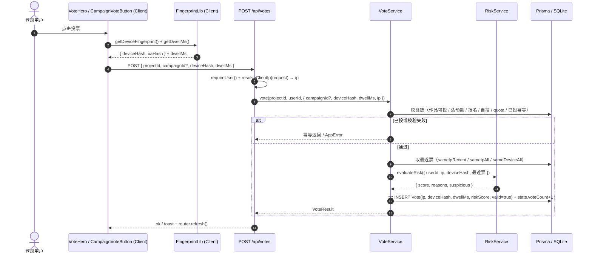
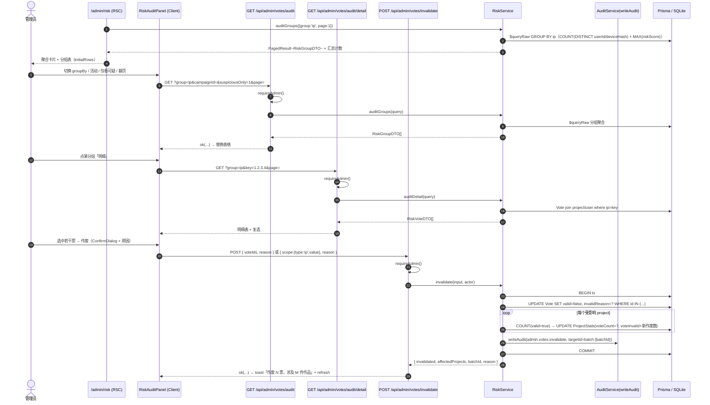
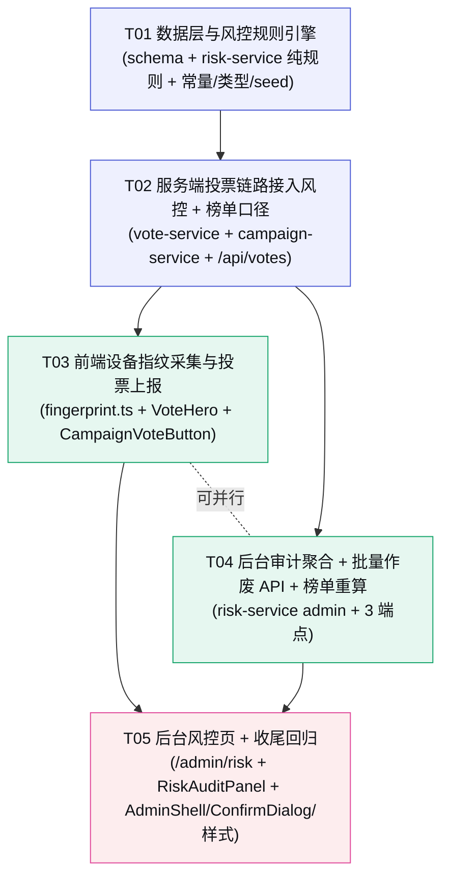

# Kernel · 创意种子 — P2 增量设计 · 风控模块

> 架构师：高见远　|　阶段：**P2 · 运营与治理（增量）**　|　运行形态：**本地 Node.js 轻量桩（非生产部署）**
>
> P2 目标（对齐 `docs/04-实施路线图.md`）：**管理员能管、能查、能防**。本轮只覆盖**风控**（设备指纹 / 风险评分 / 可疑票聚合 / 批量作废 + 榜单重算）；后台其它能力（概览/作品/用户/清理/审计）已在既有轮次交付。
>
> 前置依赖：P0（上传/沙箱/过期/生命周期）+ P1（登录/鉴权/投票/排行榜/活动）+ P2 既有（后台管理/审计）已交付。
> 本文档是**增量设计**，只描述「在现有代码上新增/修改什么」，已存在的能力不再重复描述。
>
> 设计基准：`docs/P0-架构与任务分解.md`（分层单体/文件结构/共享知识/约束）· `docs/P2-后台管理设计.md`（增量设计体例/后台模式/审计约定）· `docs/P1-活动模块设计.md`（Vote.campaignId 扩展后的现状）· `docs/03-数据模型与API.md` §2（Vote 完整字段裁剪源）§3.6（audit/invalidate API 裁剪源）
> 视觉真源：`DESIGN.md` + 后台既有 token 体系（风控页无独立原型，沿用全站 token 与 `.admin-*` 样式骨架）

---

## 〇、本轮范围锁定（先划边界，避免蔓延）

### 做（P2 风控 In Scope）

| 能力 | 说明 |
|------|------|
| 数据层 | `Vote` 加 7 字段（valid/invalidReason/ip/uaHash/deviceHash/dwellMs/riskScore）+ 2 索引（ip/deviceHash）+ 1 复合索引（campaignId+valid）；默认值保证存量票 valid=true **零迁移** |
| 设备指纹采集 | 前端投票时原生采集（UA + canvas hash + 可选随机 salt cookie），vote 请求带 `deviceHash` / `dwellMs`；服务端从请求头解析 `ip` |
| 风险评分 | 本地桩规则引擎（**纯函数**）：同 IP 高频 / 同 IP 多账号 / 同设备多账号 / 秒级连投；每条规则产出 score 增量 + reason，入库 `vote.riskScore` |
| 后台风控 API | `GET /api/admin/votes/audit`（按 ip/device/user 聚合 + campaign 过滤 + 分页）、`GET /api/admin/votes/audit/detail`（可疑票明细）、`POST /api/admin/votes/invalidate`（voteIds 或 scope 批量作废 + **榜单重算** + AuditLog） |
| 榜单一致性 | 作废后活动榜 / 总榜 / quota 一律按 `valid=true` 计；现有 COUNT 查询加 valid 过滤 |
| 风控页 UI | `/admin/risk`：可疑聚合卡片 + 分组表 + 明细表 + 选中作废（ConfirmDialog + 原因输入）+ 作废结果反馈 |

### 不做（Out of Scope，推后续轮次）

风险扫描定时任务（`risk-scan` cron，本轮改为投票时实时打分）· 验证码 / 人机校验 · 用户风险等级（User.riskLevel）自动升级与封禁联动 · 审计日志查看页（P2 只写不留 UI）· 风控规则阈值后台可配置（本轮常量收口）· 生产级指纹（fingerprintjs / 设备可信度上报）· 邮件/站内信告警。

---

## 一、增量设计要点

### 1.1 总体思路与难点

| # | 难点 | 本轮解法 |
|---|------|--------|
| D1 | **存量票零迁移**：库里已有历史票，加字段不能破坏 | 全部新字段**可空或带默认值**：`valid Boolean @default(true)`、`riskScore Int @default(0)`、其余 `String?/Int?`；`prisma db push` 加列即安全，旧行自动 valid=true、riskScore=0 |
| D2 | **规则引擎要可单测**（纯函数铁律） | 4 条规则全部是**纯函数**：入参为普通对象数组（`RiskVoteLike[]`，非 Prisma 类型）+ 上下文（now/阈值），出参 `RiskRuleResult[]`；`evaluateRisk()` 为纯聚合器。DB 查询收敛在 `vote-service`（取最近票）与 `risk-service` 的 admin 查询里，**规则函数不碰 DB** |
| D3 | **同一用户取消「已被作废的票」会重复减票**（stats 双扣） | `unvote()` 修复：先读票的 `valid` 标志——`valid=true` 删行 + `voteCount-1`；`valid=false` **只删行不减票**（作废时已从 stats 剔除） |
| D4 | **SQLite 下 Prisma `groupBy` 不支持 `COUNT(DISTINCT)`**（聚合页需要「涉及账号数」） | 审计聚合用 `prisma.$queryRaw` 原生 SQL（SQLite 支持 `COUNT(DISTINCT x)` / `MAX` / `SUM(CASE ...)`）；查询与 DTO 映射封装在 `risk-service`，route 层不碰 SQL |
| D5 | **作废后榜单/计数一致性**：`ProjectStats.voteCount` 是计数器，批量作废不能简单 -N（可能有历史漂移） | 作废事务内对**受影响作品的 voteCount 全量重算**：`COUNT(Vote where projectId AND valid=true)` 写回，天然自愈；`voteInvalid` 按本次新作废数累加 |
| D6 | **前端指纹零新依赖**（不引 fingerprintjs） | 原生 API 组合：`navigator.userAgent` + 离屏 canvas 确定性绘制 → `toDataURL()` → FNV-1a 32 位 hash；叠加随机 salt cookie `kernel_device_salt`；canvas 被禁时降级为 UA+salt hash |
| D7 | **沙箱 iframe 是不透明源读不到主站 cookie** | 指纹只在**主站页面**（详情页 VoteHero / 活动页 CampaignVoteButton）采集，沙箱内作品无需任何指纹能力；salt cookie 是普通 document.cookie（非 httpOnly），与登录会话 cookie 无关 |
| D8 | **不破坏现有投票消费方** | `VoteOptions` 只做**加法**（+deviceHash/dwellMs/ip）；不带这些字段时行为与现状完全一致（本地桩测试可直接裸投，风险字段落空值）；现有 DTO 全部零破坏 |

### 1.2 Prisma Schema（增量 · SQLite 兼容）

**沿用既有降级手法**：无 enum、无 `@db.*`、无 BigInt；布尔用 `Boolean`（SQLite 存 0/1，Prisma 自动映射）。

#### Vote（修改 · 纯加法，`prisma/schema.prisma`）

| 字段 | 类型 | 说明 |
|------|------|------|
| `+ valid` | `Boolean @default(true)` | 被作废置 false；**默认 true 保证存量票零迁移** |
| `+ invalidReason` | `String?` | 管理员作废原因（中文） |
| `+ ip` | `String?` | 服务端从请求头解析（x-forwarded-for 首值 → x-real-ip → 'unknown'） |
| `+ uaHash` | `String?` | 前端 UA hash（hex） |
| `+ deviceHash` | `String?` | 前端设备指纹 hash（UA+canvas+salt） |
| `+ dwellMs` | `Int?` | 投票前页面停留毫秒 |
| `+ riskScore` | `Int @default(0)` | 规则引擎打分（0–100） |
| `+ @@index([campaignId, valid])` | 索引 | 活动票 COUNT / 活动榜按 valid 过滤 |
| `+ @@index([ip])` | 索引 | 同 IP 风险查询 / 审计按 IP 聚合 |
| `+ @@index([deviceHash])` | 索引 | 同设备风险查询 / 审计按设备聚合 |

> ⬆️ 切 Postgres 还原清单：无额外动作（本模块未引入 enum/BigInt/Json 新字段；`valid Boolean` 双库一致）。`@@index([campaignId, valid])` 与 docs/03 的 Vote 索引逐字对齐。

### 1.3 设备指纹采集方案（前端实现约束）

**新文件 `src/lib/fingerprint.ts`**（`'use client'`，零新依赖）：

```
getDeviceFingerprint(): Promise<{ deviceHash: string; uaHash: string }>
  ├─ uaHash = fnv1a(navigator.userAgent)                        // 稳定、可降级
  ├─ canvasHash = try { drawOnCanvas() → toDataURL() → fnv1a } catch { '' }
  │    绘制内容确定性：品牌三色渐变 + 固定文本「kernel-fp」+ 固定噪声点
  │    （同一浏览器/设备每次结果一致；不同浏览器因字体/抗锯齿不同而区分）
  ├─ salt = readCookie('kernel_device_salt') ?? (randomHex(16) → writeCookie 365d)
  ├─ deviceHash = fnv1a(`${uaHash}|${canvasHash}|${salt}`)
  └─ 结果模块级记忆化（首次计算后缓存，同页多次投票复用）

getDwellMs(): number
  └─ 模块加载时记录 T0 = Date.now()；调用返回 Date.now() - T0（页面停留毫秒）
```

**实现约束（写进 code review checklist）**：
1. 只能被 `'use client'` 组件引用（依赖 navigator/document/canvas），禁止在 Server Component 导入。
2. canvas 绘制失败（隐私模式/禁 canvas）→ `canvasHash=''`，**不阻塞投票**（deviceHash 降级为 UA+salt）。
3. salt cookie 用普通 `document.cookie`（非 httpOnly），与登录会话 cookie 无关；沙箱 iframe 不透明源读不到它——**指纹只在主站页面采集**。
4. `dwellMs` 粒度 = 页面挂载到点击投票的毫秒差（`Date.now()` 差值），原样存储，供「秒级连投」规则参考。
5. 投票请求体：`POST /api/votes` body 增加 `deviceHash?` / `dwellMs?`（**可选**，缺省行为与现状一致）。

### 1.4 风险评分规则定义（纯函数规则引擎）

**新文件 `src/lib/risk-service.ts`** 内的纯函数（不碰 DB，入参为普通对象）：

```ts
interface RiskVoteLike {                 // 规则入参的"票"：纯数据，非 Prisma 类型
  userId: string;
  ip?: string | null;
  deviceHash?: string | null;
  dwellMs?: number | null;
  createdAt: Date | string;              // 时间可注入，便于单测
}
interface RiskRuleContext { now: Date; } // 阈值全部来自 constants（可注入便于单测）
interface RiskRuleResult { code: RiskRuleCode; score: number; reason: string; label: string; }
interface RiskEvaluateInput { userId: string; ip?: string; deviceHash?: string; now?: Date;
  sameIpRecent: RiskVoteLike[]; sameIpAll: RiskVoteLike[]; sameDeviceAll: RiskVoteLike[]; }
interface RiskVerdict { score: number; reasons: RiskRuleResult[]; suspicious: boolean; }
```

| 规则 | 触发条件（默认阈值，`lib/constants.ts` 收口） | score | code / label（reason 模板） |
|------|----------------------------------------------|-------|------------------------------|
| **同 IP 高频** `ruleIpHighFreq` | `sameIpRecent`（1 分钟窗口）票数 ≥ `RISK_IP_HIGH_FREQ_THRESHOLD=5` | +30 | `IP_HIGH_FREQ`「同 IP 高频投票」（`1 分钟内同 IP 投票 N 次`） |
| **同 IP 多账号** `ruleIpMultiAccount` | `sameIpAll`（24h 窗口）去重 userId ≥ `RISK_IP_MULTI_ACCOUNT_THRESHOLD=3` | +25 | `IP_MULTI_ACCOUNT`「同 IP 多账号」（`同 IP 关联 M 个账号`） |
| **同设备多账号** `ruleDeviceMultiAccount` | `sameDeviceAll`（24h 窗口）去重 userId ≥ `RISK_DEVICE_MULTI_ACCOUNT_THRESHOLD=3` | +35 | `DEVICE_MULTI_ACCOUNT`「同设备多账号」（`同设备关联 M 个账号`） |
| **秒级连投** `ruleRapidConsecutive` | `sameDeviceAll` 按 createdAt 倒序，连续 ≥ `RISK_RAPID_COUNT=3` 条且相邻间隔 ≤ `RISK_RAPID_GAP_MS=3000` | +20 | `RAPID_CONSECUTIVE`「秒级连投」（`N 秒内连续投票 K 次`） |

**聚合器**：`evaluateRisk(input): RiskVerdict` —— 逐条规则求值、score 求和（上限 `RISK_MAX_SCORE=100`）、拼接 reasons；`suspicious = score >= RISK_SUSPICIOUS_THRESHOLD=30`；`riskLevel = score >= RISK_HIGH_THRESHOLD=60 ? 'high' : suspicious ? 'suspect' : 'normal'`。

**调用点（vote-service 插入前）**：
```
sameIpRecent   = Vote where ip=X AND createdAt > now-60s          （COUNT 窗口）
sameIpAll      = Vote where ip=X AND createdAt > now-24h          （账号多样性）
sameDeviceAll  = Vote where deviceHash=Y AND createdAt > now-24h  （账号多样性 + 秒级连投）
evaluateRisk(...) → riskScore 随 INSERT 落库
```

### 1.5 投票链路接入（服务端）

**`lib/vote-service.ts`（修改）**：
- `VoteOptions` 扩展：`{ campaignId?, deviceHash?, dwellMs?, ip? }`；缺省全部走现有路径（零破坏）。
- `vote()`：两条插入路径（带/不带 campaignId）都在 `INSERT Vote` 时写入 `ip/deviceHash/dwellMs/riskScore`；riskScore 由 §1.4 求值得到。
- **榜单/配额 valid 口径**（本轮一致性铁律，全部加 `valid: true` 过滤）：
  - `campaignVoteCount(campaignId, projectId)` → `where: { campaignId, projectId, valid: true }`
  - `usedQuota(campaignId, userId)` → `where: { campaignId, userId, valid: true }`（**作废票退回额度**，见 §七 7.2）
  - `myVotes(userId)` → `where: { userId, valid: true }`（用户中心不显示被作废的票，Q6 建议）
- `unvote()` **修复**：先 `findUnique` 取票含 `valid`——`valid=true` 删行 + `voteCount-1`（下限 0，沿用 updateMany gt 0）；`valid=false` **只删行不减票**。
- `hasVoted()` **不改**：作废票仍占 `@@unique([projectId,userId])`，按钮保持「已投」态（防重复投票，Q5）。

**`lib/campaign-service.ts`（修改）**：`campaignVoteMap(campaignId)` 的 `groupBy` 加 `where: { campaignId, valid: true }`（活动榜/活动详情作品票数只计有效票）。

**`app/api/votes/route.ts`（修改）**：body 解析加 `deviceHash?` / `dwellMs?`；新增 `resolveClientIp(request)`（`x-forwarded-for` 首值 → `x-real-ip` → `'unknown'`），注入 `vote()`。

### 1.6 后台审计聚合查询设计（GROUP BY）

**`risk-service.auditGroups(query)`** —— 用 `prisma.$queryRaw` 原生 SQL（D4），封装 DTO：

| 参数 | 说明 |
|------|------|
| `group` | `ip \| device \| user`，缺省 `ip`（聚合维度 = 分组键列） |
| `campaignId?` | 活动 DB id 过滤（可选） |
| `suspiciousOnly?` | `true` 只返回 `MAX(riskScore) >= RISK_SUSPICIOUS_THRESHOLD` 的分组 |
| `page` / `pageSize` | 后台分页：默认 20 / 上限 100 |

```sql
SELECT ${col} AS key,
       COUNT(*)                          AS voteCount,
       SUM(CASE WHEN valid = 1 THEN 1 ELSE 0 END)  AS validCount,
       SUM(CASE WHEN valid = 0 THEN 1 ELSE 0 END)  AS invalidCount,
       COUNT(DISTINCT userId)            AS accountCount,
       COUNT(DISTINCT deviceHash)        AS deviceCount,
       COUNT(DISTINCT projectId)         AS projectCount,
       MAX(riskScore)                    AS maxRiskScore,
       MAX(createdAt)                    AS latestAt
FROM   Vote
WHERE  ${col} IS NOT NULL AND ${col} != ''
       ${campaignId ? `AND campaignId = ${campaignId}` : ''}
GROUP  BY ${col}
       ${suspiciousOnly ? 'HAVING MAX(riskScore) >= 30' : ''}
ORDER  BY maxRiskScore DESC, voteCount DESC
LIMIT  ? OFFSET ?
```
总数：`SELECT COUNT(*) FROM (SELECT 1 FROM Vote WHERE … GROUP BY ${col})`。`col` 白名单映射：`{ ip: 'ip', device: 'deviceHash', user: 'userId' }`（**禁止拼接自由字符串**，防注入）。

**`risk-service.auditDetail(query)`** —— 分组下的可疑票明细（分页）：`group + key + campaignId?` → `Vote` join `project`(slug/title) + `user`(nickname)，出 `RiskVoteDTO[]`（含 valid/invalidReason/riskScore/dwellMs/createdAt）。

**DTO**：`RiskGroupDTO = { key, display, voteCount, validCount, invalidCount, accountCount, deviceCount, projectCount, maxRiskScore, riskLevel, latestAt }`；`RiskVoteDTO = { id, projectId, slug, title, userId, nickname, campaignId, valid, invalidReason, ip, deviceHash, dwellMs, riskScore, createdAt }`。

### 1.7 批量作废与榜单重算（事务策略 + 两种 scope 语义）

**`risk-service.invalidate(input, actor)`**：

入参 `{ voteIds?: string[], scope?: { type: 'ip' | 'device', value: string }, campaignId?: string, reason: string }`
- 校验：`voteIds` 与 `scope` **二选一**（都缺/都有 → `VALIDATION_FAILED`）；`reason` 必填、≤ `RISK_REASON_MAX_LEN=200`；`voteIds` 1..`ADMIN_BATCH_MAX_IDS=100` 条。

**两种 scope 语义**：
| 模式 | 匹配目标 | 说明 |
|------|---------|------|
| `voteIds` | 精确作废指定票 id | 已 `valid=false` 的行**跳过**（幂等）；不存在的 id 跳过；返回实际作废数 |
| `scope` | `ip=value` 或 `deviceHash=value` 且 `valid=true` 的全部票 | 可选 `campaignId` 限定「只作废某活动内的票」（Q7 默认支持） |

**事务策略（单个 Prisma 交互事务，全部原子）**：
```
1. 查 affected = Vote where (ids 或 scope 条件) AND valid=true（含 campaignId 过滤）
2. 空 → 返回 { invalidated: 0, affectedProjects: [], batchId }（幂等，200）
3. UPDATE Vote SET valid=false, invalidReason=reason WHERE id IN (affectedIds)
4. distinct affectedProjectIds → 逐作品：
     newCount = COUNT(Vote where projectId AND valid=true)
     newlyInvalid = 该作品本次作废数
     UPDATE ProjectStats SET voteCount=newCount, voteInvalid=voteInvalid+newlyInvalid
     （voteCount 用「全量重算」而非「-N」：自愈历史漂移，见 D5）
5. writeAudit(admin.votes.invalidate, targetType:'vote', targetId:`batch:${batchId}`,
     meta:{ count, reason, scope/voteIds, affectedProjects, campaignId })
6. 返回 { invalidated, affectedProjects, batchId, reason }
```

> `batchId = crypto.randomUUID()` 作为一次作废的批次标识（AuditLog.targetId 用 `batch:{batchId}`，targetType 新增 `'vote'`）。作废**不删行**（保留审计证据），同一 `(projectId,userId)` 因唯一约束不可重投（Q5）。

### 1.8 后台风控页 UI（/admin/risk）

```
src/app/admin/risk/page.tsx                    # RSC：SSR 首屏 auditGroups({group:'ip',page:1}) + 汇总计数
src/components/admin/risk/RiskAuditPanel.tsx   # 'use client'：自包含风控面板
```

- **聚合卡片**（复用 `MetricCard`）：可疑分组数 / 可疑票数（riskScore≥30）/ 累计作废票数 / 高危分组数（riskScore≥60）。
- **筛选条**（复用 `Select/Input/Button`）：分组维度（IP/设备/用户）+ 活动筛选（活动 Select，数据来自 `campaignService.list` 精简）+ 仅看可疑开关 + 查询。
- **分组表**（复用 `Table/Badge/Pagination`）：key（mono）/ 票数 / 账号数 / 设备数 / 作品数 / 最高风险（Badge：normal→live、suspect→expiring、high→danger）/ 已作废 / 最近投票 / 操作（「明细」「作废该组」）。
- **明细下钻**（点击「明细」或行展开）：`RiskVoteDTO[]` 表 + 每行 checkbox 复选 → 「作废选中」按钮。
- **作废确认**（复用 `ConfirmDialog`，**additive 扩展**：可选 `reason` + `onReasonChange` props，现有调用方零改动）：确认后 `POST /api/admin/votes/invalidate` → `toast` 结果（成功 N 条/涉及作品 M 件）→ `router.refresh()` + 本地刷新。
- 作废按钮文案：票模式「作废选中票」；scope 模式「作废该 IP/设备全部票」（确认框说明受影响票数）。
- 样式：`.risk-*` 少量布局类 + 风险 Badge tone（尽量复用现有 badge 变量，零 hex）。

---

## 二、文件列表及相对路径

> ⭐ = 新增；其余为修改。全部相对项目根。

```
prisma/
├── schema.prisma                   # 修改：Vote +7 字段 + @@index([campaignId,valid]) + @@index([ip]) + @@index([deviceHash])（§1.2）
├── seed.ts                         # 修改：+ 2 个演示普通用户（多账号刷票演示）+ 一批同 IP/同设备可疑票（验收非空）

src/
├── lib/
│   ├── constants.ts                # 修改：+ RISK_* 阈值常量 / RiskRuleCode 枚举 / AUDIT_ACTION.VOTES_INVALIDATE / RISK_REASON_MAX_LEN
│   ├── types.ts                    # 修改：+ VoteOptions 扩展（deviceHash/dwellMs/ip）+ 风控 DTO 族（RiskVoteLike/RiskRuleResult/RiskVerdict/RiskGroupDTO/RiskVoteDTO/RiskAuditQuery/InvalidateInput/InvalidateResult）+ AuditLogInput.targetType 加 'vote'
│   ├── risk-service.ts             # ⭐ 新增：纯函数规则引擎（4 规则 + evaluateRisk）+ admin 聚合/明细/作废（auditGroups/auditDetail/invalidate）
│   ├── vote-service.ts             # 修改：vote() 写入风控字段 + riskScore；campaignVoteCount/usedQuota/myVotes 加 valid 过滤；unvote() 作废票修复
│   ├── campaign-service.ts         # 修改：campaignVoteMap 加 valid: true（活动榜/活动作品票数口径）
│   └── fingerprint.ts              # ⭐ 新增：'use client' 设备指纹采集（UA + canvas hash + salt cookie + dwellMs，原生零依赖）
│
├── app/api/
│   ├── votes/route.ts              # 修改：POST body 解析 +deviceHash/dwellMs；resolveClientIp(request) 注入 ip
│   └── admin/votes/
│       ├── audit/route.ts          # ⭐ 新增：GET 聚合（group/campaignId/suspiciousOnly/page/pageSize）
│       ├── audit/detail/route.ts   # ⭐ 新增：GET 明细（group/key/campaignId/page/pageSize）
│       └── invalidate/route.ts     # ⭐ 新增：POST 批量作废（voteIds|scope + reason）→ 榜单重算 + AuditLog
│
├── app/admin/
│   └── risk/page.tsx               # ⭐ 新增：风控页（RSC 首屏 + RiskAuditPanel）
│
├── components/
│   ├── project/VoteHero.tsx        # 修改：投票前 getDeviceFingerprint()+getDwellMs() → POST body 携带
│   ├── campaign/CampaignVoteButton.tsx  # 修改：同上（活动票）
│   ├── admin/AdminShell.tsx        # 修改：侧栏 +「风控中心」（/admin/risk）
│   ├── admin/ConfirmDialog.tsx     # 修改：+ 可选 reason/onReasonChange（additive，现有调用方零改动）
│   └── admin/risk/RiskAuditPanel.tsx   # ⭐ 新增：风控面板（聚合卡片/筛选/分组表/明细表/作废确认，client）
│
└── styles/
    └── globals.css                 # 修改：+ .risk-* 布局类 + 风险 Badge 语义类（全 token 化，零 hex）
```

**计数**：新增 ≈ 7 · 修改 ≈ 12 ≈ **19 个文件**。

---

## 三、数据结构与接口

```mermaid
classDiagram
    direction LR

    class Vote {
        +String id
        +String projectId
        +String userId
        +String campaignId
        +Boolean valid
        +String invalidReason
        +String ip
        +String uaHash
        +String deviceHash
        +Int dwellMs
        +Int riskScore
        +DateTime createdAt
    }

    class ProjectStats {
        +String projectId
        +Int voteCount
        +Int voteInvalid
    }

    class RiskService {
        +ruleIpHighFreq(votes, ctx) RiskRuleResult[]
        +ruleIpMultiAccount(votes, ctx) RiskRuleResult[]
        +ruleDeviceMultiAccount(votes, ctx) RiskRuleResult[]
        +ruleRapidConsecutive(votes, ctx) RiskRuleResult[]
        +evaluateRisk(input) RiskVerdict
        +auditGroups(query) PagedResult~RiskGroupDTO~
        +auditDetail(query) PagedResult~RiskVoteDTO~
        +invalidate(input, actor) InvalidateResult
    }

    class VoteService {
        +vote(projectId, userId, options) VoteResult
        +unvote(projectId, userId) VoteResult
        +campaignVoteCount(campaignId, projectId) Int
        +usedQuota(campaignId, userId) Int
    }

    class CampaignService {
        +campaignVoteMap(campaignId) Map~string, number~
    }

    class FingerprintLib {
        +getDeviceFingerprint() Promise~Fingerprint~
        +getDwellMs() Int
        +hashFnv1a(input) String
        +drawCanvasHash() String
    }

    class VoteHero {
        +collectAndVote() Promise~void~
    }

    class CampaignVoteButton {
        +collectAndToggle() Promise~void~
    }

    Vote "0..*" --> "1" ProjectStats : counts(valid)
    RiskService ..> Vote : aggregates / invalidates
    RiskService ..> ProjectStats : recalcs voteCount
    VoteService ..> RiskService : evaluate on insert
    VoteService ..> Vote : persists
    CampaignService ..> Vote : counts valid
    FingerprintLib ..> VoteHero : reports deviceHash/dwellMs
    FingerprintLib ..> CampaignVoteButton : reports deviceHash/dwellMs
    VoteHero ..> VoteService : POST /api/votes
    CampaignVoteButton ..> VoteService : POST /api/votes
```



**关键 DTO**（`lib/types.ts` 新增，均为纯类型）：

| 类型 | 字段 |
|------|------|
| `VoteOptions`（扩展） | `campaignId? / deviceHash? / dwellMs? / ip?`（原有字段不变，纯加法） |
| `RiskVoteLike` | `userId / ip? / deviceHash? / dwellMs? / createdAt`（规则入参，纯数据） |
| `RiskRuleResult` | `code / score / reason / label` |
| `RiskVerdict` | `score / reasons: RiskRuleResult[] / suspicious: boolean` |
| `RiskGroupDTO` | `key / display / voteCount / validCount / invalidCount / accountCount / deviceCount / projectCount / maxRiskScore / riskLevel('normal'\|'suspect'\|'high') / latestAt(ISO)` |
| `RiskVoteDTO` | `id / projectId / slug / title / userId / nickname / campaignId / valid / invalidReason / ip / deviceHash / dwellMs / riskScore / createdAt(ISO)` |
| `RiskAuditQuery` | `group('ip'\|'device'\|'user') / campaignId? / suspiciousOnly? / page / pageSize` |
| `InvalidateInput` | `voteIds?: string[] / scope?: {type:'ip'\|'device', value} / campaignId? / reason: string` |
| `InvalidateResult` | `invalidated / affectedProjects: string[] / batchId / reason` |

---

## 四、程序调用流程

### 4.1 投票带风控（详情页 / 活动页主链路）



### 4.2 后台审计聚合 + 批量作废（风控页主链路）



---

## 五、任务分解

> **分组原则**：按「层次 + 可独立验收」分块，共 **5 个主任务块（T01–T05）**，每块 ≥ 3 文件。
> 本轮为增量模块、无新增配置文件/依赖，「项目基础设施」语义由 **T01（数据层与规则引擎）** 承担（对齐 P2 既有体例）。
> 主理人建议的 T1–T5 全部被覆盖，映射见 §5.5。

### T01 · 数据层与风控规则引擎

| 项 | 内容 |
|----|------|
| **优先级** | P0（阻塞全部） |
| **依赖** | 无（在 P0/P1/P2 既有代码之上） |
| **产出文件** | `prisma/schema.prisma`（Vote +7 字段 + 3 索引）· `prisma/seed.ts`（+2 演示用户 + 同 IP/同设备可疑票）· `src/lib/constants.ts`（+RISK_* 阈值 / RiskRuleCode / AUDIT_ACTION.VOTES_INVALIDATE / RISK_REASON_MAX_LEN）· `src/lib/types.ts`（+风控 DTO 族 + VoteOptions 扩展 + targetType 'vote'）· `src/lib/risk-service.ts`（⭐ 纯规则 + evaluateRisk） |
| **要点** | ① Schema 按 §1.2：全部新字段可空或带默认值，`valid @default(true)` 保证存量票零迁移<br/>② 4 条规则 + `evaluateRisk` 全部**纯函数**（入参普通对象、阈值经 ctx 注入），可单测<br/>③ 阈值/标签/错误码常量收口 constants，规则代码即文档<br/>④ seed 补 2 个演示用户 + 若干同 IP/同设备可疑票（含不同 userId），保证 T04/T05 起即有数据可看<br/>⑤ `npm run db:push && npm run db:seed` 后 Prisma client 含新字段 |
| **验收点** | ✅ `db:push` 后旧数据 vote 行 valid=true、riskScore=0（存量零迁移）<br/>✅ 单测 4 条规则：构造用例分别触发/不触发，score/reason 正确<br/>✅ 单测 `evaluateRisk`：多条命中 score 求和封顶 100、suspicious 阈值正确<br/>✅ seed 后同一 IP 出现 ≥3 个账号的可疑分组 |

### T02 · 服务端投票链路接入风控 + 榜单口径

| 项 | 内容 |
|----|------|
| **优先级** | P0 |
| **依赖** | T01 |
| **产出文件** | `src/lib/vote-service.ts`（vote() 写风控字段 + riskScore；campaignVoteCount/usedQuota/myVotes 加 valid；unvote() 修复）· `src/lib/campaign-service.ts`（campaignVoteMap valid: true）· `src/app/api/votes/route.ts`（+deviceHash/dwellMs 解析 + resolveClientIp） |
| **要点** | ① `VoteOptions` 纯加法扩展，缺省行为与现状一致<br/>② 插入前取最近票（sameIpRecent/sameIpAll/sameDeviceAll，3 个 bounded 查询）→ `evaluateRisk` → 落库 riskScore<br/>③ 榜单/配额 valid 口径（§1.5）：活动票 COUNT、quota used、活动榜 groupBy 全部 `valid: true`<br/>④ `unvote()`：作废票只删行不减票（防双扣）；有效票维持原逻辑<br/>⑤ route 层只做解析与注入，不写 prisma |
| **验收点** | ✅ curl 带 deviceHash/dwellMs 投票 → vote 行含 ip/deviceHash/dwellMs/riskScore<br/>✅ 同 IP 1 分钟内第 5 票 riskScore ≥ 30（触发 IP_HIGH_FREQ）<br/>✅ 活动票 COUNT / quota used / 活动榜只计 valid=true；作废后自动回落<br/>✅ 对已作废票执行 DELETE /api/votes/:projectId → 只删行、stats 不再减（回归无负票） |

### T03 · 前端设备指纹采集与投票上报

| 项 | 内容 |
|----|------|
| **优先级** | P1 |
| **依赖** | T02（服务端已接受 deviceHash/dwellMs 后再上报） |
| **产出文件** | `src/lib/fingerprint.ts`（⭐ 原生指纹采集）· `src/components/project/VoteHero.tsx`（投票带指纹）· `src/components/campaign/CampaignVoteButton.tsx`（活动票带指纹） |
| **要点** | ① fingerprint.ts 按 §1.3：UA + canvas hash + salt cookie + dwellMs，模块级记忆化<br/>② 零新依赖：FNV-1a 手写 hash、原生 canvas、document.cookie<br/>③ canvas 失败降级（deviceHash = UA+salt），**不阻塞投票**；请求字段可选<br/>④ 两组件只在「投票」动作上报（取消不改）；dwellMs = 挂载到点击的毫秒差<br/>⑤ 禁止 Server Component 导入 fingerprint.ts |
| **验收点** | ✅ 详情页/活动页投票请求体含 deviceHash/dwellMs，且同一浏览器两次投票 deviceHash 一致<br/>✅ 无头/禁 canvas 环境投票不报错，降级为 UA+salt hash<br/>✅ 取消投票请求不含风控字段（回归） |

### T04 · 后台审计聚合 + 批量作废 API + 榜单重算

| 项 | 内容 |
|----|------|
| **优先级** | P0（P2 验收核心） |
| **依赖** | T01 · T02（作废后榜单口径依赖 T02 的 valid 过滤一致性） |
| **产出文件** | `src/lib/risk-service.ts`（扩展 auditGroups/auditDetail/invalidate）· `src/app/api/admin/votes/audit/route.ts`（⭐）· `src/app/api/admin/votes/audit/detail/route.ts`（⭐）· `src/app/api/admin/votes/invalidate/route.ts`（⭐） |
| **要点** | ① 每个 route 首行 `requireAdmin()`，全部走 `ok()/toErrorResponse()`<br/>② `auditGroups` 用 `$queryRaw` 原生 SQL（COUNT(DISTINCT)），`col` 白名单映射防注入；DTO 封装在 service<br/>③ `auditDetail`：Vote join project/user，按 group+key 过滤，分页<br/>④ `invalidate` 按 §1.7：voteIds 与 scope 二选一 + reason 必填；**单个交互事务**：作废 → 受影响作品 voteCount 全量重算 → voteInvalid 累加 → writeAudit<br/>⑤ AuditLog：action=`admin.votes.invalidate`、targetType=`vote`、targetId=`batch:{batchId}`（constants/audit 类型同步 T01） |
| **验收点** | ✅ 无会话 → 401；USER 会话 → 403；ADMIN 会话 → 200<br/>✅ audit 按 ip/device/user 分组：票数/账号数/设备数/最高风险与 DB 一致（对照 prisma studio）<br/>✅ invalidate voteIds：只作废指定票；scope ip/device：作废该维度全部有效票（含 campaignId 过滤）<br/>✅ 作废后 `ProjectStats.voteCount === COUNT(valid=true)`；AuditLog 有 `admin.votes.invalidate`<br/>✅ 空集/重复作废幂等（invalidated=0，不报错） |

### T05 · 后台风控页 + 收尾回归

| 项 | 内容 |
|----|------|
| **优先级** | P1 |
| **依赖** | T03 · T04 |
| **产出文件** | `src/app/admin/risk/page.tsx`（⭐ RSC）· `src/components/admin/risk/RiskAuditPanel.tsx`（⭐ client）· `src/components/admin/AdminShell.tsx`（侧栏 +风控中心）· `src/components/admin/ConfirmDialog.tsx`（+可选 reason，additive）· `src/styles/globals.css`（.risk-* 收尾） |
| **要点** | ① RSC 首屏直调 `riskService.auditGroups`（对齐「页面不 fetch 自家 API」约定）<br/>② RiskAuditPanel：聚合卡片（MetricCard）+ 筛选条 + 分组表 + 明细下钻 + 复选作废<br/>③ 作废确认用 ConfirmDialog（扩展可选 reason 输入）；两种模式（选中票 / 作废整组）文案区分<br/>④ 作废结果 toast「作废 N 票，涉及 M 件作品」+ 本地刷新 + router.refresh()<br/>⑤ AdminShell 侧栏 +「风控中心」（/admin/risk）；globals.css 全 token 化零 hex；暗色可读<br/>⑥ 全站回归：广场/详情/投票/活动/榜单/后台其它页不受影响 |
| **验收点** | ✅ /admin/risk 按 IP/设备/用户分组、活动筛选、仅看可疑生效<br/>✅ 模拟刷票（T03 投票或 seed 数据）→ 后台定位来源分组 → 明细选中作废 → 票数/榜单回落、AuditLog 留痕<br/>✅ ConfirmDialog 原有调用方（作品/用户页）零回归<br/>✅ 375/768/1280 三档 + 暗色无布局错乱；全局搜 `#` 6 位色值零命中 |

### 5.5 与主理人建议 T1–T5 的映射

| 主理人建议 | 归属任务 | 说明 |
|-----------|---------|------|
| T1 schema + risk 规则引擎 | **T01** | +constants/types/seed（数据层与领域层合并） |
| T2 前端指纹采集 + 投票上报 | **T03** | 服务端先接（T02）再上报，保证契约先立 |
| T3 audit + invalidate API + 榜单重算 | **T04** | 聚合/明细/作废 3 端点 + 榜单重算事务 |
| T4 后台风控页 | **T05** | risk page + RiskAuditPanel + AdminShell 入口 |
| T5 收尾回归 | **T05** | 样式收尾 + 全站回归并入 T05 |

> **微调说明**：主理人建议的 T2（前端上报）实际依赖服务端先接受新字段，故把「服务端投票链路接入」（原 T2 的一半 + 榜单 valid 口径）独立为 T02 前置，前端上报顺延为 T03。职责更内聚、每块可独立验收。

### 5.6 任务依赖图



**关键路径**：`T01 → T02 → T03/T04 → T05`。T03 与 T04 在 T02 后可并行（前端上报与后台 API 互不阻塞）。

---

## 六、依赖包列表

**无新增依赖**。设备指纹用原生 API（`navigator.userAgent` / canvas / `document.cookie` / 手写 FNV-1a），审计聚合用 Prisma `$queryRaw`。明确不装：`fingerprintjs` / `@fingerprintjs/*`、任何图表/表格库、任何 UI 库、Redis 客户端。

---

## 七、共享知识（跨文件约定）

### 7.1 风险分阈值约定（`lib/constants.ts` 收口）

| 常量 | 默认值 | 说明 |
|------|--------|------|
| `RISK_SUSPICIOUS_THRESHOLD` | `30` | riskScore ≥ 30 → `suspect`（审计默认可疑口径） |
| `RISK_HIGH_THRESHOLD` | `60` | riskScore ≥ 60 → `high`（高危分组卡片口径） |
| `RISK_MAX_SCORE` | `100` | 规则求和封顶 |
| `RISK_IP_HIGH_FREQ_WINDOW_MS` | `60_000` | 同 IP 高频窗口（1 分钟） |
| `RISK_IP_HIGH_FREQ_THRESHOLD` | `5` | 窗口内票数 ≥ 5 触发 |
| `RISK_IP_MULTI_ACCOUNT_THRESHOLD` | `3` | 同 IP 去重账号 ≥ 3 触发 |
| `RISK_DEVICE_MULTI_ACCOUNT_THRESHOLD` | `3` | 同设备去重账号 ≥ 3 触发 |
| `RISK_RAPID_GAP_MS` | `3000` | 秒级连投相邻间隔 ≤ 3s |
| `RISK_RAPID_COUNT` | `3` | 连续 ≥ 3 条触发 |
| `RISK_REASON_MAX_LEN` | `200` | 作废原因上限 |

> riskLevel 映射：`score >= 60 → 'high'`；`>= 30 → 'suspect'`；否则 `'normal'`。所有阈值/标签改动只动 constants + 规则函数，页面与 API 零感知。

### 7.2 作废后 quota / 榜单口径

- **quota 退回**：`used = COUNT(Vote where userId AND campaignId AND valid=true)` —— 作废票**退回额度**（用户可再投**其它**作品）。
- **同一作品不可重投**：`@@unique([projectId,userId])` 保留作废行（作废不删行），同一 (projectId,userId) 因唯一约束不可再投该作品。
- **总榜**：`ProjectStats.voteCount` 由作废事务全量重算（`COUNT(valid=true)`），作废后自然回落。
- **活动榜**：`COUNT(Vote where campaignId AND projectId AND valid=true)`（campaign-service 的 `campaignVoteMap` 已过滤）。
- **用户中心**：`myVotes` 只返回 `valid=true`（被作废的票不展示）。

### 7.3 AuditLog 约定（扩展）

- action 新增：`admin.votes.invalidate`（归入 `AUDIT_ACTION`，风格对齐既有 `admin.{domain}.{action}`）。
- targetType 新增：`'vote'`；targetId 用 **`batch:{batchId}`**（一次作废一个批次，batchId = `crypto.randomUUID()`）。
- meta 快照：`{ count, reason, scope?/voteIds?, campaignId?, affectedProjects: string[] }`，由 `writeAudit` 统一序列化；写失败不阻断主流程。

### 7.4 规则引擎纯函数约定（可单测）

- 规则函数与 `evaluateRisk` **禁止 import Prisma / 触碰 DB**；入参为 `RiskVoteLike[]` 纯对象 + `RiskRuleContext{now}`。
- 时间可注入（`now` 参数），阈值经 ctx/constants 读取 —— 单测可任意构造历史窗口。
- 每条规则返回 `RiskRuleResult[]`（可一次命中多条同规则？否——同规则只返回一条最强命中），code 唯一。
- 测试目录/方式沿用既有（`npm test` 或 tsx 脚本，按工程师既有习惯），验收点见 T01。

### 7.5 设备指纹与前端约束

- `fingerprint.ts` 只能被 `'use client'` 组件引用；禁止 Server Component 导入。
- 指纹采集**失败不阻塞投票**（deviceHash 可空）；请求字段可选，缺省行为与现状一致。
- salt cookie `kernel_device_salt` 为普通 document.cookie（365d），与登录会话无关；沙箱 iframe 不透明源读不到主站 cookie，指纹只在主站页面采集。
- 取消投票（DELETE）**不携带**风控字段。

### 7.6 安全与 SQL 约定

- `auditGroups` 的 `col` 必须经白名单映射 `{ ip: 'ip', device: 'deviceHash', user: 'userId' }`，**禁止拼接自由字符串**（防注入）。
- IP 解析：`x-forwarded-for` 首值 → `x-real-ip` → `'unknown'`（本地 dev 常见 `::1`/`127.0.0.1`）。
- 作废事务必须**单个交互事务**完成（作废 + 重算 + 审计）；审计写失败不阻断（`writeAudit` 内 try/catch）。

### 7.7 沿用既有硬性约定

统一响应体 `{ok,data,meta}` · `message` 中文面向用户 · `code` 大写下划线 · 时间 ISO 8601 UTC · `node:fs` 仅 `storage.ts` · 无硬编码 hex（CSS 变量唯一真源）· 日志 `[模块][动作] key=value` · 过渡 160–240ms `--ease` · 圆角 8/14/999px · 字重 400/500/600 · 数字列 `mono` + `tabular-nums` · 危险操作必须 ConfirmDialog · 后台分页 pageSize 默认 20 / 上限 100。

---

## 八、待明确事项（需主理人拍板）

> 每条均给**默认建议**，若无异议工程师按建议执行。

| # | 议题 | 我的建议（默认执行） | 影响面 |
|---|------|---------------------|--------|
| **Q1** | 作废票是否退回用户 quota？ | **退回**：`used` 只计 `valid=true`。理由：作废是管理员纠错，不应永久占用用户活动额度；但同一作品因唯一约束不可重投 | 中 |
| **Q2** | 风险阈值默认值？ | **30（可疑）/ 60（高危）/ 100（封顶）**；各规则阈值见 §7.1 表。全部收口 constants，后续可调 | 低 |
| **Q3** | audit 分页默认？ | **pageSize 20 / 上限 100**（对齐 `ADMIN_DEFAULT_PAGE_SIZE`/`ADMIN_MAX_PAGE_SIZE`） | 低 |
| **Q4** | dwellMs 采集粒度？ | **页面挂载到点击投票的毫秒差**（Date.now() 差值），原样存储；仅作规则辅助参考，不设上限裁剪 | 低 |
| **Q5** | 作废后同一 (projectId,userId) 是否可重投？ | **不可**（保留作废行 + 唯一约束）。若要求可重投需删行或放宽约束，成本 +1 任务，不建议本轮做 | 中 |
| **Q6** | myVotes / hasVoted 是否过滤 valid？ | **myVotes 过滤 valid=true**（用户中心不显示被作废票）；**hasVoted 不过滤**（按钮保持已投态，与唯一约束一致，防止误以为可重投） | 低 |
| **Q7** | scope 作废是否支持 campaign 限定？ | **支持可选 `campaignId`**：scope 模式可只作废某活动内该 IP/设备的票；voteIds 模式天然精确，无需 campaign 限定 | 中 |
| **Q8** | 是否需要新增错误码？ | **不加**：全部复用 `VALIDATION_FAILED`（参数二选一/reason 必填）/ `NOT_FOUND` / `FORBIDDEN` / `NOT_LOGGED_IN` | 低 |
| **Q9** | seed 是否补刷票演示数据？ | **补**：2 个演示用户 + 若干同 IP/同设备可疑票（含不同 userId），保证 T04/T05 验收「模拟刷票」开箱即用 | 低 |

---

## 九、P2 风控模块验收标准

> **管理员登录 `/admin/risk`：按 IP/设备/用户看到可疑票聚合（票数/账号数/设备数/风险分）；点进某分组看到明细票；勾选可疑票（或整组）填写原因一键作废——作废后活动榜/总榜票数回落、quota 退回、AuditLog 留痕 `admin.votes.invalidate`；全程零新增依赖，不带风控字段的投票行为与改造前完全一致。**

- [ ] `npm run db:push && npm run db:seed` 后旧票 valid=true、新字段落库；seed 可疑数据可见
- [ ] 规则引擎 4 规则 + evaluateRisk 单测通过（阈值/封顶/时间注入）
- [ ] 前端投票请求携带 deviceHash/dwellMs；同一浏览器 deviceHash 稳定；canvas 被禁降级不报错
- [ ] 活动票 COUNT / quota used / 活动榜只计 valid=true；作废后自动回落
- [ ] 已作废票取消投票不再重复减票（无负票）
- [ ] `/api/admin/votes/audit` 分组/筛选/分页正确；`/detail` 明细正确；`/invalidate` voteIds 与 scope 两种模式 + 榜单重算 + AuditLog
- [ ] `/admin/risk` 聚合卡片 + 分组表 + 明细 + 作废确认（原因必填）全交互走通
- [ ] 全局搜 `#` 6 位色值零命中；暗色 / 375/768/1280 三档回归无异常；广场/详情/投票/活动/榜单/后台其它页零破坏

---

### 附：交付文件

| 文件 | 内容 |
|------|------|
| `docs/P2-风控模块设计.md` | 本文档（增量设计 + 任务分解全量） |
| `docs/P2-risk-class-diagram.mermaid` | §3 类图独立文件 |
| `docs/P2-risk-sequence-diagram.mermaid` | §4 时序图独立文件 |
