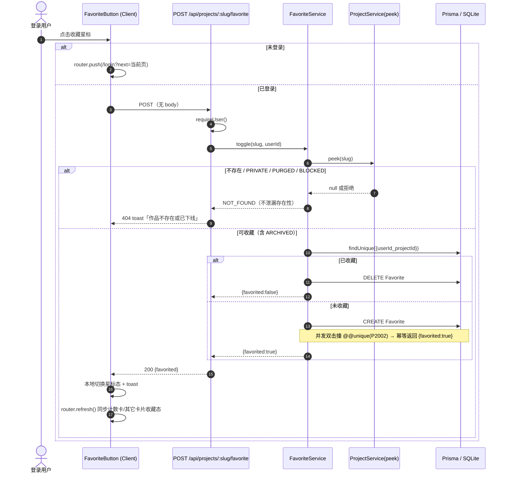
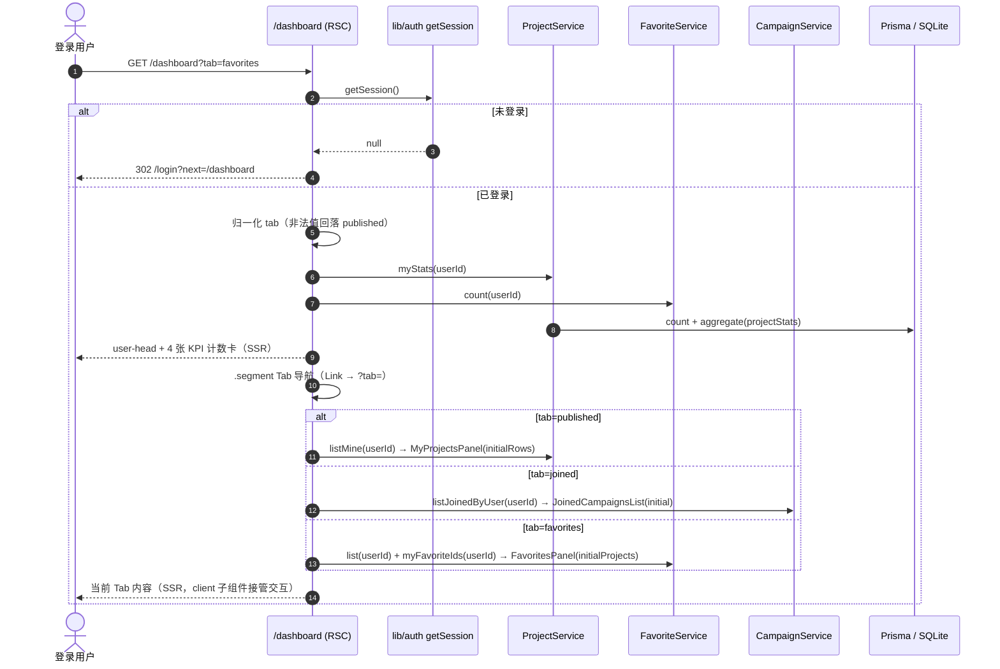
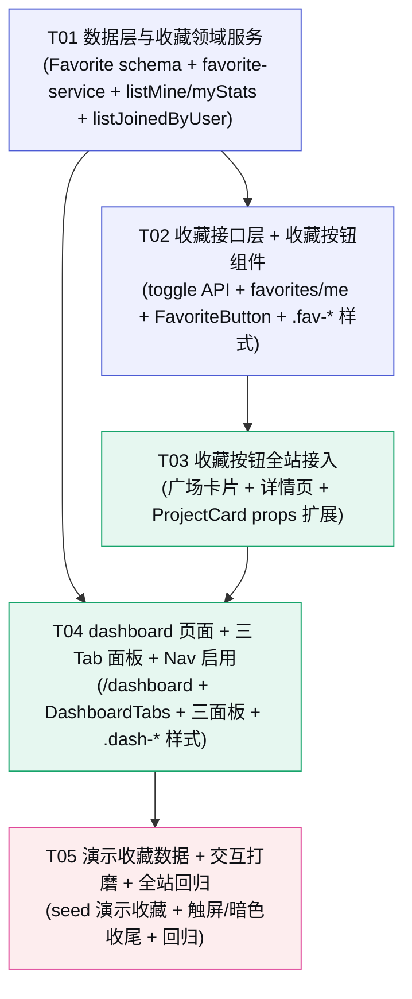

# Kernel · 创意种子 — P3 增量设计 · 「我的作品」个人空间

> 架构师：高见远　|　阶段：**P3 · 个人空间（完整版）**　|　运行形态：**本地 Node.js 轻量桩（非生产部署）**
>
> P3 目标：在 Nav 增加一个**完整个人空间页** `/dashboard`（三个 Tab：我发布的 / 我参与的活动 / 收藏），并新增**收藏能力**（Favorite 表 + toggle API + 列表 + 全站收藏按钮）。
>
> 前置依赖：P0（上传/沙箱/过期）+ P1（登录/鉴权/投票/排行榜/活动模块）+ P2（后台管理/风控）已交付。
> 本文档是**增量设计**，只描述「在现有代码上新增/修改什么」，已存在的能力不再重复描述。
>
> 设计基准：`docs/P0-架构与任务分解.md`（分层单体/文件结构/共享知识/约束）· `docs/P1-活动模块设计.md`（增量设计体例）· `docs/03-数据模型与API.md`（§3.1 Project / §3.2 Campaign·ProjectCampaign / §3.4 Vote 裁剪源）
> 视觉真源：`prototype/Kernel-创意种子-优化版.html` `#view-dashboard`（1628-1784 行：user-head + kpis + myprojects 表格 + 空态）
> 命名拍板：三个 Tab 定为 **我发布的 / 我参与的活动 / 收藏**（原型「我的参与/我的作品/我参加的活动」语义按主理人拍板调整）

---

## 〇、本轮范围锁定（先划边界，避免蔓延）

### 做（P3 In Scope）

| 能力 | 说明 |
|------|------|
| Favorite 表 | `id/userId/projectId/createdAt` + `@@unique([userId,projectId])` + `@@index([projectId])`，SQLite 兼容（无 enum/BigInt/Json） |
| 收藏 API | `POST /api/projects/[slug]/favorite`（**单端点 toggle**：未收藏→`{favorited:true}`、已收藏→`{favorited:false}`，需登录）；`GET /api/favorites/me`（我收藏的作品 id 列表，供批量渲染已收藏态） |
| 收藏按钮 | 详情页与「投一票」并列 + 广场卡片右上角 hover 显示；复用 `.btn-vote` 风格骨架 + 星形图标；未登录点击跳 `/login?next=<当前页>` |
| 个人空间页 | `/dashboard`：requireUser 门禁（未登录跳 `/login?next=/dashboard`）；URL 驱动三 Tab（`?tab=published\|joined\|favorites`）；顶部 4 张计数卡；空态文案三处 |
| Tab 1 我发布的 | 作者 = 当前用户的 **PUBLIC/UNLISTED/PRIVATE 全部作品（含 ARCHIVED/PURGED/BLOCKED 状态展示）**，createdAt desc；表格 + ProjectActions 续期/删除 |
| Tab 2 我参与的活动 | 我作品报名过的活动（ProjectCampaign join），含活动状态/时间/我的参赛作品数/活动票累计 |
| Tab 3 收藏 | 我收藏的作品列表（卡片网格，ProjectCard 复用 + 收藏按钮可取消） |
| Nav 启用 | 「我的作品」disabled 改 false，href=/dashboard；**所有角色可见**（非 ADMIN 专属，与 `/admin` 区别开） |

### 不做（Out of Scope，推后续轮次）

收藏分页（本轮列表一次取全）· 收藏夹分组/备注 · 收藏数公开展示（作品详情页展示「收藏数」）· 我收到的票/我投出的票 Tab（原型 myvotes，本轮不做）· 账户设置页（原型 settings）· 存储空间配额卡（原型 storage panel，无配额体系）· 收藏的排序/筛选 · 活动报名管理（个人空间内取消报名）· 作品编辑入口（仅续期/删除，编辑仍在详情页/状态页）。

---

## 一、增量设计要点

### 1.1 总体思路与难点

| # | 难点 | 本轮解法 |
|---|------|--------|
| D1 | **Favorite 无现成表、无现成 API，且不能破坏「重复操作不报错」铁律** | 新建 `Favorite` 模型 + `@@unique([userId,projectId])` 兜底；toggle 端点按当前状态确定性翻转，并发撞唯一约束（P2002）→ 幂等返回 `{favorited:true}`，与 vote-service「重复操作不报错」一致 |
| D2 | **「我发布的」要展示回收站/已清除作品，但 `ProjectCard`/`getBySlug` 对 PURGED/BLOCKED/PRIVATE 一律拒绝** | 新增 `projectService.listMine(userId)`：**不经过 getBySlug**，直接 `findMany({where:{authorId}})` + 复用 `toDTO`；展示层区分：ACTIVE/ARCHIVED 可进详情/操作，PURGED/BLOCKED 只展示状态徽章、不提供操作（ProjectActions 对 PURGED 会抛 NOT_FOUND） |
| D3 | **「我参与的活动」要跨 ProjectCampaign→Campaign 聚合，且活动状态是懒计算** | 新增 `campaignService.listJoinedByUser(userId)`：`projectCampaign.findMany({where:{status:'joined', project:{authorId}}})` 一次取回 → 按 campaignId 分组 → `computeStatus` 算有效状态 → 复用 `campaignVoteMap` 算票数；**不重复写 prisma 查询逻辑** |
| D4 | **计数卡口径要透明**（票数/浏览是「我作品总和」，不是「我收到的」） | 新增 `projectService.myStats(userId)`：`projectStats.aggregate({where:{project:{authorId}},_sum:{voteCount,viewCount}})` + `project.count({where:{authorId}})`，**口径 = 作者全部作品（含回收站）**，与 Tab 1 展示一致 |
| D5 | **收藏按钮不能破坏 ProjectCard 的整卡 Link（交互元素不能嵌在 Link 内）** | 收藏按钮作为 **card__badges 同级兄弟**，绝对定位在卡片右上角（z-index 高于 Link），与现有徽章布局同一模式；ProjectCard 只加**可选 props**（缺省不渲染），既有调用方零改动 |
| D6 | **Tab 切换要可刷新/可分享还原** | Tab 用 **URL 参数 `?tab=`** 驱动（`published\|joined\|favorites`，非法值回落 published）；Tab 导航用 `<Link>`（复用 `.segment` + `.segment-link`），切换即全页导航重新 SSR，不做客户端状态 |

### 1.2 Favorite 模型（SQLite 兼容）

**沿用 P0 既定 SQLite 降级手法**：无 enum、无 `@db.*`、无 `BigInt`、`Json→String`。纯新增表，不动现有任何表。

```prisma
/// 收藏（P3 个人空间）。一人一作品最多一条，唯一约束天然去重幂等。
model Favorite {
  id        String   @id @default(cuid())
  userId    String
  projectId String
  createdAt DateTime @default(now())

  user    User    @relation(fields: [userId], references: [id], onDelete: Cascade)
  project Project @relation(fields: [projectId], references: [id], onDelete: Cascade)

  /// 一人一作品一收藏（toggle 幂等 + 列表去重的唯一权威）
  @@unique([userId, projectId])
  /// 作品被收藏数 / 按作品反查（后续若展示「收藏数」）
  @@index([projectId])
}
```

**同步修改**（纯加法，不影响存量数据）：

| 模型 | 变更 |
|------|------|
| `User` | `+ favorites Favorite[]` |
| `Project` | `+ favorites Favorite[]` |

> ⬆️ 切 Postgres 还原清单：无额外动作（本模块未引入 enum/BigInt/Json 新字段）。

### 1.3 收藏 toggle API 契约

**取舍说明（对齐共享知识 §7.3）**：投票用 `POST /api/votes` + `DELETE /api/votes/:projectId` 双端点，因为要区分「投/取消」并返回**票数**；收藏**无公开计数展示**、无配额、无风控，客户端只需「当前是否已收藏」这一个布尔，因此采用**单端点 toggle**：服务端按当前状态确定性翻转，客户端零分支、天然幂等。若未来要展示「收藏数」，可在此返回体上做加法扩展。

#### POST /api/projects/[slug]/favorite（⭐ 新增）

| 项 | 约定 |
|----|------|
| 鉴权 | `requireUser()`，未登录 401 `NOT_LOGGED_IN` |
| 入参 | 无 body（路径 slug 即目标） |
| 行为 | 未收藏 → 建 `Favorite` → `{favorited:true}`；已收藏 → 删 `Favorite` → `{favorited:false}` |
| 出参 | `{ ok:true, data:{ favorited:boolean } }`（200） |
| 错误码 | 401 `NOT_LOGGED_IN` / 404 `NOT_FOUND`（作品不存在 **或** PRIVATE/PURGED/BLOCKED —— 与 `getBySlug` 一致，**不泄漏存在性**） |
| 幂等 | 并发双击撞 `@@unique`（P2002）→ 幂等返回 `{favorited:true}`；重复 toggle 按状态翻转，不报错 |
| 可收藏范围 | 任意可见性/状态中**可被当前用户看到**的作品：ARCHIVED 允许（回收站内仍可访问状态页）；PRIVATE/PURGED/BLOCKED/不存在 → 404 |

**为什么不校验 owner**：收藏是「读者行为」，与投票一致——任何登录用户可收藏任何可见作品（含自己的作品，不做自收藏限制）。

#### GET /api/favorites/me（⭐ 新增）

| 项 | 约定 |
|----|------|
| 鉴权 | `requireUser()`，未登录 401 `NOT_LOGGED_IN` |
| 出参 | `{ ok:true, data:[{ projectId, createdAt }] }`（createdAt desc，对齐 `/api/votes/me` 形态） |
| 用途 | 广场/详情页 SSR 批量渲染已收藏态；收藏 Tab 的 SSR 也复用它取 id 集合 |

### 1.4 我参与的活动查询（join ProjectCampaign + Campaign）

`campaignService.listJoinedByUser(userId): Promise<JoinedCampaignDTO[]>`

```
① projectCampaign.findMany({
     where: { status:'joined', project:{ authorId:userId } },
     include: { campaign:{ include: CARD_COUNT } },   // CARD_COUNT = joined 作品数 + 有效票数（复用）
     orderBy: { joinedAt:'desc' }                     // 最近报名在前
   })
② 按 campaignId 分组（保留组内最早 joinedAt 作为排序键）
③ 每组：
     campaign   → toCardDTO（status 为 computeStatus 懒计算值；projectCount/voteCount 为活动全量）
     myProjectCount   = 组内行数（我报名了该活动的作品数）
     myCampaignVoteCount = Σ campaignVoteMap(campaignId).get(projectId)  // 我的作品在该活动的票
```

**DTO**（`JoinedCampaignDTO`）：

| 字段 | 说明 |
|------|------|
| `campaign: CampaignCardDTO` | 含懒计算 `status` / `collectEndAt` / `voteStartAt` / `voteEndAt` / `projectCount`（活动全部 joined 作品数）/ `voteCount`（**活动票累计** = 活动内全部有效票 COUNT） |
| `myProjectCount` | 我报名了该活动的作品数 |
| `myCampaignVoteCount` | 我的作品在该活动内的票数合计（`myCampaignVoteCount <= voteCount`） |

> 口径说明：`voteCount`（活动票累计）默认 = 该活动**全部** joined 作品的票数（对齐活动详情页/活动榜口径）；`myCampaignVoteCount` 单独给出「我的作品拿到的票」。两值并列展示，避免歧义（§八 Q9）。

### 1.5 三个 Tab 的 query/loader 设计

| Tab | service 方法（RSC 直调） | 展示形态 | 空态 |
|-----|-------------------------|---------|------|
| published（默认） | `projectService.listMine(userId)` | `.admin-table` 表格：作品 / 状态 Badge / 可见性 / 票数 / 浏览 / 有效期 / 操作（ProjectActions） | 「你还没有作品」+ CTA 发布作品 |
| joined | `campaignService.listJoinedByUser(userId)` | `.dash-joined` 行列表：活动封面 + 标题 + 状态 Badge + 时间 + 我的参赛作品数 + 我的作品活动票 / 活动票累计 | 「还没有参与任何活动」+ CTA 浏览活动 |
| favorites | `favoriteService.list(userId)` + `myFavoriteIds(userId)` | 卡片网格（ProjectGrid/ProjectCard 复用 + 右上角收藏按钮可取消） | 「还没有收藏」+ CTA 逛逛广场 |

**loader 一次取全（页面级 Promise.all）**：`myStats` + `favoriteCount`（计数卡）+ 当前 Tab 数据，Server Component 直调 lib 服务（不 fetch 自家 API，对齐 §7.5）。

### 1.6 URL tab 驱动方案

```
/dashboard            → tab = published（默认）
/dashboard?tab=joined → 我参与的活动
/dashboard?tab=favorites → 收藏
/dashboard?tab=xxx    → 非法值回落 published（不 404）
```

- Tab 导航 = `.segment` 容器 + 3 个 `<Link className="segment-link" aria-pressed={active}>`（复用 P1 已落地的 `.segment-link`，零新增样式）。
- 切换 Tab 即全页导航（Link → searchParams 变化 → RSC 重跑），刷新/分享可还原。
- `DASHBOARD_TAB` 常量收口取值（`lib/constants.ts`），页面/组件不散落字符串。
- 页面级：`export const dynamic = 'force-dynamic'`（读 cookies + searchParams）。

### 1.7 Nav 启用细节

`src/components/ui/Nav.tsx`：

```
NAV_ITEMS: { href:'/dashboard', label:'我的作品', disabled:true }  →  { href:'/dashboard', label:'我的作品' }
```

- 仅去掉 `disabled: true`，其余不动；Nav 是 client 组件，**不 import lib/auth**（node:crypto 不进客户端 bundle）。
- **所有角色可见**（含 ADMIN —— 管理员也有自己的作品；ADMIN 的「后台管理」入口是独立追加项，不受影响）；访客也显示，点击 `/dashboard` 后由页面层 302 到登录（§八 Q10）。
- 「我的作品」处于 active 态时高亮规则不变（`pathname.startsWith('/dashboard')` 已天然覆盖）。

### 1.8 计数卡聚合口径（dashboard 头部，4 张）

| 卡 | 口径 | service |
|----|------|---------|
| 我的作品 | `COUNT(Project where authorId=userId)`，**含 ARCHIVED/PURGED/BLOCKED**（与 Tab 1 展示一致） | `myStats().projectCount` |
| 累计票数 | `SUM(ProjectStats.voteCount)` over 作者全部作品（含回收站） | `myStats().voteCount` |
| 累计浏览 | `SUM(ProjectStats.viewCount)` over 作者全部作品（含回收站） | `myStats().viewCount` |
| 收藏 | `COUNT(Favorite where userId)` | `favoriteService.count()` |

- 数字一律 `mono` + `tabular-nums`，用 `formatCount` 格式化（对齐广场 hero 统计）。
- KPI 卡样式从 prototype 434-441 行直译（`.kpis` 4 列 / `.kpi` 卡 + 左侧品牌色条 nth-child / `.kpi__ico` 彩色底 + `.kpi__num` 28px mono），**全 token 化（零 hex）**：色条依次 `--color-primary-soft→primary`、`--tint-magenta→accent-magenta`、`--tint-cyan→accent-cyan`、`--tint-primary→primary`（prototype 同款）。
- 每卡 foot 一行口径说明文字（如「含回收站」），不做趋势（无历史数据，§八 Q3）。

---

## 二、文件列表及相对路径

> ⭐ = 新增；其余为修改。全部相对项目根。

```
prisma/
├── schema.prisma                   # 修改：+Favorite 模型 + User.favorites/Project.favorites 关系（§1.2）
├── seed.ts                         # 修改：+demo 用户演示收藏 2 条（T05，保证收藏 Tab 非空）

src/
├── lib/
│   ├── constants.ts                # 修改：+DASHBOARD_TAB（published|joined|favorites 收口）
│   ├── types.ts                    # 修改：+FavoriteItem / MyProjectStats / JoinedCampaignDTO
│   ├── favorite-service.ts         # ⭐ 新增：toggle / myFavorites / myFavoriteIds / hasFavorited / list / count
│   ├── project-service.ts          # 修改：+listMine(userId) / +myStats(userId)
│   └── campaign-service.ts         # 修改：+listJoinedByUser(userId)
│
├── app/api/
│   ├── projects/[slug]/favorite/route.ts   # ⭐ 新增：POST 收藏 toggle
│   └── favorites/me/route.ts               # ⭐ 新增：GET 我收藏的作品 id 列表
│
├── app/
│   ├── dashboard/page.tsx          # ⭐ 新增：个人空间 RSC（requireUser + 计数卡 + 三 Tab + 当前 Tab SSR）
│   ├── (feed)/page.tsx             # 修改：SSR 取 favoritedIds 传入网格（广场卡片收藏态）
│   └── w/[slug]/page.tsx           # 修改：SSR 取 hasFavorited + 详情页右侧加收藏按钮
│
├── components/
│   ├── dashboard/                  # ⭐ 新增 6 个：index / DashboardTabs / MyProjectsPanel / JoinedCampaignsList / FavoritesPanel
│   ├── project/
│   │   ├── FavoriteButton.tsx      # ⭐ 新增：收藏 toggle 按钮（client，复用 .btn-vote 骨架）
│   │   ├── ProjectCard.tsx         # 修改：+可选 favorite props（缺省不渲染，既有调用零改动）
│   │   └── index.ts                # 修改：桶导出 FavoriteButton
│   └── ui/Nav.tsx                  # 修改：「我的作品」disabled 改 false（§1.7）
│
└── styles/
    └── globals.css                 # 修改：+.dash-*（user-head/kpis/joined 行）+ .fav-*（收藏按钮/卡片 overlay）+ 响应式
```

**计数**：新增 10 · 修改 11 ≈ **21 个文件**。

---

## 三、数据结构与接口

```mermaid
classDiagram
    direction LR

    class Favorite {
        +String id
        +String userId
        +String projectId
        +DateTime createdAt
    }

    class User {
        +String id
        +String nickname
        +String role
    }

    class Project {
        +String id
        +String slug
        +String title
        +String visibility
        +String status
        +String authorId
        +Int viewCount
        +Int voteCount
    }

    class Campaign {
        +String id
        +String slug
        +String title
        +String status
        +DateTime collectEndAt
        +DateTime voteStartAt
        +DateTime voteEndAt
    }

    class ProjectCampaign {
        +String campaignId
        +String projectId
        +String status
        +DateTime joinedAt
    }

    User "1" --> "0..*" Favorite : favorites
    Project "1" --> "0..*" Favorite : favoritedBy
    User "1" --> "0..*" Project : authors
    Project "1" --> "0..*" ProjectCampaign : campaigns
    Campaign "1" --> "0..*" ProjectCampaign : projects

    class FavoriteService {
        +toggle(slug, userId) Promise~{favorited}~
        +myFavorites(userId) Promise~FavoriteItem[]~
        +myFavoriteIds(userId) Promise~string[]~
        +hasFavorited(projectId, userId) Promise~boolean~
        +list(userId) Promise~ProjectDTO[]~
        +count(userId) Promise~number~
    }

    class ProjectService {
        +listMine(userId) Promise~ProjectDTO[]~
        +myStats(userId) Promise~MyProjectStats~
    }

    class CampaignService {
        +listJoinedByUser(userId) Promise~JoinedCampaignDTO[]~
    }

    FavoriteService ..> Favorite : persists
    FavoriteService ..> ProjectService : uses peek (可见性判定)
    CampaignService ..> ProjectCampaign : reads
    CampaignService ..> Campaign : reads
```

**关键 DTO**（`lib/types.ts` 新增，均为纯类型，时间字段 ISO 8601 UTC）：

| 类型 | 字段 |
|------|------|
| `FavoriteItem` | `{ projectId: string; createdAt: string }` |
| `MyProjectStats` | `{ projectCount: number; voteCount: number; viewCount: number }` |
| `JoinedCampaignDTO` | `{ campaign: CampaignCardDTO; myProjectCount: number; myCampaignVoteCount: number }` |

**API 一览（本轮新增 2 个端点）**：

| 方法 | 路径 | 鉴权 | 出参 | 错误码 |
|------|------|------|------|--------|
| `POST` | `/api/projects/:slug/favorite` | 登录 | `{ favorited: boolean }` | 401 `NOT_LOGGED_IN` / 404 `NOT_FOUND` |
| `GET` | `/api/favorites/me` | 登录 | `FavoriteItem[]`（createdAt desc） | 401 `NOT_LOGGED_IN` |

> 无新增错误码：`NOT_FOUND` / `NOT_LOGGED_IN` 均为既有码，直接复用 `response.ts`。

---

## 四、程序调用流程

### 4.1 收藏 toggle（详情页 / 广场卡片共用）



### 4.2 dashboard 首屏加载（RSC 直调，三 Tab 共用）



---

## 五、任务分解

> **分组原则**：按「层次 + 可独立验收」分块，共 **5 个主任务块（T01–T05）**，每块 ≥ 3 文件。
> 本轮为增量模块、无新增配置文件/依赖，「项目基础设施」语义由 **T01（数据层与领域服务）** 承担（对齐 P1/P2 体例）。

### T01 · 数据层与收藏领域服务

| 项 | 内容 |
|----|------|
| **优先级** | P0（阻塞全部） |
| **依赖** | 无（在 P0–P2 既有代码之上） |
| **产出文件** | `prisma/schema.prisma`（+Favorite/关系）· `src/lib/constants.ts`（+DASHBOARD_TAB）· `src/lib/types.ts`（+3 DTO）· `src/lib/favorite-service.ts`（⭐）· `src/lib/project-service.ts`（+listMine/myStats）· `src/lib/campaign-service.ts`（+listJoinedByUser） |
| **要点** | ① Schema 按 §1.2 写，SQLite 兼容（纯新增表，不动现有表）<br/>② `favorite-service.toggle`：peek + 可见性判定（PRIVATE/PURGED/BLOCKED/不存在 → NOT_FOUND，不泄漏存在性）→ findUnique → 建/删 → 返回 `{favorited}`；P2002 幂等<br/>③ `listMine` 不过 `getBySlug`，`findMany({where:{authorId}})` + 复用 `toDTO`（含全部状态/可见性）<br/>④ `myStats` 用 `projectStats.aggregate` 一次取 SUM，口径 = 作者全部作品<br/>⑤ `listJoinedByUser` 一次取回 ProjectCampaign→Campaign，按 campaignId 分组 + computeStatus + campaignVoteMap 复用 |
| **验收点** | ✅ `npm run db:push` 成功，Prisma Studio 可见 Favorite 表与唯一索引<br/>✅ 单测 `toggle`：未收藏→true、再点→false、再点→true；PRIVATE slug → NOT_FOUND<br/>✅ `listMine` 返回含 ARCHIVED/PURGED 的全部状态作品，createdAt desc<br/>✅ `myStats` 票数/浏览与 `projectStats._sum` 手工核对一致<br/>✅ `listJoinedByUser` 对 seed 活动返回 2 条（camp-demo1，myProjectCount=2） |

### T02 · 收藏接口层 + 收藏按钮组件

| 项 | 内容 |
|----|------|
| **优先级** | P0 |
| **依赖** | T01 |
| **产出文件** | `src/app/api/projects/[slug]/favorite/route.ts`（⭐）· `src/app/api/favorites/me/route.ts`（⭐）· `src/components/project/FavoriteButton.tsx`（⭐）· `src/styles/globals.css`（+.fav-*） |
| **要点** | ① 两个 route 只做「解析 → requireUser → 调 service → ok()/toErrorResponse()」，业务规则全在 T01<br/>② `POST /favorite` 无 body；404 语义与 `getBySlug` 一致（PRIVATE 与不存在同响应，不泄漏存在性）<br/>③ `FavoriteButton`（client）：props = `{ slug, initialFavorited, isLoggedIn, loginNext, variant?: 'inline'\|'overlay', size?: 'sm'\|'md' }`；未登录跳登录；本地切换 + toast + `router.refresh()`；`aria-label` 随状态变化<br/>④ `.fav-*` 样式复用 `.btn-vote` 骨架（星形图标区分投票爱心），**全 token 化（零 hex）**：默认 `--text-tertiary`、已收藏 `--color-accent-magenta`（§八 Q7）；`.fav-overlay` 卡片右上角绝对定位 + 半透明底 |
| **验收点** | ✅ curl：未登录 401；登录后 toggle 两次分别返回 `{favorited:true}/{favorited:false}`；`/api/favorites/me` 返回 id 列表<br/>✅ FavoriteButton 在暗色/375px 下可读，focus-visible 环齐全，触摸目标 ≥ 40px |

### T03 · 收藏按钮全站接入（广场卡片 + 详情页）

| 项 | 内容 |
|----|------|
| **优先级** | P1 |
| **依赖** | T02 |
| **产出文件** | `src/components/project/ProjectCard.tsx`（修改）· `src/app/(feed)/page.tsx`（修改）· `src/app/w/[slug]/page.tsx`（修改）· `src/components/project/index.ts`（修改） |
| **要点** | ① `ProjectCard` 加**可选** props `{ favorited?: boolean; isLoggedIn?: boolean }`（缺省不渲染收藏按钮，既有调用方零改动）；按钮放 `card__badges` 同级兄弟（**不嵌进整卡 Link**，避免非法嵌套），绝对定位右上角 `.fav-overlay`<br/>② 广场：`(feed)/page.tsx` SSR `getSession()` + `favoriteService.myFavoriteIds(userId)` → `favoritedIds: Set<string>` → `ProjectGrid` → `ProjectCard`（ProjectGrid 增加透传 props）<br/>③ 详情页：`w/[slug]/page.tsx` SSR `favoriteService.hasFavorited(project.id, userId)` → 右侧 `VoteHero` 下方/并列渲染 `FavoriteButton`（`variant='inline'`，与「投一票」并列）<br/>④ 桶导出 `FavoriteButton`，`ProjectCard`/`ProjectGrid` 的 props 类型同步更新 |
| **验收点** | ✅ 广场卡片 hover 右上角出现收藏星标，点击即时切换、刷新保持<br/>✅ 详情页收藏按钮与「投一票」并列；未登录点击跳 `/login?next=/w/{slug}`，登录后回跳<br/>✅ 未传 favorite props 的既有卡片（活动页网格等）渲染完全不变（回归） |

### T04 · dashboard 页面 + 三 Tab 面板 + Nav 启用

| 项 | 内容 |
|----|------|
| **优先级** | P0（本轮核心交付） |
| **依赖** | T01 · T03 |
| **产出文件** | `src/app/dashboard/page.tsx`（⭐）· `src/components/dashboard/index.ts`（⭐）· `DashboardTabs.tsx`（⭐）· `MyProjectsPanel.tsx`（⭐）· `JoinedCampaignsList.tsx`（⭐）· `FavoritesPanel.tsx`（⭐）· `src/components/ui/Nav.tsx`（修改）· `src/styles/globals.css`（+.dash-*） |
| **要点** | ① 页面：`getSession()` 未登录 `redirect('/login?next=/dashboard')`；`force-dynamic`；searchParams.tab 归一化（`DASHBOARD_TAB`）；`Promise.all` 取 `myStats` + `favoriteCount` + 当前 Tab 数据<br/>② `DashboardTabs`（RSC）：`.segment` + 3 个 `.segment-link`（`aria-pressed`），零新增 tab 样式<br/>③ `MyProjectsPanel`（client）：SSR initialRows → `.admin-table` 表格（作品/状态/可见性/票数/浏览/有效期/操作）；操作列复用 `ProjectActions`（canManage=true）；PURGED/BLOCKED 行仅展示状态徽章、不渲染操作、标题不加链接；续期/删除后 `router.refresh()`<br/>④ `JoinedCampaignsList`：行列表（封面占位 + 标题链 `/campaigns/{slug}` + 状态 Badge + 时间 + 我的参赛作品数 + 我的作品活动票/活动票累计）<br/>⑤ `FavoritesPanel`（client）：SSR initialProjects + initialFavoritedIds → ProjectGrid + FavoriteButton（overlay）；取消收藏本地移除 + `router.refresh()` 同步计数<br/>⑥ 空态：EmptyState 三处（原型文案：你还没有作品 / 还没有参与任何活动 / 还没有收藏）<br/>⑦ `Nav.tsx`：`/dashboard` 启用（§1.7）；globals.css 移植 `.user-head` / `.kpis` / `.kpi` / `.dash-joined`（prototype 直译，零 hex）+ 响应式（kpis 4→2→1 列） |
| **验收点** | ✅ 未登录访问 `/dashboard` → 302 到 `/login?next=/dashboard`，登录后回跳<br/>✅ 三 Tab 用 URL 切换、刷新/分享可还原；非法 tab 值回落 published<br/>✅ 4 张计数卡口径正确；「我发布的」表格续期/删除可用且刷新<br/>✅ 登录 demo 用户：published 有 3 条、joined 有 1 条、favorites 空态显示；375/768/1280 无横向滚动 |

### T05 · 演示收藏数据 + 交互打磨 + 全站回归

| 项 | 内容 |
|----|------|
| **优先级** | P1 |
| **依赖** | T04 |
| **产出文件** | `prisma/seed.ts`（修改：demo 用户演示收藏 2 条）· `src/styles/globals.css`（修改：响应式/暗色/触屏收藏按钮显示策略收尾）· `src/components/dashboard/FavoritesPanel.tsx`（修改：取消收藏本地移除 + 空态联动） |
| **要点** | ① seed：demo 用户收藏 `Aur9raFx` + `NebuLa42`（upsert by `userId_projectId`，幂等），保证收藏 Tab 开箱非空<br/>② 触屏设备（`@media (hover: none)`）收藏按钮常显而非 hover 显，保证可发现性<br/>③ FavoritesPanel：取消收藏后从本地列表移除（不回退整页），列表空时即时切空态<br/>④ 全站回归：广场/详情/投票/活动/后台/上传不受影响；全局搜 `#` 6 位色值零命中；暗色无白块 |
| **验收点** | ✅ `npm run db:seed` 后 demo 登录：收藏 Tab 2 条、计数卡「收藏=2」<br/>✅ 取消收藏 → 列表即时移除 → 空态出现；广场对应卡片收藏态同步<br/>✅ 全站三档宽度 + 暗色回归无布局错乱、无硬编码色残留 |

### 5.6 任务依赖图



**关键路径**：`T01 → T02 → T03 → T04 → T05`。T02 与 T03 紧密（按钮调 API），不拆并行。

---

## 六、依赖包列表

**无新增依赖**。全部复用现有栈（Next.js 15 / Prisma / SQLite / 自写 ui 组件）。明确不装：任何 UI 库、图标库（星形图标内联 SVG）、状态管理库、TanStack Query（收藏 toggle 用本地 state + router.refresh，对齐现有投票按钮模式）。

---

## 七、共享知识（跨文件约定）

### 7.1 dashboard 是 requireUser 页面（非 ADMIN 专属）
- `/dashboard` **任何登录用户可访问**（USER/JUDGE/ADMIN/SUPER_ADMIN 均可），与 `/admin`（requireAdmin，仅管理员）严格区别。
- 页面层用 `getSession() + redirect('/login?next=/dashboard')`（对齐 `admin/layout.tsx` 门禁模式）；未登录访问任何 Tab 都先过这关。
- Nav「我的作品」对所有角色显示（含 ADMIN）；访客点击 → 302 登录。

### 7.2 Tab 用 URL 参数驱动
- `?tab=published|joined|favorites`，缺省/非法值回落 `published`；取值收口在 `DASHBOARD_TAB` 常量。
- Tab 切换 = `<Link>` 全页导航（重新 SSR），刷新/分享可还原；**不做客户端 tab 状态**（保持 URL 为唯一真源）。
- Tab 导航复用 `.segment` + `.segment-link`（P1 已落地），`aria-pressed` 标记激活项。

### 7.3 收藏 toggle 与投票的取舍
- 投票是 **POST/DELETE 双端点**（要区分投/取消并返回票数）；收藏是 **单端点 toggle**（无公开计数、无配额，客户端只需布尔态）——`POST /api/projects/[slug]/favorite` 按当前状态确定性翻转，天然幂等。
- toggle 语义：未收藏→`{favorited:true}`、已收藏→`{favorited:false}`；并发撞 `@@unique`（P2002）幂等返回 `{favorited:true}`。
- **不校验 owner、不做自收藏限制**：任何登录用户可收藏任何可见作品。

### 7.4 收藏可见性口径（读侧）
- `favoriteService.list(userId)`：只返回 `status NOT IN (PURGED, BLOCKED)` 且 `visibility != PRIVATE` 的收藏作品（对齐「能看才能继续看」）；ARCHIVED 保留展示（可进状态页）。
- 作品被 PURGED/BLOCKED/改 PRIVATE 后，收藏行保留（不主动清理），只是从列表隐藏；作品行物理删除时 `onDelete: Cascade` 自动清理。
- 收藏 Tab 卡片点击：ACTIVE/UNLISTED → `/w/{slug}`；ARCHIVED → `/w/{slug}`（自动 302 到状态页）；列表已过滤 PURGED/BLOCKED/PRIVATE，不会出现死链。

### 7.5 计数卡口径（透明约定）
- 我的作品 = `COUNT(authorId)` **含回收站/已清除**（与 Tab 1 展示一致）；累计票数/浏览 = `SUM(ProjectStats.voteCount/viewCount)` over 作者全部作品（含回收站）。
- 收藏数 = `COUNT(Favorite where userId)`（与 Tab 3 条数一致）。
- 数字一律 `mono` + `tabular-nums` + `formatCount`；KPI 卡样式走 CSS 变量（`.kpi::before` 品牌色条），零 hex。

### 7.6 数据通路
- dashboard 首屏 = Server Component 直调 `lib/` 领域服务（`listMine` / `listJoinedByUser` / `favoriteService.list`），**禁止在 Server Component 里 fetch 自家 `/api`**。
- 客户端交互（收藏 toggle / 续期 / 删除）走 `/api/*`，成功后 `router.refresh()` 同步服务端；收藏 Tab 的取消收藏先本地移除再 refresh（体验优先，refresh 失败不闪回）。
- 复用清单：`.segment`/`.segment-link`（Tab）、`.admin-table`（我发布的表格）、`ProjectCard`/`ProjectGrid`（收藏网格）、`ProjectActions`（续期/删除）、`EmptyState`（空态）、`.btn-vote`（收藏按钮骨架）、`CoverPlaceholder`（活动封面占位）。

### 7.7 收藏按钮可访问性与样式
- `aria-label` 随状态变化（「收藏」「取消收藏」）；focus-visible 环 3px；overlay 按钮触摸目标 ≥ 40px（hover 设备隐藏、触屏常显，见 T05）。
- 星形图标内联 SVG（区分投票爱心）；已收藏色 `--color-accent-magenta`（§八 Q7，备选金色）。
- 收藏按钮**禁止**嵌进 `ProjectCard` 的整卡 `<Link>` 内（非法嵌套）：与 `card__badges` 同级、绝对定位右上角。

### 7.8 沿用既有硬性约定
统一响应体 `{ok,data,meta}` · `message` 中文面向用户 · `code` 大写下划线（本轮无新错误码）· 时间 ISO 8601 UTC · `node:fs` 仅 `storage.ts` · 无硬编码 hex · 日志 `[dashboard][...]` / `[favorite][...]` `key=value` · Route Handler `export const runtime='nodejs'` + `dynamic='force-dynamic'` · 可访问性（focus-visible/aria-label/触摸目标）。

---

## 八、待明确事项（需主理人拍板）

> 每条均给**默认建议**，若无异议工程师按建议执行。

| # | 议题 | 我的建议（默认执行） | 影响面 |
|---|------|---------------------|--------|
| **Q1** | 收藏按钮位置？ | **两处都做**：详情页与「投一票」并列（inline）；广场卡片右上角 hover 星标（overlay）。理由：brief 已列两种，各自语境合理 | 低 |
| **Q2** | 空态文案？ | 按原型：**「你还没有作品」+ CTA 发布作品**；**「还没有参与任何活动」+ CTA 浏览活动**；**「还没有收藏」+ CTA 逛逛广场** | 低 |
| **Q3** | 计数卡点击是否筛选？ | **不点击（纯展示）**，foot 一行口径说明；备选：点「收藏」跳 `?tab=favorites`。本轮避免把 KPI 变成隐式导航 | 低 |
| **Q4** | Tab 默认值？ | **published（我发布的）**：与原型「概览页→我的作品」优先信息一致，且新用户最关心自己作品 | 低 |
| **Q5** | 「我发布的」展示形态？ | **表格**（复用 `.admin-table` + 操作列 ProjectActions，对齐原型 myprojects 表格）；备选卡片网格（管理动作不好放）。PURGED/BLOCKED 行只展示状态、无操作、标题不加链接 | 中 |
| **Q6** | 收藏列表是否含 ARCHIVED？ | **含**（显示状态徽章，可进状态页）；PURGED/BLOCKED/PRIVATE 过滤掉。理由：回收站 30 天内仍可恢复，收藏不该静默消失 | 低 |
| **Q7** | 收藏按钮已收藏颜色？ | **品红 `--color-accent-magenta`**（与投票一致，符合「复用投票按钮风格」）；备选金色星标（区分投票）。默认品红，星形图标已足够区分语义 | 低 |
| **Q8** | 「我的作品数」是否含 PURGED/BLOCKED？ | **含**（与 Tab 1 展示一致，口径透明）；备选只计 ACTIVE+ARCHIVED（口径更「健康」但 Tab 条数对不上） | 低 |
| **Q9** | 「活动票累计」口径？ | **活动内全部 joined 作品票数**（`campaign.voteCount`，与活动详情页/活动榜一致），同时单独展示 `myCampaignVoteCount`（我的作品在该活动的票）；两值并列，避免歧义 | 中 |
| **Q10** | Nav「我的作品」是否对 ADMIN 显示？ | **显示**（管理员也有个人作品；「后台管理」是独立入口）。brief「ADMIN 之外的角色都可见」按「非 ADMIN 专属」理解；如需对 ADMIN 隐藏，改一行过滤即可 | 低 |
| **Q11** | dashboard 三列表是否分页？ | **本轮不分页**（一次取全，个人作品量级小）；量大再补 `page/pageSize`（复用 `PagedResult` 契约） | 低 |

---

## 九、P3 个人空间验收标准

> **登录用户从 Nav 进入「我的作品」：看到 4 张计数卡与三 Tab（我发布的 / 我参与的活动 / 收藏）；我发布的表格可续期/删除自己的作品（含回收站状态展示）；我参与的活动列出报名过的活动与我的作品票数；收藏 Tab 展示收藏的作品且可在卡片/详情页/广场上收藏/取消收藏——全程零新增依赖，未登录访问被正确导向登录，广场/详情/投票/活动/后台行为与改造前完全一致。**

- [ ] `npm run db:push && npm run db:seed` 后 Favorite 表可见；demo 用户收藏 Tab 有 2 条演示数据
- [ ] 未登录访问 `/dashboard` → 302 `/login?next=/dashboard`；登录后回跳
- [ ] 三 Tab URL 驱动：`?tab=published|joined|favorites` 刷新/分享可还原；非法值回落 published
- [ ] 4 张计数卡口径正确（作品数含回收站；票数/浏览 = 我作品 SUM；收藏数 = 我收藏条数）
- [ ] 我发布的：全部状态作品展示、续期/删除可用；PURGED/BLOCKED 无操作、无死链
- [ ] 我参与的活动：活动状态/时间/我的参赛作品数/活动票累计正确，与活动详情页口径一致
- [ ] 收藏全链路：广场卡片 hover 收藏、详情页与「投一票」并列收藏、收藏 Tab 取消收藏即时移除；未登录跳登录且 next 回跳正确
- [ ] 收藏 toggle 幂等：重复点击按状态翻转不报错；PRIVATE/不存在统一 404 不泄漏存在性
- [ ] 全站回归：广场/详情/投票/活动/后台/上传不受影响；`#` 6 位色值零命中；375/768/1280 三档无横向滚动、暗色无白块

---

### 附：交付文件

| 文件 | 内容 |
|------|------|
| `docs/P3-个人空间设计.md` | 本文档（增量设计 + 任务分解全量） |
| `docs/P3-class-diagram.mermaid` | §三 类图独立文件 |
| `docs/P3-sequence-diagram.mermaid` | §四 时序图独立文件 |
