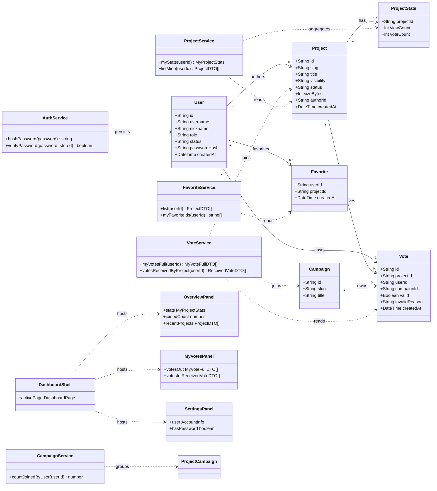
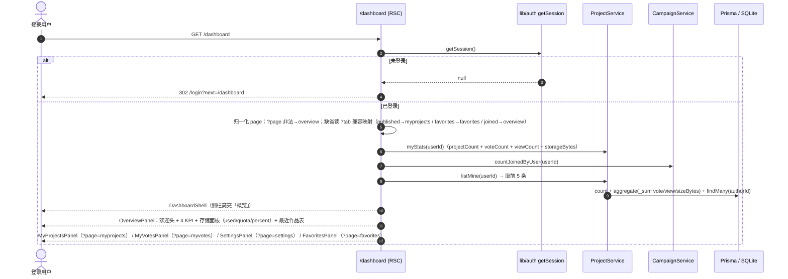
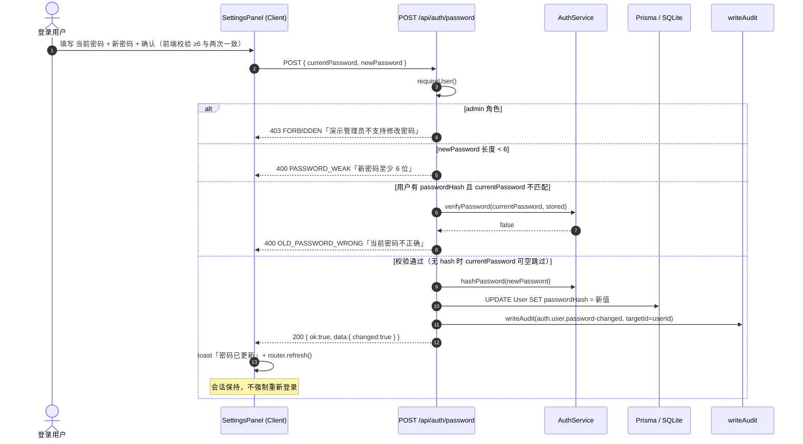
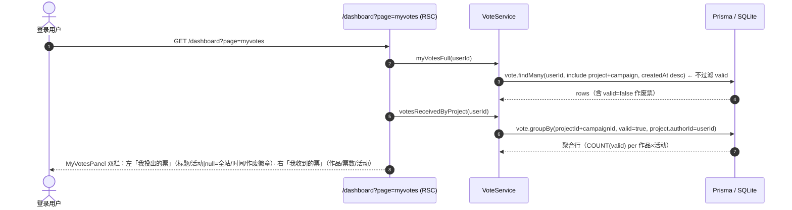
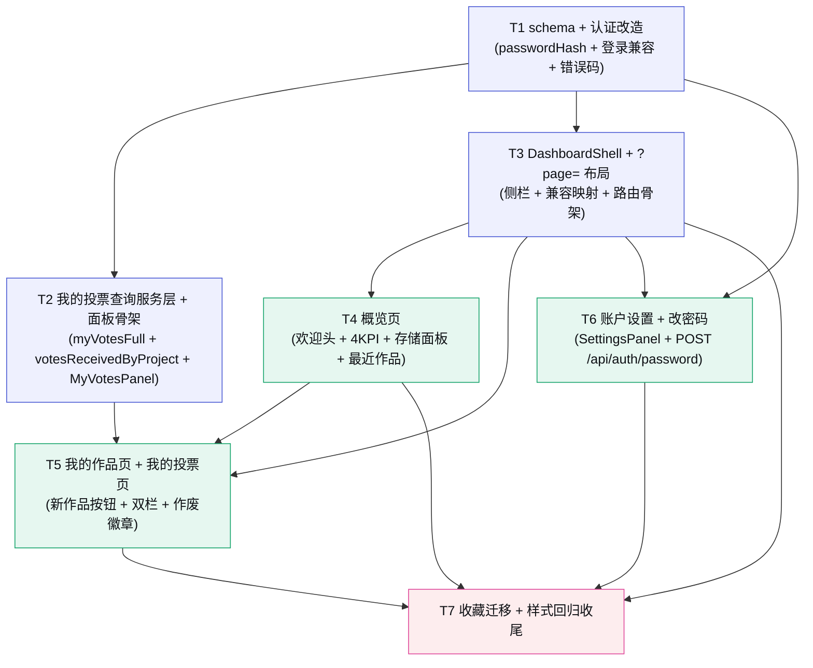

# Kernel · 创意种子 — P3 增量设计 · 「我的后台」完整版

> 架构师：高见远　|　阶段：**P3.5 · 我的后台（完整版，对齐原型 view-dashboard）**　|　运行形态：**本地 Node.js 轻量桩（非生产部署）**
>
> 本轮目标：把当前简化版 `/dashboard`（三 Tab + 4 计数卡）补齐为原型 `view-dashboard` 的**完整个人后台**——侧栏式布局 + 5 页（概览 / 我的作品 / 我的投票 / 账户设置 / 收藏）+ 存储空间面板 + 改密码（passwordHash）。
>
> 前置依赖：P0（上传/沙箱/过期）+ P1（登录/投票/活动）+ P2（后台/风控）+ P3（个人空间三 Tab + 收藏）已交付。本文档是**增量设计**，只描述「在现有代码上新增/修改什么」。
>
> 设计基准：`docs/P0-架构与任务分解.md`（分层单体/文件结构/共享知识/约束）· `docs/P3-个人空间设计.md`（三 Tab + 收藏现状，§1.6/§1.8/§7.2/§7.5 口径沿用）
> 视觉真源：`prototype/Kernel-创意种子-优化版.html` `#view-dashboard`（1628-1784 行：侧栏 side__group + 概览 user-head/kpis/存储面板/最近作品 + myprojects 表格 + myvotes 双栏 + settings 改密码/退出）
> 命名拍板：侧栏「我的」组 = **概览 / 我的作品 / 我的投票 / 账户设置 / 收藏**（收藏为 P3 功能保留的第 5 项）；「快捷」组 = **发布新作品 → /new、浏览作品广场 → /**。

---

## 〇、本轮范围锁定（先划边界，避免蔓延）

### 做（In Scope）

| 能力 | 说明 |
|------|------|
| 侧栏式布局 | `/dashboard` 改 DashboardShell：左侧栏（我的组 5 项 + 快捷组 2 项，对齐 AdminShell 风格）；URL 驱动 `?page=overview\|myprojects\|myvotes\|settings\|favorites`，非法回落 overview；移动端侧栏折叠为顶部横向滚动（复用 `.admin-shell` 断点行为） |
| 概览页 | 欢迎头（Avatar + 「你好，{昵称}」+ 角色徽章「创作者」+ 副文案）+ 4 个 KPI（我的作品数 / 累计票数 / 总浏览 / 参与活动数）+ 存储空间面板（SUM(sizeBytes) / 5GB + 进度条 + 「超出配额无法发布」文案）+ 最近作品表格（最近 5 条，列：作品/状态/票数/浏览/操作） |
| 我的作品页 | 迁移现有表格（全状态含私密 + ProjectActions），Panel head 右侧加「＋ 新作品」按钮 → `/new`（对齐原型 1730 行） |
| 我的投票页（双栏） | 左「我投出的票」：Vote join Project（作品标题 / 所属活动 null=全站 / 投票时间 / valid 状态——作废票显示「已作废」徽章）；右「我收到的票」：我的作品收到的有效票按 作品×活动 聚合（作品/票数/活动） |
| 账户设置页 | 账号信息（用户名 / 角色徽章 / 注册时间）+ 修改密码（当前/新/确认 + 保存）+ 退出登录按钮 |
| 认证改造 | User +`passwordHash String?`（可空，node:crypto scrypt，零新依赖）；登录逻辑兼容（有 hash 校验 / 无 hash 任意密码）；`POST /api/auth/password` 改密码 |
| AuditLog | 改密码写 `auth.user.password-changed`（低优先级，复用现有 `writeAudit`） |

### 不做（Out of Scope，推后续轮次）

发布时存储配额**硬拦截**（本轮仅展示；P0 已决策不做硬限制）· admin 改密码（表单隐藏 + 说明，保持 admin/123456）· 密码找回/重置 · 昵称/头像修改 · 「我参与的活动」独立页（P3 三 Tab 的 joined 列表不再单独成页，活动参与通过概览 KPI「参与活动数」表达；旧链接 `?tab=joined` 兼容到 overview）· 收藏分页/分组 · 我的投票分页。

---

## 一、增量设计要点

### 1.1 总体思路与难点

| # | 难点 | 本轮解法 |
|---|------|--------|
| D1 | **侧栏布局不能重造轮子，且要与 AdminShell 视觉一致** | 直接复用 `.admin-shell / .admin-sidebar / .admin-content` 布局类（零新增布局逻辑）；侧栏内部按原型 `side__group` 分组（我的/快捷），新增 `.dash-side__*` 增强类（组标签/图标/计数徽章）；移动端 ≤767px 复用现有断点（sidebar 变横向滚动行），**快捷组隐藏**（站点头部 Nav 已有「发布作品」与 Logo→广场，语义不丢） |
| D2 | **URL 驱动从 `?tab=`（3 值）升级为 `?page=`（5 值），老链接不能断** | 新增 `DASHBOARD_PAGE` 常量；`page.tsx` 归一化顺序 = 先读 `?page=`（非法回落 overview）→ 缺省时读 `?tab=` 做兼容映射（published→myprojects / favorites→favorites / joined→overview）→ 都没有回落 overview。**本地兼容解析、不强制 301**（本地桩无 SEO 需求，URL 保持老链接也能直达正确页；如需规范化后续可加 `redirect()`） |
| D3 | **存储面板口径要「透明且与磁盘一致」** | 已用 = `SUM(Project.sizeBytes where authorId)`（PURGED 作品在 purge 任务中 `sizeBytes` 已归 0，故 SUM 天然等于磁盘占用）；配额 = `STORAGE_QUOTA_BYTES = 5 * BYTES_PER_GB` 常量；percent 封顶 100；展示 `formatBytes`（已有）。纯展示，不拦截发布 |
| D4 | **我投出的票要展示作废票，但现有 `myVotes()` 只返回 valid** | 新增 `voteService.myVotesFull(userId)`：`vote.findMany({ where:{userId}, include:{ project:{include:{author,stats}}, campaign:{select:{title}} }, orderBy:{createdAt:desc} })` —— **不过滤 valid**，作废票返回 `valid:false + invalidReason` 由展示层画「已作废」徽章（原型 brief 明确要展示） |
| D5 | **我收到的票要按作品×活动聚合，且与 KPI 票数口径一致** | 新增 `voteService.votesReceivedByProject(userId)`：`vote.groupBy({ by:['projectId','campaignId'], where:{ valid:true, project:{ authorId:userId } }, _count:{_all:true} })` + join project/campaign title —— `COUNT(valid=true)` 与 `ProjectStats.voteCount` 同口径（作废票已从 stats 剔除），双栏右栏总数 = 概览 KPI「累计票数」 |
| D6 | **改密码不能破坏「展示用登录」现状（任意用户名密码可登录）** | `passwordHash` 可空 + 登录三分支（见 §1.6）；改密码后**不强制重新登录**（会话 Cookie 不失效）；admin 不支持改密码（403 + 前端隐藏表单）；无 hash 用户当前密码可空校验通过（拍板） |

### 1.2 DashboardShell 侧栏结构（对齐 AdminShell + 原型分组）

```
<div class="admin-shell dash-shell">                          ← 复用布局类
  <aside class="admin-sidebar dash-sidebar">
    <nav class="admin-sidebar__nav">
      <div class="dash-side__group">                          ← 「我的」组
        <div class="dash-side__label">我的</div>
        <Link class="admin-sidebar__link dash-side__item" href="/dashboard"                aria-current> 概览</Link>
        <Link class="admin-sidebar__link dash-side__item" href="/dashboard?page=myprojects"> 我的作品</Link>
        <Link class="admin-sidebar__link dash-side__item" href="/dashboard?page=myvotes">   我的投票</Link>
        <Link class="admin-sidebar__link dash-side__item" href="/dashboard?page=settings">  账户设置</Link>
        <Link class="admin-sidebar__link dash-side__item" href="/dashboard?page=favorites"> 收藏</Link>
      </div>
      <div class="dash-side__group dash-side__group--quick">  ← 「快捷」组（≤767px 隐藏）
        <div class="dash-side__label">快捷</div>
        <Link class="admin-sidebar__link dash-side__item" href="/new"> 发布新作品</Link>
        <Link class="admin-sidebar__link dash-side__item" href="/">    浏览作品广场</Link>
      </div>
    </nav>
  </aside>
  <div class="admin-content">{children}</div>
</div>
```

- **组件**：`DashboardShell`（client，`usePathname` + `useSearchParams` 高亮，`aria-current="page"`）。每项内联 SVG 图标（对齐原型 1634-1658 行：概览四宫格 / 我的作品文件夹 / 我的投票爱心 / 账户设置人像 / 收藏星标 / 快捷+加号 / 快捷放大镜），全部 `currentColor`。
- **移动端**：≤767px 复用 `.admin-sidebar` 断点（width 100%、nav 横向滚动、link nowrap）；`.dash-side__group--quick` 直接 `display:none`；「我的」组 5 项横向滚动（375px 下每项 ~80px，5 项可滚动浏览，语义完整）。
- **URL 高亮规则**：`?page=` 缺省/非法（即 overview）时概览高亮；其余按参数精确匹配。

### 1.3 `?page=` URL 驱动与各页 loader

| 页面 | URL | 默认 loader（RSC 直调，禁止 fetch 自家 /api） | 组件 |
|------|-----|----------------------------------------------|------|
| overview（默认） | `/dashboard` · `?page=overview` | `Promise.all([ myStats(含storageBytes), countJoinedByUser, listMine(slice 5) ])` | `OverviewPanel` |
| myprojects | `?page=myprojects` | `listMine(userId)` | `MyProjectsPanel`（迁移） |
| myvotes | `?page=myvotes` | `Promise.all([ myVotesFull, votesReceivedByProject ])` | `MyVotesPanel` |
| settings | `?page=settings` | `prisma.user.findUnique({ select:{ username, role, createdAt, passwordHash } })`（passwordHash 仅转布尔 `hasPassword`） | `SettingsPanel` |
| favorites | `?page=favorites` | `Promise.all([ favoriteService.list, favoriteService.myFavoriteIds ])` | `FavoritesPanel`（P3 迁移） |

- 页面级 `export const dynamic = 'force-dynamic'`；requireUser 门禁不变（未登录 `redirect('/login?next=/dashboard')`）。
- 计数类数据（KPI / 存储）只在 overview 页取，其它页不再重复聚合（避免无谓查询）。

### 1.4 存储面板口径（原型 1697-1710 行）

| 项 | 口径 |
|----|------|
| 已用 | `SUM(Project.sizeBytes where authorId=userId)` —— 作者**全部作品**（PURGED 已归 0，口径 = 磁盘占用，与 P3「含回收站」口径一致） |
| 配额 | `STORAGE_QUOTA_BYTES = 5 * BYTES_PER_GB`（常量收口，`BYTES_PER_GB = 1024^3`） |
| 进度条 | `percent = min(100, round(used/quota*100))`；`.storage-bar > i` 宽度 = percent%（全 token） |
| 文案 | 「已用 {formatBytes} / 配额 {formatBytes} · {percent}%」+「超出配额将无法发布新作品。删除陈旧作品可释放空间。」（纯展示，不拦截发布） |
| 数据源 | `projectService.myStats()` 扩展 `storageBytes`（一次 `project.aggregate _sum.sizeBytes`，纯加法，口径与 P3 myStats 同 where） |

### 1.5 我的投票双栏查询设计（原型 1742-1755 行）

**左栏 · 我投出的票** —— `voteService.myVotesFull(userId): Promise<MyVoteFullDTO[]>`

```
① vote.findMany({
     where: { userId },
     include: { project: { include: { author: true, stats: true } }, campaign: { select: { title: true } } },
     orderBy: { createdAt: 'desc' },
   })
② 每行 → MyVoteFullDTO：
     project  → 轻量（id/slug/title/status/visibility/detailUrl；复用 ProjectDTO 或裁切）
     campaignId / campaignTitle（null = 全站）
     valid / invalidReason / createdAt（ISO UTC）
```

- **不过滤 valid**：作废票（`valid=false`）展示「已作废」徽章（`Badge tone="blocked"`）+ 悬停 title 显示 `invalidReason`（管理员原因）。
- 作品标题链接规则复用 MyProjectsPanel：PURGED/BLOCKED/PRIVATE 纯文本 + 状态徽章，不产生死链。

**右栏 · 我收到的票** —— `voteService.votesReceivedByProject(userId): Promise<ReceivedVoteDTO[]>`

```
① vote.groupBy({
     by: ['projectId', 'campaignId'],
     where: { valid: true, project: { authorId: userId } },
     _count: { _all: true },
   })
② 再按 projectId 取 project(id/slug/title/status) + 按 campaignId 取 campaign(title)
③ 每行 → ReceivedVoteDTO：projectId / slug / title / projectStatus / campaignId / campaignTitle(null=全站赞) / voteCount
```

- 口径：`COUNT(valid=true)` 按 作品×活动 分组；右栏票数合计 = 概览 KPI「累计票数」（同为 `ProjectStats.voteCount` 口径）。campaignId=null 显示「全站赞」徽章；活动已结束/草稿不影响展示（只读 title）。
- 空态：左「你还没有投出过票」；右「你的作品还没有收到票」。

### 1.6 账户设置与改密码流程（原型 1758-1780 行）

**账号信息**：用户名（`username`）· 角色徽章（USER→创作者 / JUDGE→评委 / ADMIN→管理员 / SUPER_ADMIN→超级管理员，`Badge tone="campaign"` + `var(--brand-gradient)` 渐变徽章对齐原型）· 注册时间（`createdAt` → `formatDate`）。

**修改密码**（client `SettingsPanel` 内嵌表单）：

| 字段 | 规则 |
|------|------|
| 当前密码 | 有 hash → 必填校验；无 hash（旧用户/任意登录）→ 可空/任意（拍板：无 hash 时当前密码可空校验通过） |
| 新密码 | 必填，`≥ MIN_PASSWORD_LEN(6)`，前端 + 后端双重校验 |
| 确认新密码 | 仅前端校验（两次一致），后端不收该字段 |

保存 → `POST /api/auth/password`（契约见 §1.7）→ 成功 toast「密码已更新」+ `router.refresh()`；错误按 `code` 分支展示（不解析 message 文案分支）。

**退出登录**：复用 UserMenu 模式（`POST /api/auth/logout` + `router.push('/')` + refresh）。

**admin 特例**：`role=ADMIN/SUPER_ADMIN` 时**不渲染**改密码表单，显示说明「演示管理员账号密码固定为 admin / 123456」；账户信息 + 退出登录正常展示。

### 1.7 认证改造（passwordHash 方案 + 登录兼容 + 错误码）

**Schema（纯加法，零迁移）**：

```
User + passwordHash String?   // 可空；null = 尚未设密码（旧用户/任意登录兼容）
```

**派生方案（node:crypto，零新依赖，收敛在 `lib/auth.ts`）**：

```
格式： scrypt$N$r$p$saltHex$hashHex
参数： N=16384, r=8, p=1（Node scrypt 默认档），keyLen=64，salt=randomBytes(16)
实现： hashPassword(password) 用 scryptSync；verifyPassword(password, stored) 解析参数后
      scryptSync + timingSafeEqual 常数时间比较（auth.ts 已 import node:crypto）
```

**登录三分支（改造 `upsertUserByUsername`，不碰 admin 分支）**：

| 场景 | 行为 |
|------|------|
| `admin` / `123456` | 现状不变（不设 hash，硬编码校验） |
| 用户名**不存在** | 自动创建（`passwordHash=null`），任意非空密码可登录（现状） |
| 用户名存在 + **有 hash** | 校验密码：错误 → 400 `PASSWORD_WRONG`「用户名或密码错误」；正确 → update（**update 不写 passwordHash，绝不覆盖**） |
| 用户名存在 + **无 hash** | 任意密码可登录（旧数据兼容），登录后在设置页可设密码 |
| BANNED | 403（现状保留） |

**新增端点 `POST /api/auth/password`（⭐）**：

| 项 | 约定 |
|----|------|
| 鉴权 | `requireUser()`，未登录 401 `NOT_LOGGED_IN` |
| 入参 | `{ currentPassword?: string, newPassword: string }` |
| 校验顺序 | ① admin 角色 → 403 `FORBIDDEN`「演示管理员不支持修改密码」② `newPassword` 长度 <6 → 400 `PASSWORD_WEAK` ③ 有 hash 且 `currentPassword` 不匹配 → 400 `OLD_PASSWORD_WRONG` ④ 无 hash → 跳过当前密码校验（可空） |
| 行为 | 更新 `passwordHash` → 200 `{ ok:true, data:{ changed:true } }` → `writeAudit({ action:'auth.user.password-changed', targetType:'user', targetId:userId, detail:'用户修改密码' })`（写失败不阻断，审计是增强能力） |
| 会话 | **不强制重新登录**（Cookie 不失效，拍板默认） |

**新增错误码（全部 400，`response.ts` STATUS_MAP 追加）**：

| code | HTTP | 触发点 |
|------|------|--------|
| `PASSWORD_WRONG` | 400 | 登录：账号已设密码但密码不匹配 |
| `PASSWORD_WEAK` | 400 | 改密码：新密码 < 6 位 |
| `OLD_PASSWORD_WRONG` | 400 | 改密码：当前密码错误 |

---

## 二、文件列表及相对路径

> ⭐ = 新增；其余为修改。全部相对项目根。

```
prisma/
└── schema.prisma                   # 修改：User +passwordHash String?（可空，纯加法零迁移）

src/
├── lib/
│   ├── constants.ts                # 修改：+DASHBOARD_PAGE(5值) +MIN_PASSWORD_LEN +BYTES_PER_GB
│   │                              #       +STORAGE_QUOTA_BYTES +AUDIT_ACTION.PASSWORD_CHANGED
│   ├── response.ts                 # 修改：+PASSWORD_WRONG / PASSWORD_WEAK / OLD_PASSWORD_WRONG（400）
│   ├── auth.ts                     # 修改：+hashPassword(password) / verifyPassword(password, stored)
│   ├── types.ts                    # 修改：+MyVoteFullDTO / ReceivedVoteDTO；MyProjectStats +storageBytes
│   ├── project-service.ts          # 修改：myStats 扩展 +storageBytes（_sum.sizeBytes，纯加法）
│   ├── campaign-service.ts         # 修改：+countJoinedByUser(userId)（groupBy campaignId，去重计数）
│   └── vote-service.ts             # 修改：+myVotesFull(userId)（含 invalid）/+votesReceivedByProject(userId)
│
├── app/
│   ├── api/auth/
│   │   ├── login/route.ts          # 修改：登录三分支校验（有 hash 校验 / 无 hash 任意 / 不覆盖 hash）
│   │   └── password/route.ts       # ⭐ 新增：POST 修改密码（requireUser + 校验链 + 写 hash + AuditLog）
│   └── dashboard/page.tsx          # 修改：重构 ?page= 驱动（?tab= 兼容映射）+ DashboardShell 包裹
│
└── components/dashboard/
    ├── index.ts                    # 修改：桶导出 DashboardShell/OverviewPanel/MyVotesPanel/SettingsPanel；
    │                              #       移除 DashboardTabs（被侧栏替代）与 JoinedCampaignsList 导出（可选保留文件）
    ├── DashboardShell.tsx          # ⭐ 新增：侧栏壳（client，我的组 5 + 快捷组 2，?page= 高亮）
    ├── OverviewPanel.tsx           # ⭐ 新增：概览页（欢迎头 + 4 KPI + 存储面板 + 最近作品表）
    ├── MyVotesPanel.tsx            # ⭐ 新增：我的投票双栏（RSC，左投出含作废徽章 / 右收到聚合）
    ├── SettingsPanel.tsx           # ⭐ 新增：账户设置（client，账号信息 + 改密码表单 + 退出登录）
    ├── MyProjectsPanel.tsx         # 修改：Panel head 右侧 +「＋ 新作品」按钮 → /new（表格本身不动）
    ├── FavoritesPanel.tsx          # 修改：仅微调（如无必要可零改动，直接复用）
    └── JoinedCampaignsList.tsx     # 不再被 page 引用（保留文件；如 Q5 决定并入概览可随时加回）

src/
└── styles/
    └── globals.css                 # 修改：+.dash-side*(侧栏分组/图标/计数) +.role-badge(品牌渐变)
                                   #       +.storage-*(进度条/元信息) +.myvotes-grid(双栏)
                                   #       +.set-grid(设置行) + 响应式收尾（快捷组隐藏/单列）
```

**计数**：新增 5 · 修改 13 ≈ **18 个文件**。

---

## 三、数据结构与接口



**关键 DTO（`lib/types.ts` 新增/扩展，时间字段 ISO 8601 UTC）**：

| 类型 | 字段 |
|------|------|
| `MyVoteFullDTO` | `{ id; project: { id; slug; title; status; visibility; detailUrl }; campaignId: string\|null; campaignTitle: string\|null; valid: boolean; invalidReason: string\|null; createdAt }` |
| `ReceivedVoteDTO` | `{ projectId; slug; title; projectStatus; campaignId: string\|null; campaignTitle: string\|null; voteCount }` |
| `MyProjectStats`（扩展） | `{ projectCount; voteCount; viewCount; storageBytes }` |
| `AccountInfo`（settings SSR 用，不透出 hash） | `{ username; nickname; role; createdAt; hasPassword }` |

---

## 四、程序调用流程

### 4.1 dashboard 首屏加载（?page=overview，RSC 直调）



### 4.2 修改密码



### 4.3 我的投票双栏加载



---

## 五、任务分解

> **分组原则**：按用户拍板任务骨架 T1–T7 分解（认证改造 → 投票 loader → 侧栏布局 → 概览 → 作品+投票页 → 设置+改密码 → 收尾回归），每块 ≥3 文件、可独立验收。
> 无新增配置文件/依赖，「项目基础设施」语义由 **T1（schema + 认证改造）** 承担（对齐 P3 体例）。

### T1 · schema + 认证改造（passwordHash + 登录兼容 + 错误码）

| 项 | 内容 |
|----|------|
| **优先级** | P0（阻塞 T2/T3/T6） |
| **依赖** | 无（在 P0–P3 既有代码之上） |
| **产出文件** | `prisma/schema.prisma`（User +passwordHash String?）· `src/lib/constants.ts`（+MIN_PASSWORD_LEN=6 / +AUDIT_ACTION.PASSWORD_CHANGED='auth.user.password-changed'）· `src/lib/response.ts`（+3 错误码 400）· `src/lib/auth.ts`（+hashPassword/verifyPassword，scrypt）· `src/app/api/auth/login/route.ts`（登录三分支） |
| **要点** | ① schema 纯加法可空列，存量数据零迁移（`db:push` 不触存量）<br/>② hash 格式 `scrypt$N$r$p$saltHex$hashHex`（N=16384/r=8/p=1/keyLen=64/salt=16B random），verify 用 `timingSafeEqual`；**只允许 auth.ts 引用**（服务端模块，不进 client bundle）<br/>③ 登录改造：admin 分支不动；普通用户 upsert 改为「查 → 分支校验 → update（**update 不写 passwordHash**）/ create（hash=null）」；BANNED 403 保留<br/>④ 三个错误码入 STATUS_MAP/DEFAULT_MESSAGE（中文面向用户） |
| **验收点** | ✅ `npm run db:push` 成功，Prisma Studio 可见 passwordHash 可空列，存量用户无变化<br/>✅ hashPassword→verifyPassword 往返一致；错密码 false；格式含 scrypt 参数<br/>✅ 登录：demo（无 hash）任意密码可登录；`UPDATE demo SET passwordHash=...` 后错密码 400 PASSWORD_WRONG、对密码登录成功、update 不覆盖 hash；admin/123456 不变<br/>✅ `#` 6 位色值零新增（本轮无样式改动） |

### T2 · 我的投票查询服务层 + 双栏面板骨架

| 项 | 内容 |
|----|------|
| **优先级** | P0 |
| **依赖** | T1 |
| **产出文件** | `src/lib/types.ts`（+MyVoteFullDTO / ReceivedVoteDTO）· `src/lib/vote-service.ts`（+myVotesFull / +votesReceivedByProject）· `src/components/dashboard/MyVotesPanel.tsx`（⭐ 双栏骨架：SSR props 定义 + 基础行渲染，样式在 T5 完善） |
| **要点** | ① `myVotesFull` **不过滤 valid**（作废票返回 valid=false + invalidReason），join project（轻量字段）+ campaign.title（null=全站）<br/>② `votesReceivedByProject` 用 `groupBy(projectId, campaignId)` where `valid=true && project.authorId`，口径 = ProjectStats.voteCount<br/>③ MyVotesPanel 骨架：props `{ votesOut: MyVoteFullDTO[]; votesIn: ReceivedVoteDTO[] }`，先渲染双栏容器 + 行结构（标题/活动/时间/状态徽章占位），空态文案两处 |
| **验收点** | ✅ 手工造数据：demo 投出含 1 条作废票 → myVotesFull 返回 valid=false 行；作废票不参与右栏计数<br/>✅ votesReceivedByProject 各作品×活动票数合计 = myStats().voteCount<br/>✅ 组件可被 T3 的 page 分支直接挂载（数据形状确定） |

### T3 · DashboardShell 侧栏布局 + ?page= 驱动

| 项 | 内容 |
|----|------|
| **优先级** | P0（本轮布局核心） |
| **依赖** | T1 |
| **产出文件** | `src/lib/constants.ts`（+DASHBOARD_PAGE）· `src/components/dashboard/DashboardShell.tsx`（⭐）· `src/app/dashboard/page.tsx`（重构 ?page= 骨架 + 兼容映射 + 各页占位分支）· `src/components/dashboard/index.ts`（桶导出 DashboardShell，移除 DashboardTabs 导出）· `src/styles/globals.css`（+.dash-side* / .role-badge / 快捷组移动端隐藏） |
| **要点** | ① `DASHBOARD_PAGE = { OVERVIEW, MY_PROJECTS, MY_VOTES, SETTINGS, FAVORITES }` 收口；归一化 = 先 ?page 后 ?tab 兼容映射，非法回落 overview（不 404）<br/>② DashboardShell 复用 `.admin-shell/.admin-sidebar/.admin-content`，侧栏按原型分组（我的 5 + 快捷 2），内联 SVG 图标，`aria-current` 高亮<br/>③ page.tsx 骨架：requireUser → 归一化 → 各页分支先渲染占位（T4-T6 填充）<br/>④ `.dash-side__group--quick` ≤767px `display:none`；`.role-badge` 用 `var(--brand-gradient)`（零 hex） |
| **验收点** | ✅ `/dashboard` 默认 overview；5 个 ?page= 可切换；非法回落 overview<br/>✅ 老链接：`?tab=published`→myprojects、`?tab=favorites`→favorites、`?tab=joined`→overview<br/>✅ 375/768/1280：侧栏折叠为横向滚动、快捷组隐藏、无横向溢出；暗色无白块 |

### T4 · 概览页（欢迎头 + KPI + 存储面板 + 最近作品）

| 项 | 内容 |
|----|------|
| **优先级** | P0（默认落地页） |
| **依赖** | T3 |
| **产出文件** | `src/lib/project-service.ts`（myStats +storageBytes）· `src/lib/campaign-service.ts`（+countJoinedByUser）· `src/lib/types.ts`（MyProjectStats +storageBytes）· `src/components/dashboard/OverviewPanel.tsx`（⭐）· `src/styles/globals.css`（+.storage-* 进度条/元信息） |
| **要点** | ① `myStats` 增加 `_sum.sizeBytes`（同一 where，纯加法，P3 调用方零改动）<br/>② `countJoinedByUser` = `projectCampaign.groupBy({ by:['campaignId'], where:{ status:'joined', project:{ authorId } } })` 取 length（参与活动数 KPI）<br/>③ OverviewPanel：欢迎头（Avatar 缩写 + 你好{昵称} + 角色徽章 + 副文案「这是你的个人工作台 · 管理作品、查看投票、参与活动」）+ 4 KPI（复用 .kpis/.kpi 现有样式，第 4 卡改「参与活动数」，foot 口径说明）+ 存储面板（quota 常量 + percent 封顶 100 + formatBytes）+ 最近作品表（listMine slice 5，列：作品/状态/票数/浏览/操作，操作复用 ProjectActions）<br/>④ KPI 卡样式零新增（.kpis/.kpi 已在 P3 落地），存储面板全 token |
| **验收点** | ✅ 4 KPI 口径：作品数（含回收站）/ 累计票数 / 总浏览 / 参与活动数（去重活动数）与 DB 手工核对<br/>✅ 存储面板：SUM(sizeBytes)/5GB 百分比正确、进度条不超 100%、超限文案出现（人为改大 sizeBytes 验证）<br/>✅ 最近 5 条 createdAt desc、操作可用（续期/删除） |

### T5 · 我的作品页 + 我的投票页

| 项 | 内容 |
|----|------|
| **优先级** | P0 |
| **依赖** | T2 · T3 |
| **产出文件** | `src/components/dashboard/MyProjectsPanel.tsx`（+「＋ 新作品」按钮）· `src/components/dashboard/MyVotesPanel.tsx`（完善双栏：作废徽章 / 全站赞徽章 / 空态）· `src/app/dashboard/page.tsx`（接入 myprojects / myvotes 分支数据）· `src/styles/globals.css`（+.myvotes-grid 双栏 + 作废徽章） |
| **要点** | ① MyProjectsPanel：Panel head 右侧「＋ 新作品」按钮（`btn btn-secondary btn-sm` → `/new`，对齐原型 1730 行）；表格本体迁移不动（全状态含私密 + ProjectActions + PURGED/BLOCKED 无操作）<br/>② MyVotesPanel：左栏行 = 标题（死链防护）+ 活动徽章（campaignTitle / 「全站」）+ `formatDateTime` 投票时间 + 作废徽章（`tone="blocked"` + title=invalidReason）；右栏行 = 作品 + 票数（mono）+ 活动徽章（campaignTitle / 「全站赞」）<br/>③ `.myvotes-grid`：`display:grid; grid-template-columns:1fr 1fr; gap:20px`（原型 1745 行），≤1024px 单列 |
| **验收点** | ✅ 我的作品：全状态表格 + 新作品按钮跳 /new；续期/删除刷新<br/>✅ 我的投票双栏：作废票显示「已作废」徽章；收到的票按作品×活动聚合、合计 = KPI 票数；空态两处<br/>✅ 375px 双栏变单列无横向滚动 |

### T6 · 账户设置 + 改密码

| 项 | 内容 |
|----|------|
| **优先级** | P1 |
| **依赖** | T1（hash 函数 + 错误码）· T3（shell） |
| **产出文件** | `src/app/api/auth/password/route.ts`（⭐）· `src/components/dashboard/SettingsPanel.tsx`（⭐）· `src/app/dashboard/page.tsx`（settings 分支 SSR：AccountInfo + hasPassword）· `src/styles/globals.css`（+.set-grid 设置行 + 密码表单） |
| **要点** | ① route：解析 → requireUser → admin 403 → newPassword 长度校验（PASSWORD_WEAK）→ 有 hash 时 verify currentPassword（OLD_PASSWORD_WRONG）/ 无 hash 跳过 → 写 hash → writeAudit（`auth.user.password-changed`）→ `ok({changed:true})`<br/>② SettingsPanel（client）：账号信息（用户名/角色徽章/注册时间 formatDate）+ 改密码表单（当前/新/确认，前端校验两次一致）+ 保存（fetch → code 分支 toast → router.refresh()）+ 退出登录（logout + router.push('/')）；admin 隐藏表单显示说明<br/>③ `AccountInfo` 不透出 hash（SSR 只转 `hasPassword` 布尔） |
| **验收点** | ✅ 无 hash 用户：当前密码可空 + 新密码≥6 → 200；登录需用新密码<br/>✅ 有 hash 用户：当前密码错 → 400 OLD_PASSWORD_WRONG；新密码<6 → 400 PASSWORD_WEAK<br/>✅ admin：表单隐藏 + 说明；直接调 API → 403 FORBIDDEN<br/>✅ AuditLog 出现 `auth.user.password-changed`；退出登录回到首页登录态 |

### T7 · 收藏迁移 + 样式回归收尾

| 项 | 内容 |
|----|------|
| **优先级** | P1 |
| **依赖** | T3 · T4 · T5 · T6 |
| **产出文件** | `src/app/dashboard/page.tsx`（favorites 分支接入 FavoritesPanel）· `src/components/dashboard/index.ts`（桶导出收尾：OverviewPanel/MyVotesPanel/SettingsPanel；移除 DashboardTabs / JoinedCampaignsList 导出）· `src/components/dashboard/FavoritesPanel.tsx`（如 P3 行为无需改动则零改动，仅回归）· `src/styles/globals.css`（响应式收尾：kpis 在 overview 容器内、myvotes-grid 单列、暗色无白块） |
| **要点** | ① favorites 分支复用 P3 `FavoritesPanel`（取消收藏本地移除 + refresh，行为不丢）<br/>② JoinedCampaignsList 保留文件但移除导出（Q5 待拍板；如并入概览可加回）<br/>③ 全站回归：广场/详情/投票/活动/后台/上传不受影响；`#` 6 位色值零命中；375/768/1280 三档无横向滚动、暗色无白块 |
| **验收点** | ✅ 收藏页可取消收藏即时移除、计数同步（P3 行为不丢）<br/>✅ 全站回归清单全绿（含未登录访问 /dashboard 302、登录后回跳） |

### 5.7 任务依赖图



**关键路径**：`T1 → T3 → T4 → T5 → T7`；T2 与 T3 可在 T1 后并行；T6 只依赖 T1/T3，可全程并行。

---

## 六、依赖包列表

**零新增依赖**。全部复用现有栈（Next.js 15 / React 19 / Prisma / SQLite / 自写 ui 组件 / node:crypto 内置）。明确不装：任何 UI 库、图标库（侧栏图标内联 SVG）、状态管理库、bcrypt/argon2（用 node:crypto scrypt）。

---

## 七、共享知识（跨文件约定）

### 7.1 `?page=` 与 `?tab=` 迁移兼容
- 新 URL 契约：`/dashboard` 与 `?page=overview|myprojects|myvotes|settings|favorites`，取值收口 `DASHBOARD_PAGE` 常量；非法/缺省回落 overview（不 404）。
- **老链接兼容**（`page.tsx` 归一化顺序）：先读 `?page=`；若缺省/非法则读 `?tab=` 映射——`published→myprojects`、`favorites→favorites`、`joined→overview`；都没有回落 overview。**本地兼容解析，不强制 301/307**（本地桩无 SEO 需求，避免一次额外跳转；如需 URL 规范化可后续加 `redirect()`）。
- 页面级 `force-dynamic` + requireUser 门禁不变。

### 7.2 passwordHash 派生方案（node:crypto scrypt）
- 存储格式：`scrypt$N$r$p$saltHex$hashHex`；参数 `N=16384, r=8, p=1, keyLen=64`，`salt = randomBytes(16)`。
- 校验：解析参数 → `scryptSync` + `timingSafeEqual`（常数时间）。
- 实现**只允许**在 `src/lib/auth.ts`（服务端模块）；任何 client 组件禁止 import（node:crypto 不进客户端 bundle，沿用 P3 Nav 铁律）。

### 7.3 登录兼容规则（展示用登录演进，不破坏现状）
- `admin/123456` 硬编码分支**不动、不设 hash**。
- 用户名不存在 → 自动创建（hash=null）→ 任意非空密码可登录（P0–P3 现状）。
- 用户名存在 + 有 hash → 校验密码，错误 400 `PASSWORD_WRONG`「用户名或密码错误」；正确 → update（**绝不写 passwordHash**）。
- 用户名存在 + 无 hash → 任意密码可登录（旧数据兼容），登录后可在设置页设密码。
- BANNED → 403（现状保留）。

### 7.4 错误码（新增 3 个，全部 400）
`PASSWORD_WRONG`（登录密码不匹配）· `PASSWORD_WEAK`（新密码 <6 位）· `OLD_PASSWORD_WRONG`（改密码当前密码错误）。命名大写下划线、中文 message、前端按 code 分支不解析 message（沿用 §7.4 响应体铁律）。

### 7.5 存储口径（透明约定）
- 已用 = `SUM(Project.sizeBytes where authorId)`（作者全部作品；PURGED 已在 purge 任务归 0，口径 = 磁盘占用）。
- 配额 = `STORAGE_QUOTA_BYTES = 5 * BYTES_PER_GB`（常量），展示 `formatBytes`；percent 封顶 100。
- **纯展示不拦截发布**（P0 已决策不做硬限制；发布接口零改动）。

### 7.6 我的投票口径
- 我投出的票 = `myVotesFull`：**含作废票**（valid=false + invalidReason 展示「已作废」徽章），与现有 `myVotes()`（只 valid，供详情页「已投过」判断）并存、互不替换。
- 我收到的票 = `votesReceivedByProject`：`COUNT(valid=true)` 按 作品×活动 分组，**合计 = ProjectStats.voteCount（= 概览 KPI 累计票数）**；campaignId=null 显示「全站赞」徽章。
- 作品标题链接防护复用 MyProjectsPanel 规则：PURGED/BLOCKED/PRIVATE 纯文本，不产生死链。

### 7.7 数据通路
- dashboard 首屏 = Server Component 直调 `lib/` 领域服务（`myStats` / `listMine` / `myVotesFull` / `votesReceivedByProject` / `countJoinedByUser` / `favoriteService`），**禁止在 Server Component 里 fetch 自家 `/api`**。
- 客户端交互（改密码 / 退出登录 / 收藏 toggle / 续期 / 删除）走 `/api/*`，成功后 `router.refresh()` 或 `router.push`。
- 复用清单：`.admin-shell/.admin-sidebar/.admin-content`（侧栏布局）、`.admin-sidebar__link`（侧栏项）、`.kpis/.kpi`（KPI）、`.admin-table*`（作品/最近作品表）、`ProjectActions`（操作列）、`Badge`/`EmptyState`（徽章/空态）、`formatBytes/formatDate/formatDateTime/formatCount`（格式化）、`var(--brand-gradient)`（角色徽章渐变）。

### 7.8 沿用既有硬性约定
统一响应体 `{ok,data,meta}` / `{ok:false,error:{code,message}}` · `message` 中文面向用户 · `code` 大写下划线 · 时间 ISO 8601 UTC · `node:fs` 仅 `storage.ts` · 无硬编码 hex（角色徽章用 `var(--brand-gradient)`）· 日志 `[auth][password]` / `[dashboard][page]` key=value · Route Handler `runtime='nodejs'` + `dynamic='force-dynamic'` · 可访问性（focus-visible / aria-label / 触摸目标 ≥40px）。

---

## 八、待明确事项（需主理人拍板）

> 每条均给**默认建议**，若无异议工程师按建议执行。

| # | 议题 | 我的建议（默认执行） | 影响面 |
|---|------|---------------------|--------|
| **Q1** | `?tab=` 旧链接兼容方式？ | **本地兼容解析（不 301）**：`?tab=published→myprojects`、`favorites→favorites`、`joined→overview`，URL 保持老链接也能直达正确页；如需地址栏规范化可后续加 `redirect()` | 低 |
| **Q2** | admin 是否支持改密码？ | **不支持（默认）**：设置页隐藏表单 + 说明「演示管理员密码固定 admin / 123456」；API 层 403 兜底。理由：拍板「admin 不改密码逻辑，仅普通用户支持设密码」 | 低 |
| **Q3** | 改密码后是否强制重新登录？ | **不强制（默认）**：会话 Cookie 不失效，改完即生效并保持登录。理由：本地桩无敏感会话场景；如需可后续加「改密码踢出其它会话」 | 低 |
| **Q4** | 存储配额超限是否拦截发布？ | **仅展示（默认，P0 已决策）**：概览存储面板展示超限文案，发布接口零改动。理由：不做硬限制是 P0 拍板，本轮不翻案 | 低 |
| **Q5** | 「我参与的活动」列表（P3 joined Tab）去处？ | **不保留独立页（默认）**：侧栏按原型只有 5 项；`?tab=joined` 兼容到 overview，活动参与通过 KPI「参与活动数」表达。备选：把 `JoinedCampaignsList` 并入概览页「我参与的活动」区块（偏离原型，需主理人拍板） | 中 |
| **Q6** | 改密码是否写 AuditLog？ | **留（默认，低优先级）**：`auth.user.password-changed`（targetType=user）。复用 `writeAudit`，失败不阻断主流程 | 低 |
| **Q7** | 概览「最近作品」操作列？ | **复用 ProjectActions（默认）**：与「我的作品」一致（续期/删除），原型 recentRows 有操作列 | 低 |
| **Q8** | 概览「参与活动数」KPI 是否可点击跳活动广场？ | **不点击（默认，纯展示）**：对齐 P3 Q3「KPI 不变成隐式导航」；foot 写口径说明「我报名的活动数」 | 低 |

---

## 九、验收标准

> **登录用户从 Nav 进入「我的作品」：看到左侧栏（我的 5 项 + 快捷 2 项）与 5 页 URL 驱动；概览页有欢迎头 + 4 KPI + 存储空间面板（SUM/5GB）+ 最近作品表；我的作品可管理含私密的全状态作品；我的投票双栏（我投出的含作废徽章 / 我收到的按作品×活动聚合）；账户设置可查看账号信息、修改密码（scrypt 落库）并退出登录；收藏 Tab 行为与 P3 完全一致——全程零新增依赖、零 hex、未登录被正确导向登录，老链接 ?tab= 全部兼容。**
